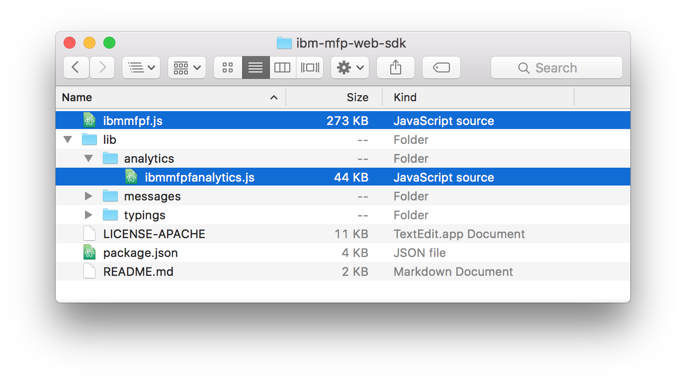

## Overview
You can develop mobile or Desktop MobileFirst web applications by using your preferred development environment and tools.  
In this tutorial, you learn how to add the MobileFirst Web SDK to your web applicaiton, as well as how to register the web application with the MobileFirst Server

The MobileFirst Web SDK is provided as a set of JavaScript files, [and is available at NPM](https://www.npmjs.com/package/ibm-mfp-web-sdk).  
The SDK includes the following files:

- **ibmmfpf.js** - The core of the SDK.
- **ibmmfpfanalytics.js** - Provides support for MobileFirst Foundation Analytics.

**Prerequisite:**
To run NPM commands, [Node.js](https://nodejs.org) is required.

#### SDK Limitations
The numbers in the table specify the first browser version that are fully supported.


|      Browser      | Chrome | Safari* | Internet Explorer | Edge | Firefox | Blackberry Browser* | Android Browser |
|:-----------------:|:------:|:-------:|:-----------------:|:----:|:-------:|:------------------:|:---------------:|
| Supported Version |   43+  |    8+   |        10+        |  20+ |  38+  |      Z series      |   Android 4.3+  |

(*) Private browsing mode will work only with Single Page Applications. Other applications may have unexpected behavior.

#### Jump to:

- [Adding the MobileFirst Web SDK](#adding-the-mobilefirst-web-sdk)
- [Initializing the MobileFirst Web SDK](#initializing-the-mobilefirst-web-sdk)
- [Registering the web application](#registering-the-web-application)
- [Updating the MobileFirst Web SDK](#updating-the-mobilefirst-web-sdk)
- [Same Origin Policy](#same-origin-policy)
- [Secure Origins Policy](#secure-origins-policy)
- [Tutorials to follow next](#tutorials-to-follow-next)

## Adding the MobileFirst Web SDK
To add the SDK to new or existing web applications, first download it to your workstation and then add it to your web application.

### Downloading the SDK
1. From a **command-line** window, navigate to your web application's root folder.
2. Run the command: `npm install ibm-mfp-web-sdk`.

This command creates the following directory structure:



### Adding the SDK
To add the MobileFirst Web SDK, reference it in a standard fashion in the web application.  
The SDK also [supports AMD](https://en.wikipedia.org/wiki/Asynchronous_module_definition), so that you can use Module Loaders such as [RequireJS](http://requirejs.org/) to load the SDK.

#### Standard
Reference the **ibmmfpf.js** file in the `HEAD` element.  

```html
<head>
    ...
    ...
    <script type="text/javascript" src="node_modules/ibm-mfp-web-sdk/ibmmfpf.js"></script>
</head>
```

#### Using RequireJS

**HTML**  

```html
<script type="text/javascript" src="node_modules/requirejs/require.js" data-main="index"></script>
```

**JavaScript**

```javascript
require.config({
	'paths': {
		'mfp': 'node_modules/ibm-mfp-web-sdk/ibmmfpf'
	}
});

require(['mfp'], function(WL) {
    // application logic.
});
```

> <span class="glyphicon glyphicon-exclamation-sign" aria-hidden="true"></span> **Important:** If adding Analytics support, place the **ibmmfpfanalytics.js** file reference **before** the **ibmmfpf.js** file reference.

## Initializing the MobileFirst Web SDK
Initialize the MobileFirst Web SDK by specifying the **context root** and **application ID** values in the main JavaScript file of your web application:

```javascript
var wlInitOptions = {
    mfpContextRoot : '/mfp', // "mfp" is the default context root in the MobileFirst Development server
    applicationId : 'com.sample.mywebapp' // Replace with your own value.
};

WL.Client.init(wlInitOptions).then (
    function() {
        // Application logic.
});
```

- **mfpContextRoot:** The context root used by the MobileFirst Server.
- **applicationId:** The application package name, as defined when you [register the application](#registering-the-web-application).

### Registering the web application
You can register applications either from the MobileFirst Operations Console or from the MobileFirst CLI.

#### From MobileFirst Operations Console

1. Open your favorite browser and load the MobileFirst Operations Console by entering the `http://localhost:9080/mfpconsole/` URL.
2. Click the **New** button next to **Applications** to create a new application.
3. Select **Web** as the platform, and provide a name and identifier.
4. Click **Register application**.


#### From MobileFirst CLI
From a **command-line** window, navigate to the root folder of the web application and run the command: `mfpdev app register`.

## Updating the MobileFirst Web SDK
SDK releases can be found in the SDK [NPM repository](https://www.npmjs.com/package/ibm-mfp-web-sdk).  
To update the MobileFirst Web SDK with the latest release:

1. Navigate to the root folder of the web application.
2. Run the command: `npm update ibm-mfp-web-sdk`.

## Same-origin policy
If web resources are hosted on a different server machine than the one that MobileFirst Server is installed on, a [same-origin policy](https://developer.mozilla.org/en-US/docs/Web/Security/Same-origin_policy) violation is triggered. The same-origin-policy security model is designed to protect against potential security threats from unverified sources. According to this policy, a browser allows web resources (such as scripts) to interact only with resources that stem from the same origin (which is defined as a combination of URI scheme, host name, and port number). For more information about the same-origin policy, see The [Web Origin Concept](https://tools.ietf.org/html/rfc6454) specification, and specifically [3. Principles of the Same-Origin Policy](https://tools.ietf.org/html/rfc6454#section-3).

Web apps that use the MobileFirst Web SDK must be handled in a supporting topology. For example, use a reverse proxy to internally redirect requests to the appropriate server while maintaining the same single origin.

### Alternatives
You can meet the policy requirements by using either of the following methods:

- Serving the web application resources, for example, from the same WebSphere Application Server Liberty profile application server that is used in the MobileFirst Development Kit.
- Using Node.js as a reverse proxy to redirect application requests to the MobileFirst Server.

> Learn more in [Setting up the Web development environmnt](../../installation-configuration/development/web) tutorial

## Secure-origins policy
When you use Chrome during development, the browser might not allow an application to load if it uses both HTTP and a host that **is not** `localhost`. The cause is the secure-origins policy that is implemented and used by default in this browser.

To overcome this, you can start the Chrome browser with the following flag:

```bash
--unsafely-treat-insecure-origin-as-secure="http://replace-with-ip-address-or-host:port-number" --user-data-dir=/test-to-new-user-profile/myprofile
```

- Replace "test-to-new-user-profile/myprofile" with the location of a folder that will act as a new Chrome user profile for the flag to work.

Read more about Secure Origins [in this Chormium developer document](https://www.chromium.org/Home/chromium-security/prefer-secure-origins-for-powerful-new-features).

## Tutorials to follow next
With the MobileFirst Web SDK now integrated, you can now:

- Review the [Using the MobileFirst Foundation SDK tutorials](../../application-development/)
- Review the [Adapters development tutorials](../../adapters/)
- Review the [Authentication and security tutorials](../../authentication-and-security/)
- Review [All Tutorials](../../all-tutorials)
