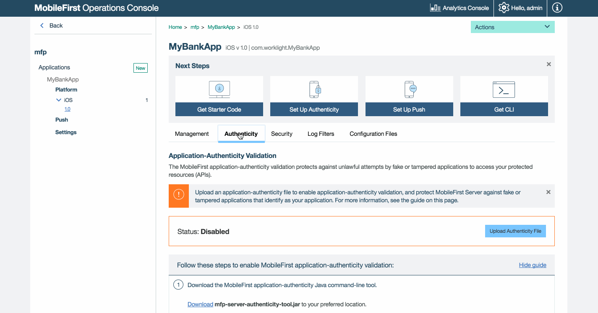
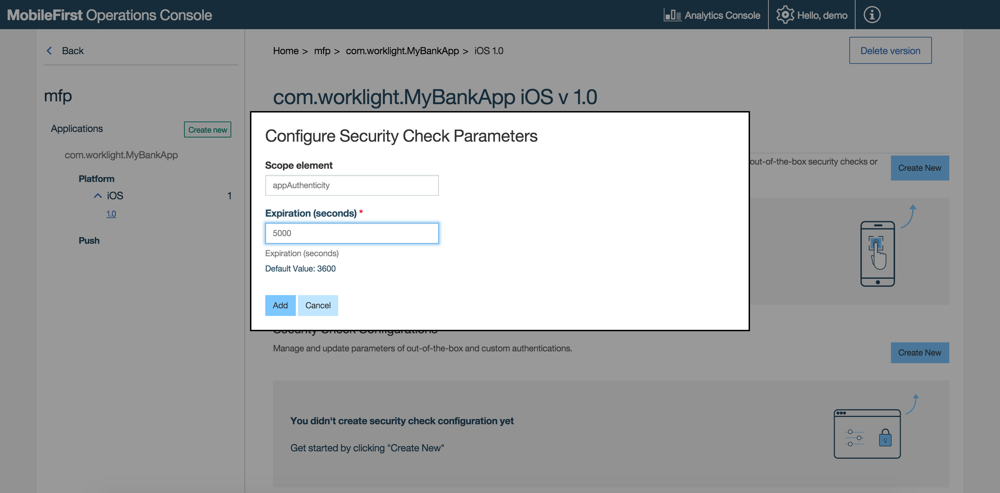

## Overview
By issuing an HTTP request, an entity can access to corporate HTTP services (APIs) that IBM MobileFirst Foundation Server provides access to. The predefined application-authenticity [security check](../) ensures that an application that tries to connect to a MobileFirst Server instance is the authentic one and was not tampered with or modified by a third-party attacker.

To enable application authenticity, you can either follow the on-screen instructions in the **MobileFirst Operations Console** → **[your-application]** → **Authenticity**, or review the information below.

#### Availability
* Application authenticity is available in all supported platforms (iOS, Android, Windows 8.1 Universal, Windows 10 UWP) in both Cordova and native applications.

#### Limitations
* Application authenticity does not support **Bitcode** in iOS. Therefore, before using application authentcity, disable Bitcode in the Xcode project properties.

#### Jump to:

- [Application Authenticity flow](#application-authenticity-flow)
- [Enabling Application Authenticity](#enabling-application-authenticity)
- [Configuring Application Authenticity](#configuring-application-authenticity)

## Application Authenticity Flow
By default, the application-authenticity security check is run during the application's runtime registration to MobileFirst Server, which occurs the first time an instance of the application attempts to connect to the server.

After an application has passed the authenticity challenge, an authenticity scope is granted. For as long as the token is valid, the authenticity challenge does not occur again. See [Configuring application authenticity](#configuring-application-authenticity) to learn how to customize this behavior.


> The challenge token in the diagram is processed by compiled native code, so that third-party attackers cannot see the logic of this processing.

## Enabling Application Authenticity
For application authenticity to be enabled in your Cordova or native application, the application binary file must be signed by using the mfp-app-authenticity tool. Eligible binary files are: `ipa` for iOS, `apk` for Android, and `appx` for Windows 8.1 Universal &amp; Windows 10 UWP.

1. Download the mfp-app-authenticity tool from the **MobileFirst Operations Console → Download Center**.
2. Open a **Command-line** window and run the command: `java -jar path-to-mfp-app-authenticity.jar path-to-binary-file`

    For example:

    ```bash
    java -jar /Users/your-username/Desktop/mfp-app-authenticity.jar /Users/your-username/Desktop/MyBankApp.ipa
    ```

    This command generates an `.authenticity_data` file, called `MyBankApp.authenticity_data, next to the `MyBankApp.ipa` file`.

3. Open the MobileFirst Operations Console in your favorite browser.
4. Select your application from the navigation sidebar and click on the **Authenticity** menu item.
5. Click on **Upload Authenticity File** to upload the `.authenticity_data` file.

When the `.authenticity_data` file is uploaded, application authenticity is enabled.



### Disabling Application Authenticity
To disable application authenticity, click the **Delete Authenticity File** button.

## Configuring Application Authenticity
You can configure the predefined application-authenticity security check with the following property:

- `expirationSec`: Defaults to 3600 seconds / 1 hour. Defines the duration until the authenticity token expires.

After an authenticity check has completed, it does not occur again until the token has expired based on the set value.

#### To configure the `expirationSec` property:

1. Load the MobileFirst Operations Console, navigate to **[your application]** → **Security** → **Security Check Configurations**, and click on **Create New**.

2. Search for the `appAuthenticity` scope element.

3. Set a new value in seconds.


