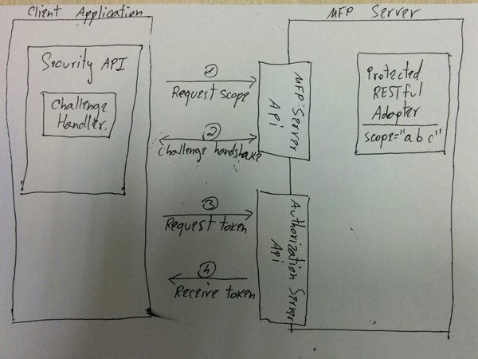
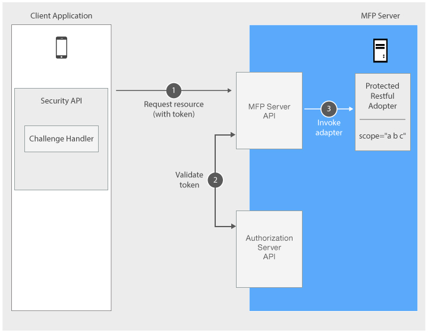

## Overview
The MobileFirst Platform Foundation authentication framework uses the [OAuth 2.0](http://oauth.net/) protocol. The OAuth 2 protocol is based on the acquisition of an access token that encapsulates the granted permissions to the client.  

In that context, IBM MobileFirst Platform Server serves as an **authorization server** and is able to **generate access tokens**. The client can then use these tokens to access resources on a resource server, which can be either the MobileFirst Server itself or an external server. The resource server checks the validity of the token to make sure that the client can be granted access to the requested resource. The separation between resource server and authorization server allows to enforce security on resources that are running outside MobileFirst Server.

#### Jump to:

* [Authorization flow](#authorization-flow)
* [Authorization entities](#authorization-entities)
* [Protecting resources](#protecting-resources)
* [Further reading](#further-reading)

## Authorization flow
The authorization flow has two phases:

1. The client acquires a token.
2. The client uses the token to access a protected resource.

### Obtaining a token
In this phase, the client undergoes **security checks** in order to receive an access token.  
These security checks use **authorization entities**, which are described in [the next section](#authorization-entities).  



1. Client application sends a request to use a protected resource.
2. Client application undergoes security checks according to the requested scope.
3. Client application requests a token from the Authorization Server.
4. Client application receives the token.

### Using a token to access a protected resource
It is possible to enforce security both on resources that run on MobileFirst Server, as shown in this diagram, and on resources that run on any external resource server as explained in tutorial [Using MobileFirst Server to authenticate external resources](../../using-mobilefirst-server-authenticate-external-resources/).



1. Client application sends a request with the received token.
2. Validation module validates the token.
3. MobileFirst Server proceeds to adapter invocation.

## Authorization entities
- You can protect resources such as adapters from unauthorized access by specifying a **scope** that contains zero or more **scope elements**.

- A **SecurityCheck** defines the process to be used to authenticate users. It is often associated with a **SecurityCheckConfiguration** that defines properties to be used by the security check. SecurityChecks are instantiated by **Security Adapters**. The same SecurityCheck can be used to protect several resources.

- The client application needs to implement a **challenge handler** to handle challenges sent by the SecurityCheck.

### Scope
A `scope` is a space-separated list of **scope elements**. A scope is used to protect a resource (see later).

#### Scope Element
Scope element is a keyword that indicates which security checks are being used to protect the resource.

#### Scope Mapping
By default, the scope elements you write in your *scope* are matched to a `SecurityCheck` with the same name.

Optionally, at the application level, you can also map a **scope element** to a different `SecurityCheck`. Specifically, you can map it to a list of zero or more `SecurityChecks`. This can be useful if you want to protect a resource differently depending on which application is trying to access it.

### SecurityCheck
A SecurityCheck is an object responsible for obtaining credentials from a client and validate them.

#### Built-in Security Checks
Also available are these out-of-the-box security checks:

- [Application Authenticity](../application-authenticity/)
- [Direct Update](../../using-the-mfpf-sdk/direct-update)
- [LTPA](../websphere-ltpa-based-authentication/)

> Learn more about security checks in the [Creating a Security Check](../creating-a-security-check/) tutorial.

## Protecting resources

### Java adapters
You can specify the `scope` of a Java adapter by using the `@OAuthSecurity` annotation.

```java
@DELETE
@Path("/{userId}")
@OAuthSecurity(scope="deletePrivilege")
//This will serve: DELETE /users/{userId}
public void deleteUser(@PathParam("userId") String userId){
    ...
}
```
In this example, the `deleteUser` procedure uses the annotation `@OAuthSecurity(scope="deletePrivilege")`, which means that it is protected by a **scope** containing the **scope element** `deletePrivilege`.

A scope can be made of several **scope elements**, space-separated: `@OAuthSecurity(scope="element1 element2 element3")`.

If you do not specify the `@OAuthSecurity` annotation, the procedure is protected by the MobileFirst default security scope. That means that only a registered mobile app that is deployed on the same MobileFirst Server instance as the adapter can access this resource. Any security test protecting the application also applies here.

If you want to disable MobileFirst default security, you can use: `@OAuthSecurity(enabled=false)`.

You can use the `@OAuthSecurity` annotation also at the resource class level, to define a scope for the entire Java class.

### JavaScript adapters
You can protect a JavaScript adapter procedure by assigning a scope to the procedure definition in the adapter's XML file:

```xml
<procedure deleteUser scope="deletePrivilege">
```

A scope can be made of several **scope elements**, space-separated:

```xml
<procedure deleteUser scope="element1 element2 element3">
```

If you do not specify any scope - the procedure will be protected by the MobileFirst default security scope. That means that only a registered mobile app that is deployed on the same MobileFirst Server instance as the adapter can access this resource. Any security test protecting the application also applies here.

If you want to disable MobileFirst default security, you can use `secured="false"`:

```xml
<procedure deleteUser secured="false">
```

## Further Reading
Continue reading about authentication in the following tutorials:

* [Creating a security check](../creating-a-security-check)
* [Implementing Security Check With Attempts](../security-check-with-attempts)
* [Implementing Security Check With User Authentication](../security-check-with-user-authentication)
