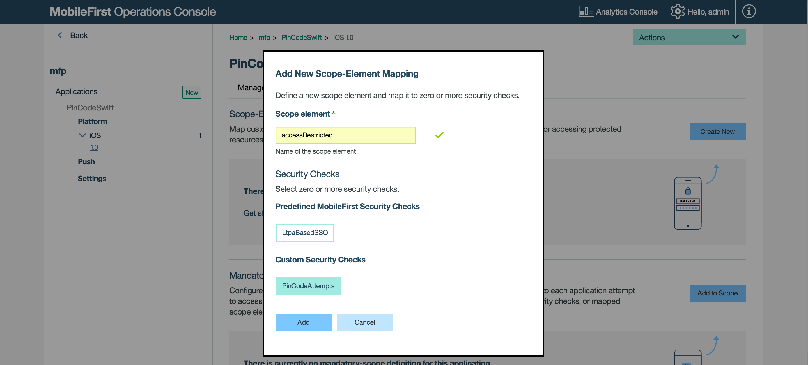
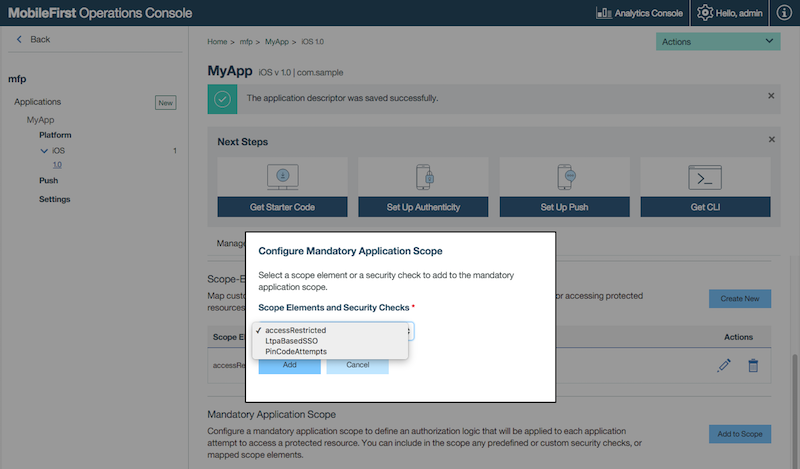

## Overview
The MobileFirst Platform Foundation authentication framework uses the [OAuth 2.0](http://oauth.net/) protocol. The OAuth 2 protocol is based on the acquisition of an access token that encapsulates the granted permissions to the client.  

In that context, the IBM MobileFirst Platform Server serves as an **authorization server** and is able to **generate access tokens**. The client can then use these tokens to access resources on a resource server, which can be either the MobileFirst Server itself or an external server. The resource server checks the validity of the token to make sure that the client can be granted access to the requested resource. The separation between resource server and authorization server allows to enforce security on resources that are running outside MobileFirst Server.

#### Jump to:

* [Authorization entities](#authorization-entities)
* [Protecting resources](#protecting-resources)
* [Authorization flow](#authorization-flow)
* [Tutorials to follow next](#tutorials-to-follow-next)

## Authorization entities
Several authorization entities are available as part of the MobileFirst Platform Foundation authentication framework:

### Security Check
A security check is an entity that is responsible for obtaining and validating client credentials.   
Security checks are instantiated by Adapters.

The security check defines the process to be used to authenticate users. It is often associated with a **SecurityCheckConfiguration** that defines properties to be used by the security check.  
The same security check can also be used to protect several resources.

On the client-side, the application logic needs to implement a **challenge handler** to handle challenges sent by the security check.

> Learn more about security checks in the [Creating a Security Check](../creating-a-security-check/) tutorial, and about challenge handlers in the [Credentials Validation](../credentials-validation) tutorial.

#### Built-in Security Checks
Several predefined security checks available:

- [Application Authenticity](../application-authenticity/)
- [Direct Update](../../using-the-mfpf-sdk/direct-update)
- LTPA

> Learn more about built-in security checks in the user documentation.

### Scope
You can protect resources such as adapters from unauthorized access by specifying a **scope**.  
A scope is a space-separated list of zero or more **scope elements**, for example `element1 element2 element3`.

#### Scope Element
A scope element can be either:

* The name of a security check.
* An arbitrary keyword such as `access-restricted` or `deletePrivilege` which defines the level of security needed for this resource. This keyword will later be mapped to a security check.

#### Default Scope
By default, all resources are protected by a default scope that restricts access to registered mobile applications only.

#### Scope Mapping
By default, the **scope elements** you write in your **scope** are mapped to a **security check with the same name**.  
For example, if you write a security check called `PinCodeAttempts`, you can use a scope element with the same name within your scope.

Scope Mapping allows to map scope elements to security checks. When the client asks for a scope element, this configuration defines which security checks should be applied.  
For example you can map the scope element `access-restricted` to your `PinCodeAttempts` security check.

This can be useful if you want to protect a resource differently depending on which application is trying to access it.  
You can also map it to a list of zero or more security checks.

For example:  
scope = `access-restricted deletePrivilege`

* In app A
  * `access-restricted` is mapped to `PinCodeAttempts`
  * `deletePrivilege` is mapped to the default scope
* In app B
  * `access-restricted` is mapped to `PinCodeAttempts`
  * `deletePrivilege` is mapped to `UserLogin`

> If you do not select any security check in the "Add New Scope Element Mapping" popup, your scope element will be mapped to the **default scope**.



## Protecting resources
Your resources can be protected by one of several ways:

### Mandatory application scope
At the application level, you can define a scope that will apply to all the resources used by this application.  
In the MobileFirst Operations Console, select **[your application] → Security tab**. Under **Mandatory Application Scope** click on **Add to Scope**.



### Resource-level
#### Java adapters
You can specify the scope of a resource method by using the `@OAuthSecurity` annotation.

```java
@DELETE
@Path("/{userId}")
@OAuthSecurity(scope="deletePrivilege")
//This will serve: DELETE /users/{userId}
public void deleteUser(@PathParam("userId") String userId){
    ...
}
```

In the above example, the `deleteUser` method uses the annotation `@OAuthSecurity(scope="deletePrivilege")`, which means that it is protected by a scope containing the scope element `deletePrivilege`.

A scope can be made of several scope elements, space-separated: `@OAuthSecurity(scope="element1 element2 element3")`.

If you do not specify the `@OAuthSecurity` annotation, or set the scope to an empty string, the method is protected by the MobileFirst default security scope.

You can use the `@OAuthSecurity` annotation also at the resource class level, to define a scope for the entire Java class.

#### JavaScript adapters
You can protect a JavaScript adapter procedure by assigning a scope to the procedure definition in the adapter's XML file:

```xml
<procedure name="deleteUser" scope="deletePrivilege">
```
A scope can be made of several scope elements, space-separated: `scope="element1 element2 element3"`

If you do not specify any scope, or use an empty string - the procedure will be protected by the MobileFirst default security scope.

### Disabling protection
Access to a resource with **disabled protection** is allowed to every client. No security or application management features are enforced on access to such resource.

#### Java adapters
If you want to disable protection, you can use: `@OAuthSecurity(enabled=false)`.

#### JavaScript adapters
If you want to disable protection, you can use `secured="false"`.

```xml
<procedure name="deleteUser" secured="false">
```

## Authorization flow
The authorization flow has two phases:

1. The client acquires an access token.
2. The client uses the token to access a protected resource.

### Obtaining an access token
In this phase, the client undergoes **security checks** in order to receive an access token.


1. Client application sends a request to obtain access token for a specified scope.
2. Client application undergoes security checks according to the requested scope.
3. After a successful completion of the challenge process, client application forwards the request to the authorization Server.
4. Client application receives the access token.

### Using a token to access a protected resource
It is possible to enforce security both on resources that run on MobileFirst Server, as shown in this diagram, and on resources that run on any external resource server as explained in tutorial [Using MobileFirst Server to authenticate external resources](../../using-mobilefirst-server-authenticate-external-resources/).


1. Client application sends a request with the received token.
2. Validation module validates the token.
3. MobileFirst Server proceeds to adapter invocation.

## Tutorials to follow next
Continue reading about authentication in the following tutorials:

* [Creating a security check](../creating-a-security-check)
* [Implementing the CredentialsValidationSecurityCheck](../credentials-validation)
* [Implementing the UserAuthenticationSecurityCheck](../user-authentication)
