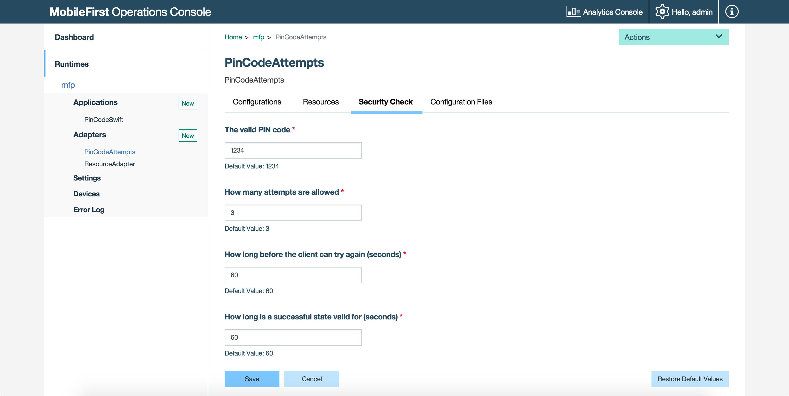

## Overview
Security checks constitute the basic server-side building block of the MobileFirst security framework. A security check is a server-side entity that implements a specific authorization logic, such as obtaining and validating client credentials. You protect a resource by assigning it a scope that maps to zero or more security checks. The security framework ensures that only a client that passes all of the security checks of the protecting scope is granted access to the resource. You can use security checks to authorize access both to resources that are hosted on MobileFirst Server and to resources on an external resource server.

Both Java and JavaScript adapters can theoretically define a security check in their respective definition files, however note that the security checks are implemented in Java code only.  
An adapter can either be a *resource* adapter (meaning it serves resources and content to send to the client), a *SecurityCheck* adapter, or **both**.

The architecture of the security framework is modular and flexible and so the implementation of the security check is not inherently dependent of any specific resource or application. You can reuse the same security check to protect different resources, and use different security-check combinations for various authorization flows. For enhanced flexibility, a security-check class exposes configuration properties that can be customized at the adapter level both in the security-check definition and during run time from thte MobileFirst Operations Console.

To facilitate and accelerate your development process, IBM MobileFirst Foundation provides base abstract implementations of the `SecurityCheck` interface. In addition, a base abstract implementation of the `SecurityCheckConfiguration` interface is provided (`SecurityCheckConfigurationBase`), as well as complementary sample security-check configuration classes for each of the provided base security-check classes. Start out with the base security-check implementation (and related sample configuration) that best fits your development needs, and extend and modify the implementation as needed.

> Learn more about the [security check contract](contract).

**Prerequisites:**

* Read the [Authorization concepts](../) tutorial.
* Learn how to [create adapters](../../adapters/creating-adapters).

**Usage:**  
The security check base classes that are described below are available are part of the MobileFirst `com.ibm.mfp.security.checks.base` Java Maven library, which are downloaded while building the adapter from from the [Maven Central repository](http://search.maven.org/#search|ga|1|a%3A%22mfp-security-checks-base%22). If you are developing offline, you can download these from the **MobileFirst Operations Console → Download Center → Tools tab → Security Checks**.

#### Jump to:

* [Defining a security Check](#defining-a-security-check)
* [Security Check Implementation](#security-check-implementation)
* [Security Check Configuration](#security-check-configuration)
* [Predefined Security Checks](#predefined-security-checks)
* [Tutorials to follow next](#tutorials-to-follow-next)

## Defining a Security Check
[Create a Java or JavaScript adapter](../../adapters/creating-adapters/) or use an exiting one.

> When creating a Java adapter, the default template assumes that the adapter will serve **resources**. It is the developer's choice to bundle security checks and resources in the same adapter, or to separate them into distinct adapters.

To remove the default **resource** implementation, delete the files **[AdapterName]Application.java** and **[AdapterName]Resource.java**. Remove the `<JAXRSApplicationClass>` element from **adapter.xml**, too.

In the Java adapter's **adapter.xml** file, add an XML element called `securityCheckDefinition`. For example:

```xml
<securityCheckDefinition name="sample" class="com.sample.sampleSecurityCheck">
    <property name="successStateExpirationSec" defaultValue="60"/>
    <property name="blockedStateExpirationSec" defaultValue="60"/>
    <property name="maxAttempts" defaultValue="3"/>
</securityCheckDefinition>
```

* The `name` attribute is the name of your security check.
* The `class` attribute specifies the implementation Java class of the security check. You need to create this class.
* Security checks can be [further configured](#security-check-configuration) with a list of `property` elements.
* For defining custom properties, see [Security Check Configuration](#security-check-configuration).

After you successfully deploy an adapter with a security-check definition to the MobileFirst Server, you can also see your security check and its configuration information, and make runtime configuration changes, from **MobileFirst Operations Console → Adapters → [your adapter]**:

* In the **Configuration Files** tab you can see the server copy of your adapter descriptor, including the `<securityCheckDefinition>` element that defines your custom security check and its configurable properties. You can also [pull the adapter configuration](../../adapters/java-adapters/#custom-properties) and push it to different servers.
* In the **Security Checks** tab you can see a list of all the configuration properties that you exposed in the security-check definition. The properties are referenced by the value of their configured `displayName` attribute, or by the value of the name attribute when no display name is configured. If you set the property's description attribute in the definition, this description is also displayed. 
For each property, the value that is configured in the `defaultValue` attribute is shown as the current value. You can change the value to override the default value from your security-check definition. You can also restore, at any time, the original default values from your security-check definition. 
* You can also select an application version from the **Applications** section of the MobileFirst Console.

## Security Check Implementation
Create the **Java class** for the security check. The implementation should extend one of the provided base classes, as shown below. The parent class you choose determines the balance between customization and simplicity.

### Security Check
`SecurityCheck` is a Java **interface**, which defines the minimum required methods to represent the security check.  
It is the sole responsibility of the developer who implements the security check to handle each scenario.

### ExternalizableSecurityCheck
This abstract class implements a basic version of the security-check interface.  
It provides, among other options: externalization as JSON, inactivity timeout, expiration countdown, and more.

Subclassing this class leaves a lot of flexibility in your security check implementation.

> Learn more in the [ExternalizableSecurityCheck](../externalizable-security-check) tutorial.

### CredentialsValidationSecurityCheck
This class extends the `ExternalizableSecurityCheck` and implements most of its methods to simplify usage. Two methods must be implemented: `validateCredentials` and `createChallenge`. The implementation allows a limited number of login attempts during a certain interval, after which the security check is blocked for a configured period. In the case of a successful login, the state of the security check remains successful for a configured period, during which the user can access the requested resource.

The `CredentialsValidationSecurityCheck` class is meant for simple flows to validate arbitrary credentials, to grant access to a resource. A built-in capability to block access after a set number of attempts is also provided.

> Learn more in the [CredentialsValidationSecurityCheck](../credentials-validation/) tutorials.

### UserAuthenticationSecurityCheck
This class extends the `CredentialsValidationSecurityCheck` and therefore inherits all of its features. The class adds to it an implementation that creates an `AuthenticatedUser` user identity object  that can be used to identify the current logged-in user. A built-in capability to optionally enable a "Remember Me" login behavior is also provided. Three methods must be implemented: `createUser`, `validateCredentials`, and `createChallenge`.

> Learn more in the [UserAuthentication security check](../user-authentication/) tutorials.

## Security Check Configuration
Each security-check implementation class can use a `SecurityCheckConfiguration` class that defines properties available for that security check. Each base `SecurityCheck` class comes with a matching `SecurityCheckConfiguration` class. You can create your own implementation that extends one of the base `SecurityCheckConfiguration` classes and use it for your custom security check.

For example, the `createConfiguration` method of `UserAuthenticationSecurityCheck` returns an instance of `UserAuthenticationSecurityCheckConfig`.

```java
public abstract class UserAuthenticationSecurityCheck extends CredentialsValidationSecurityCheck {
  @Override
  public SecurityCheckConfiguration createConfiguration(Properties properties) {
      return new UserAuthenticationSecurityCheckConfig(properties);
  }
}
```

`UserAuthenticationSecurityCheckConfig` enables a property called `rememberMeDurationSec` with a default of `0`.

```java
public class UserAuthenticationSecurityCheckConfig extends CredentialsValidationSecurityCheckConfig {

    public int rememberMeDurationSec;

    public UserAuthenticationSecurityCheckConfig(Properties properties) {
        super(properties);
        rememberMeDurationSec = getIntProperty("rememberMeDurationSec", properties, 0);
    }

}
```

<br/>
These properties can be configured at several levels:

### adapter.xml
In the Java adapter's **adapter.xml** file, inside `<securityCheckDefinition>`, you can add one or more `<property>` elements.  
The `<property>` element takes the following attributes:

- **name**: The name of the property, as defined in the configuration class.
- **defaultValue**: Overrides the default value defined in the configuration class.
- **displayName**: *optional*, a user-friendly name to be displayed in the console.
- **description**: *optional*, a description to be displayed in the console.
- **type**: *optional*, ensures that the property is of a specific type such as `integer`, `string`, `boolean`, or a list of valid values (for example `type="['1','2','3']"`).

Example:

```xml
<property name="maxAttempts" defaultValue="3" displayName="How many attempts are allowed?" type="integer"/>
```

> For a real-world example, see the [Configuring the Security Check section](../credentials-validation/security-check/#configuring-the-security-check) of the CredentialsValidation security check tutorial.

### MobileFirst Operations Console - Adapter
In the MobileFirst Operations Console → **[your adapter] → Security Check tab**, you can change the value of any property defined in the **adapter.xml** file.  
Note that **only** the properties defined in the **adapter.xml** file appear on this screen; properties defined in the configuration class won't appear here automatically.



You can also manually edit the adapter's configuration JSON file with the required configuration and push the changes back to a MobileFirst Server.

1. From a **command-line window**, navigate to the project's root folder and run the `mfpdev adapter pull`.
2. Open the configuration file, located in the **project-folder\mobilefirst** folder.
3. Edit the file and look for the `securityCheckDefinitions` object. In this object, find or create an object that is named as your selected security check. Within the security-checks object, find or add a properties object. For each available configuration property that you want to configure, add within the properties object a pair of configuration-property name and value. For example: 

   ```xml
   "securityCheckDefinitions": {
        "UserAuthentication": {
            "properties": {
                "maxAttempts": "4",
                "failureExpirationSec: "90"
            }
        }
   }
   ```
   
4. Deploy the updated configuration JSON file by running the command: `mfpdev adapter push`.

### MobileFirst Operations Console - Application
Property values can also be overridden at the application level.

In the MobileFirst Operations Console → **[your application] → Security tab**, under the **Security Check Configurations** section, you can modify the values defined in each security check available.


You can also manually edit the adapter's configuration JSON file with the required configuration and push the changes back to a MobileFirst Server.

1. From a **command-line window**, navigate to the project's root folder and run the `mfpdev app pull`.
2. Open the configuration file, located in the **project-folder\mobilefirst** folder.
3. Edit the file and look for the `securityCheckConfigurations` object. In this object, find or create an object that is named as your selected security check. Within the security-checks object, add a pair of configuration-property name and value for each available configuration property that you want to configure. For example:

   ```xml
   "SecurityCheckConfigurations": {
        "UserAuthentication": {
            "properties": {
                "maxAttempts": "2",
                "failureExpirationSec: "60"
            }
        }
   }
   ```
   
4. Deploy the updated configuration JSON file by running the command: `mfpdev app push`.

## Predefined Security Checks
These predefined security checks are also available:

- [Application Authenticity](../application-authenticity/)
- [Direct Update](../../application-development/direct-update)
- LTPA

## Tutorials to follow next
Continue reading about security checks in the following tutorials.  
Remember to deploy your adapter when you're done developing or making changes.

* [Implementing the CredentialsValidationSecurityCheck](../credentials-validation/).
* [Implementing the UserAuthenticationSecurityCheck](../user-authentication/).
* Learn about additional MobileFirst Foundation [authentication and security features](../).
