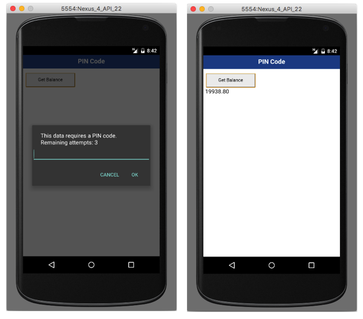

## Overview
When trying to access a protected resource, the server (the security check) will send back to the client a list containing one or more **challenges** for the client to handle.  
This list is received as a`JSON object`, listing the security check name with an optional `JSON` of additional data:

```json
{
  "challenges": {
    "SomeSecurityCheck1":null,
    "SomeSecurityCheck2":{
      "some property": "some value"
    }
  }
}
```

The client should then register a **challenge handler** for each security check.  
The challenge handler defines the client-side behavior that is specific to the security check.

## Creating the challenge handler
A challenge handler is responsible for handling challenges sent by the MobileFirst server, such as displaying a login screen, collecting credentials and submitting them back to the security check.

In this example, the security check is `PinCodeAttempts` which was defined in [Implementing the CredentialsValidationSecurityCheck](../security-check). The challenge sent by this security check contains the number of remaining attempts to login (`remainingAttempts`), and an optional `errorMsg`.


Use the `WL.Client.createWLChallengeHandler()` API method to create and register a challenge Handler:

```javascript
PinCodeChallengeHandler = WL.Client.createWLChallengeHandler("PinCodeAttempts");
```

## Handling the challenge
The minimum requirement from the `WLChallengeHandler` protocol is to implement the `handleChallenge()` method, that is responsible for asking the user to provide the credentials. The `handleChallenge` method receives the challenge as a `JSON` Object.

> Learn more about the `WLChallengeHandler` protocol in the user documentation.

In this example, a prompt is displayed asking to enter the PIN code:

```javascript
PinCodeChallengeHandler.handleChallenge = function(challenge) {
    var msg = "";
    
    // Create the title string for the prompt
    if(challenge.errorMsg != null) {
        msg =  challenge.errorMsg + "\n";
    } else {
        msg = "This data requires a PIN code.\n";
    }
    
    msg += "Remaining attempts: " + challenge.remainingAttempts;
    
    // Display a prompt for user to enter the pin code     
    var pinCode = prompt(msg, "");
    
    if(pinCode){ // calling submitChallengeAnswer with the entered value
        PinCodeChallengeHandler.submitChallengeAnswer({"pin":pinCode});
    } else { // calling submitFailure in case user pressed the cancel button
        PinCodeChallengeHandler.submitFailure();   
    }                            
};
```

If the credentials are incorrect, you can expect the framework to call `handleChallenge` again.

## Submitting the challenge's answer
Once the credentials have been collected from the UI, use `WLChallengeHandler`'s `submitChallengeAnswer()` to send an answer back to the security check. In this example `PinCodeAttempts` expects a property called `pin` containing the submitted PIN code:

```javascript
PinCodeChallengeHandler.submitChallengeAnswer({"pin":pinCode});
```

## Cancelling the challenge
In some cases, such as clicking a "Cancel" button in the UI, you want to tell the framework to discard this challenge completely.  
To achieve this, call:

```javascript
PinCodeChallengeHandler.submitFailure();
```

## Handling failures
Some scenarios may trigger a failure (such as maximum attempts reached). To handle these, implement `WLChallengeHandler`'s `handleFailure()`.  
The structure of the JSON object passed as a parameter greatly depends on the nature of the failure.

```javascript
PinCodeChallengeHandler.handleFailure = function(error) {
    WL.Logger.debug("Challenge Handler Failure!");
    
    if(error.failure && error.failure == "account blocked") {
        alert("No Remaining Attempts!");  
    } else {
        alert("Error! " + JSON.stringify(error));
    }
};
```

## Handling successes
In general successes are automatically processed by the framework to allow the rest of the application to continue.

Optionally you can also choose to do something before the framework closes the challenge handler flow, by implementing `WLChallengeHandler`'s `handleSuccess()`. Here again, the content and structure of the `success` JSON object depends on what the security check sends.

In the `PinCodeAttemptsCordova` sample application, the success does not contain any additional data.

## Registering the challenge handler
In order for the challenge handler to listen for the right challenges, you must tell the framework to associate the challenge handler with a specific security check name.  
This is done by creating the challenge handler with the security check like this:

```javascript
someChallengeHandler = WL.Client.createWLChallengeHandler("the-securityCheck-name");
```

## Sample application
The sample **PinCodeCordova** is a Corodova application that uses `WLResourceRequest` to get a bank balance.  
The method is protected with a PIN code, with a maximum of 3 attempts.

[Click to download](https://github.com/MobileFirst-Platform-Developer-Center/SecurityCheckAdapters/tree/release80) the SecurityAdapters Maven project.  
[Click to download](https://github.com/MobileFirst-Platform-Developer-Center/PinCodeCordova/tree/release80) the Cordova project.

### Sample usage
* Use either Maven or MobileFirst Developer CLI to [build and deploy the available **ResourceAdapter** and **PinCodeAttempts** adapters](../../creating-adapters/).
* Ensure the sample is registered in the MobileFirst Server by running the command: `mfpdev app register` from a **command-line** window.
* Map the `accessRestricted` scope to the `PinCodeAttempts` security check:
    * In the MobileFirst Operations Console, under **Applications** → **PIN Code** → **Security** → **Map scope elements to security checks.**, add a mapping from `accessRestricted` to `PinCodeAttempts`. 
    * Alternatively, from the **Command-line**, navigate to the project's root folder and run the command: `mfpdev app push`.  
        
        > Learn more about the mfpdev app push/push commands in the [Using MobileFirst Developer CLI to manage MobilefFirst artifacts](../../../using-the-mfpf-sdk/using-mobilefirst-developer-cli-to-manage-mobilefirst-artifacts).
* Back in the command-line:
    * Add a platform by running the `cordova platform add` command.
    * Run the Cordova application by running the `cordova run` command.

