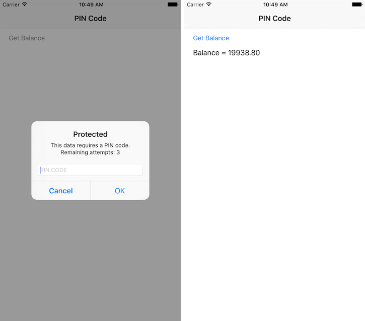

<!-- NLS_CHARSET=UTF-8 -->
## Overview
When trying to access a protected resource, the server (the security check) sends back to the client a list containing one or more **challenges** for the client to handle.  
This list is received as a `JSON` object, listing the security check name with an optional `JSON` of additional data:

```json
{
  "challenges": {
    "SomeSecurityCheck1":null,
    "SomeSecurityCheck2":{
      "some property": "some value"
    }
  }
}
```

The client must then register a **challenge handler** for each security check.  
The challenge handler defines the client-side behavior that is specific to the security check.

## Creating the challenge handler
A challenge handler is a class that handles challenges sent by the MobileFirst server, such as displaying a login screen, collecting credentials, and submitting them back to the security check.

In this example, the security check is `PinCodeAttempts`, which was defined in [Implementing the CredentialsValidationSecurityCheck](../security-check). The challenge sent by this security check contains the number of remaining attempts to log in (`remainingAttempts`), and an optional `errorMsg`.

Create a Swift class that extends `SecurityCheckChallengeHandler`:

```swift
class PinCodeChallengeHandler : SecurityCheckChallengeHandler {

}
```

## Handling the challenge
The minimum requirement from the `SecurityCheckChallengeHandler` protocol is to implement the `handleChallenge` method, which prompts the user to provide the credentials. The `handleChallenge` method receives the challenge `JSON` as a `Dictionary`.

In this example, an alert prompts the using-mobilefirst-cli-to-manage-mobilefirst-artifacts to enter the PIN code:

```swift
override func handleChallenge(challenge: [NSObject : AnyObject]!) {
    NSLog("%@",challenge)
    var errorMsg : String
    if challenge["errorMsg"] is NSNull {
        errorMsg = "This data requires a PIN code."
    }
    else{
        errorMsg = challenge["errorMsg"] as! String
    }
    let remainingAttempts = challenge["remainingAttempts"] as! Int

    showPopup(errorMsg,remainingAttempts: remainingAttempts)
}
```

> The implementation of `showPopup` is included in the sample application.

If the credentials are incorrect, you can expect the framework to call `handleChallenge` again.

## Submitting the challenge's answer
After the credentials have been collected from the UI, use the `WLChallengeHandler`'s `submitChallengeAnswer(answer: [NSObject : AnyObject]!)` method to send an answer back to the security check. In this example, `PinCodeAttempts` expects a property called `pin` containing the submitted PIN code:

```swift
self.submitChallengeAnswer(["pin": pinTextField.text!])
```

## Cancelling the challenge
In some cases, such as clicking a **Cancel** button in the UI, you want to tell the framework to discard this challenge completely.

To achieve this, call:

```swift
self.cancel()
```

## Handling failures
Some scenarios may trigger a failure (such as maximum attempts reached). To handle these, implement the `SecurityCheckChallengeHandler`'s `handleFailure` method.
The structure of the `Dictionary` passed as a parameter greatly depends on the nature of the failure.

```swift
override func handleFailure(failure: [NSObject : AnyObject]!) {
    if let errorMsg = failure["failure"] as? String {
        showError(errorMsg)
    }
    else{
        showError("Unknown error")
    }
}
```

> The implementation of `showError` is included in the sample application.

## Handling successes
In general, successes are automatically processed by the framework to allow the rest of the application to continue.

Optionally, you can also choose to do something before the framework closes the challenge handler flow, by implementing the `SecurityCheckChallengeHandler`'s `handleSuccess(success: [NSObject : AnyObject]!)` method. Here again, the content and structure of the `success` `Dictionary` depends on what the security check sends.

In the `PinCodeAttemptsSwift` sample application, the success does not contain any additional data and so `handleSuccess` is not implemented.

## Registering the challenge handler

For the challenge handler to listen for the right challenges, you must tell the framework to associate the challenge handler with a specific security check name.

To do so, initialize the challenge handler with the security check as follows:

```swift
var someChallengeHandler = SomeChallengeHandler(securityCheck: "securityCheckName")
```

You must then **register** the challenge handler instance:

```swift
WLClient.sharedInstance().registerChallengeHandler(someChallengeHandler)
```

In this example, in one line:

```swift
WLClient.sharedInstance().registerChallengeHandler(PinCodeChallengeHandler(securityCheck: "PinCodeAttempts"))
```

**Note:** Registering the challenge handler should only happen once in the entire application lifecycle. It is recommended to use the iOS AppDelegate class to do it.

## Sample application
The sample **PinCodeSwift** is an iOS Swift application that uses `WLResourceRequest` to get a bank balance.  
The method is protected with a PIN code, with a maximum of 3 attempts.

[Click to download](https://github.com/MobileFirst-Platform-Developer-Center/SecurityCheckAdapters/tree/release80) the SecurityAdapters Maven project.  
[Click to download](https://github.com/MobileFirst-Platform-Developer-Center/PinCodeSwift/tree/release80) the iOS Swift Native project.

### Sample usage
Follow the sample's README.md file for instructions.



