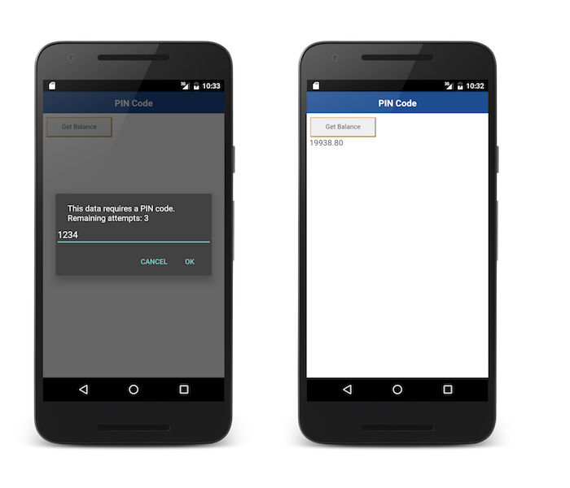

## Overview
When trying to access a protected resource, the server (the security check) will send back to the client a list containing one or more **challenges** for the client to handle.  
This list is received as a `JSON object`, listing the security check name with an optional `JSON` of additional data:

```json
{
  "challenges": {
    "SomeSecurityCheck1":null,
    "SomeSecurityCheck2":{
      "some property": "some value"
    }
  }
}
```

The client should then register a **challenge handler** for each security check.  
The challenge handler defines the client-side behavior that is specific to the security check.

## Creating the challenge handler
A challenge handler handles challenges sent by the MobileFirst server, such as displaying a login screen, collecting credentials, and submitting them back to the security check.

In this example, the security check is `PinCodeAttempts` which was defined in [Implementing the CredentialsValidationSecurityCheck](../security-check). The challenge sent by this security check contains the number of remaining attempts to log in (`remainingAttempts`), and an optional `errorMsg`.


Use the `WL.Client.createSecurityCheckChallengeHandler()` API method to create and register a challenge Handler:

```javascript
PinCodeChallengeHandler = WL.Client.createSecurityCheckChallengeHandler("PinCodeAttempts");
```

## Handling the challenge
The minimum requirement from the `createSecurityCheckChallengeHandler` protocol is to implement the `handleChallenge()` method, which is responsible for asking the user to provide the credentials. The `handleChallenge` method receives the challenge as a `JSON` Object.

In this example, an alert prompts the user to enter the PIN code:

```javascript
PinCodeChallengeHandler.handleChallenge = function(challenge) {
    var msg = "";

    // Create the title string for the prompt
    if(challenge.errorMsg != null) {
        msg =  challenge.errorMsg + "\n";
    } else {
        msg = "This data requires a PIN code.\n";
    }

    msg += "Remaining attempts: " + challenge.remainingAttempts;

    // Display a prompt for user to enter the pin code     
    var pinCode = prompt(msg, "");

    if(pinCode){ // calling submitChallengeAnswer with the entered value
        PinCodeChallengeHandler.submitChallengeAnswer({"pin":pinCode});
    } else { // calling cancel in case user pressed the cancel button
        PinCodeChallengeHandler.cancel();   
    }                            
};
```

If the credentials are incorrect, you can expect the framework to call `handleChallenge` again.

## Submitting the challenge's answer
After the credentials have been collected from the UI, use `createSecurityCheckChallengeHandler`'s `submitChallengeAnswer()` to send an answer back to the security check. In this example, `PinCodeAttempts` expects a property called `pin` containing the submitted PIN code:

```javascript
PinCodeChallengeHandler.submitChallengeAnswer({"pin":pinCode});
```

## Cancelling the challenge
In some cases, such as clicking a **Cancel** button in the UI, you want to tell the framework to discard this challenge completely.  
To achieve this, call:

```javascript
PinCodeChallengeHandler.cancel();
```

## Handling failures
Some scenarios might trigger a failure (such as maximum attempts reached). To handle these, implement `createSecurityCheckChallengeHandler`'s `handleFailure()`.  
The structure of the JSON object passed as a parameter greatly depends on the nature of the failure.

```javascript
PinCodeChallengeHandler.handleFailure = function(error) {
    WL.Logger.debug("Challenge Handler Failure!");

    if(error.failure && error.failure == "account blocked") {
        alert("No Remaining Attempts!");  
    } else {
        alert("Error! " + JSON.stringify(error));
    }
};
```

## Handling successes
In general, successes are automatically processed by the framework to allow the rest of the application to continue.

Optionally, you can also choose to do something before the framework closes the challenge handler flow, by implementing `createSecurityCheckChallengeHandler`'s `handleSuccess()`. Here again, the content and structure of the `success` JSON object depends on what the security check sends.

In the `PinCodeAttemptsCordova` sample application, the success does not contain any additional data.

## Registering the challenge handler
For the challenge handler to listen for the right challenges, you must tell the framework to associate the challenge handler with a specific security check name.  
To do so, create the challenge handler with the security check as follows:

```javascript
someChallengeHandler = WL.Client.createSecurityCheckChallengeHandler("the-securityCheck-name");
```

## Sample applications
The **PinCodeWeb** and **PinCodeCordova**  projects use `WLResourceRequest` to get a bank balance.  
The method is protected with a PIN code, with a maximum of 3 attempts.

[Click to download](https://github.com/MobileFirst-Platform-Developer-Center/PinCodeWeb/tree/release80) the Web project.  
[Click to download](https://github.com/MobileFirst-Platform-Developer-Center/PinCodeCordova/tree/release80) the Cordova project.  
[Click to download](https://github.com/MobileFirst-Platform-Developer-Center/SecurityCheckAdapters/tree/release80) the SecurityAdapters Maven project.  

### Sample usage
Follow the sample's README.md file for instructions.


