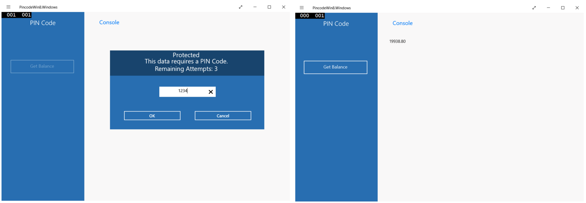

## Overview
When trying to access a protected resource, the server (the security check) sends back to the client a list containing one or more **challenges** for the client to handle.  
This list is received as a `JSON` object, listing the security check name with an optional `JSON` of additional data:

```json
{
  "challenges": {
    "SomeSecurityCheck1":null,
    "SomeSecurityCheck2":{
      "some property": "some value"
    }
  }
}
```

The client should then register a **challenge handler** for each security check.  
The challenge handler defines the client-side behavior that is specific to the security check.

## Creating the challenge handler
A challenge handler is a class that handles the challenges sent by the MobileFirst server, such as displaying a login screen, collecting credentials, and submitting them back to the security check.

In this example, the security check is `PinCodeAttempts` which was defined in [Implementing the CredentialsValidationSecurityCheck](../security-check). The challenge sent by this security check contains the number of remaining attempts to log in (`remainingAttempts`), and an optional `errorMsg`.

Create a C# class that extends `Worklight.SecurityCheckChallengeHandler`:

```csharp
public class PinCodeChallengeHandler : Worklight.SecurityCheckChallengeHandler
{
}
```

## Handling the challenge
The minimum requirement from the `SecurityCheckChallengeHandler` class is to implement a constructor and a `HandleChallenge` method, that is responsible for asking the user to provide the credentials. The `HandleChallenge` method receives the challenge as an `Object`.

Add a constructor method:

```csharp
public PinCodeChallengeHandler(String securityCheck) {
    this.securityCheck = securityCheck;
}
```

In this `HandleChallenge` example, an alert prompts the user to enter the PIN code:

```csharp
public override void HandleChallenge(Object challenge)
{
    try
    {
      JObject challengeJSON = (JObject)challenge;

      if (challengeJSON.GetValue("errorMsg") != null)
      {
          if (challengeJSON.GetValue("errorMsg").Type == JTokenType.Null)
              errorMsg = "This data requires a PIN Code.\n";
      }

      await CoreApplication.MainView.CoreWindow.Dispatcher.RunAsync(CoreDispatcherPriority.Normal,
           async () =>
           {
               _this.HintText.Text = "";
               _this.LoginGrid.Visibility = Visibility.Visible;
               if (errorMsg != "")
               {
                   _this.HintText.Text = errorMsg + "Remaining attempts: " + challengeJSON.GetValue("remainingAttempts");
               }
               else
               {
                   _this.HintText.Text = challengeJSON.GetValue("errorMsg") + "\n" + "Remaining attempts: " + challengeJSON.GetValue("remainingAttempts");
               }

               _this.GetBalance.IsEnabled = false;
           });
    } catch (Exception e)
    {
        Debug.WriteLine(e.StackTrace);
    }
}
```

> The implementation of `showChallenge` is included in the sample application.

If the credentials are incorrect, you can expect the framework to call `HandleChallenge` again.

## Submitting the challenge's answer

After the credentials have been collected from the UI, use the `SecurityCheckChallengeHandler`'s `ShouldSubmitChallengeAnswer()` and `GetChallengeAnswer()` methods to send an answer back to the security check. `ShouldSubmitChallengeAnswer()` returns a Boolean value that indicates whether the challenge response should be sent back to the security check. In this example, `PinCodeAttempts` expects a property called `pin` containing the submitted PIN code:

```csharp
public override bool ShouldSubmitChallengeAnswer()
{
  JObject pinJSON = new JObject();
  pinJSON.Add("pin", pinCodeTxt.Text);
  this.challengeAnswer = pinJSON;
  return this.shouldsubmitchallenge;
}

public override JObject GetChallengeAnswer()
{
  return this.challengeAnswer;
}

```

## Cancelling the challenge
In some cases, such as clicking a **Cancel** button in the UI, you want to tell the framework to discard this challenge completely.

To achieve this, override the `ShouldCancel` method.


```csharp
public override bool ShouldCancel()
{
  return shouldsubmitcancel;
}
```

## Registering the challenge handler
For the challenge handler to listen for the right challenges, you must tell the framework to associate the challenge handler with a specific security check name.

To do so, initialize the challenge handler with the security check as follows:

```csharp
PinCodeChallengeHandler pinCodeChallengeHandler = new PinCodeChallengeHandler("PinCodeAttempts");
```

You must then **register** the challenge handler instance:

```csharp
IWorklightClient client = WorklightClient.createInstance();
client.RegisterChallengeHandler(pinCodeChallengeHandler);
```

## Sample application
The **PinCodeWin8** and **PinCodeWin10** samples are C# applications that use `ResourceRequest` to get a bank balance.  
The method is protected with a PIN code, with a maximum of 3 attempts.

[Click to download](https://github.com/MobileFirst-Platform-Developer-Center/SecurityCheckAdapters/tree/release80) the SecurityCheckAdapters Maven project.  
[Click to download](https://github.com/MobileFirst-Platform-Developer-Center/PinCodeWin8/tree/release80) the Windows 8 project.  
[Click to download](https://github.com/MobileFirst-Platform-Developer-Center/PinCodeWin10/tree/release80) the Windows 10 UWP project.

### Sample usage
Follow the sample's README.md file for instructions.

   
