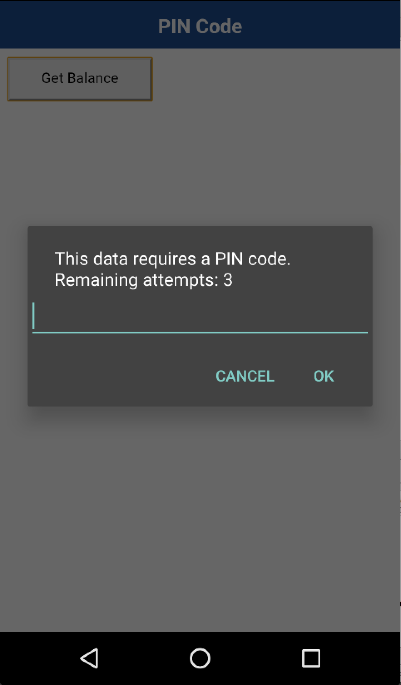
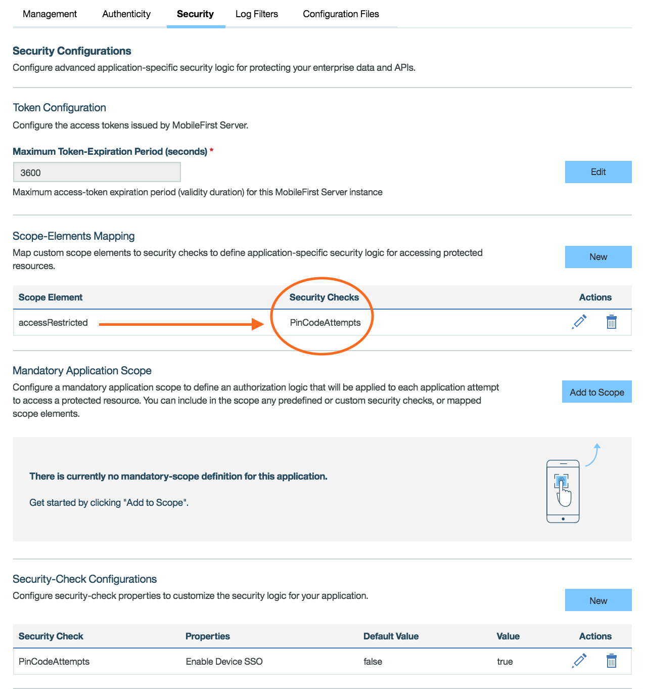
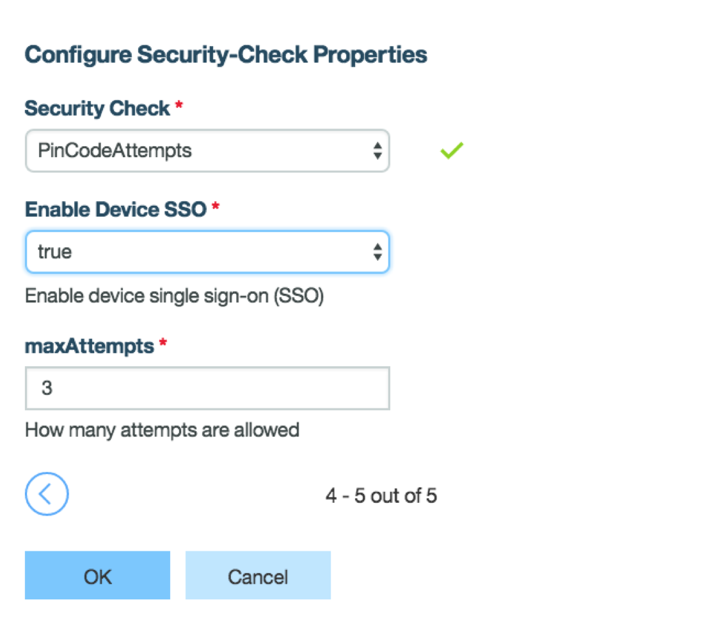
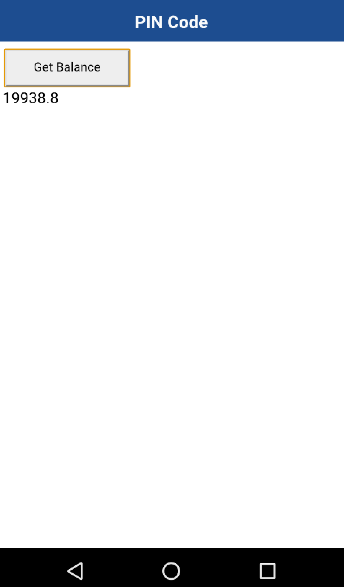

*Prerequisite*: Make sure to read the [Authentication and Security](../) tutorials.

## Overview
MobileFirst Platform offers a single-sign on feature that shares the state of any custom security check among multiple applications on the same device. This feature allows users to successfully sign onto one application on their device and also be authenticated on other applications on the same device using the same implementation.

## Implementing SSO
To configure the SSO feature, please implement the following steps.

In the MobileFirst Platform Operations Console:

1. Select your application security tab, by selecting on the current version of your application.
2. In the Security-Check Configurations section, select either `Create New` or the edit icon.
3. When the Configure Security-Check Properties dialog window pops up, select the custom security check for which you want to enable device SSO.
4. Set the `Enable Device SSO` setting to true and press `ok` to apply your changes.

Do this for _each_ of the applications you want the enable the SSO feature for.

> Please see our Knowledge Center documentation for more information regarding this feature.

## Using SSO with a Pre-Existing Sample

Please read this tutorial about [Credential Validation](../credentials-validation/) as we will be using it as the sample to implement SSO.

1. Retrieve and deploy the `PinCodeAttempts` and `ResourceAdapter` [Adapters](https://github.com/MobileFirst-Platform-Developer-Center/SecurityCheckAdapters/tree/release80) to your MFP server.
2. Retrieve and deploy [PinCode Sample](https://github.com/MobileFirst-Platform-Developer-Center?utf8=%E2%9C%93&query=pincode) for the specific mobile environment you will be developing, making sure to give them two different names.
3. Run the two applications on a single device. Notice how it will prompt you for a pincode. Before you enable SSO, you will be required to enter a pincode (`1234` for this sample) in each application.

4. Now in MFP Operations Console, check to see if the accessRestricted scope is mapped to the PinCodeAttempts Security Check for both applications.

5. `Create New` security-check.

6. Set `Enable Device SSO` to `true`.

7. Once you've done this for both applications, you can use SSO. You will be prompted to enter the pincode in one application. Then if you open the other application on the same device, you will not need to enter the pincode again to get the balance.

