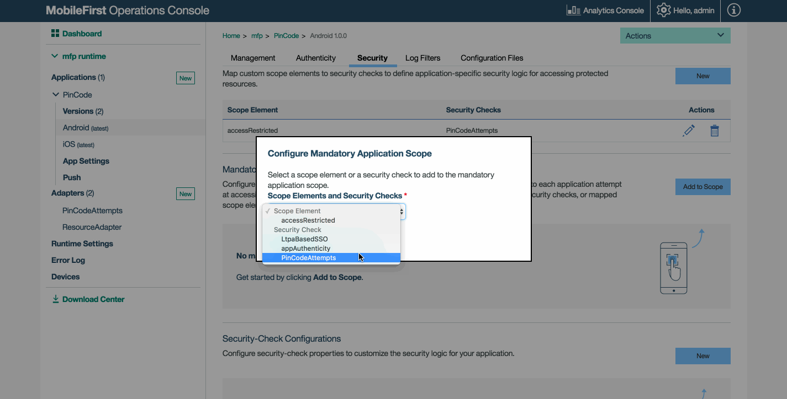

<!-- NLS_CHARSET=UTF-8 -->
## Overview
{: #overview }
The {{ site.data.keys.product_adj }} security framework is based on the [OAuth 2.0](http://oauth.net/) protocol. According to this protocol, a resource can be protected by a **scope** that defines the required permissions for accessing the resource. To access a protected resource, the client must provide a matching **access token**, which encapsulates the scope of the authorization that is granted to the client.

The OAuth protocol separates the roles of the authorization server and the resource server on which the resource is hosted.

* The authorization server manages the client authorization and token generation.
* The resource server uses the authorization server to validate the access token that is provided by the client, and ensure that it matches the protecting scope of the requested resource.

The security framework is built around an authorization server that implements the OAuth protocol, and exposes the OAuth endpoints with which the client interacts to obtain access tokens. The security framework provides the building blocks for implementing a custom authorization logic on top of the authorization server and the underlying OAuth protocol.  
By default, {{ site.data.keys.mf_server }} functions also as the **authorization server**. However, you can configure an IBM WebSphere DataPower appliance to act as the authorization server and interact with {{ site.data.keys.mf_server }}.

The client application can then use these tokens to access resources on a **resource server**, which can be either the {{ site.data.keys.mf_server }} itself or an external server. The resource server checks the validity of the token to make sure that the client can be granted access to the requested resource. The separation between resource server and authorization server allows you to enforce security on resources that are running outside {{ site.data.keys.mf_server }}.

Application developers protect access to their resources by defining the required scope for each protected resource, and implementing **security checks** and **challenge handlers**. The server-side security framework and the client-side API handle the OAuth message exchange and the interaction with the authorization server transparently, allowing developers to focus only on the authorization logic.

#### Jump to:
{: #jump-to }
* [Authorization entities](#authorization-entities)
* [Protecting resources](#protecting-resources)
* [Authorization flow](#authorization-flow)
* [Tutorials to follow next](#tutorials-to-follow-next)

## Authorization entities
{: #authorization-entities }
### Access Token
{: #access-token }
A {{ site.data.keys.product_adj }} access token is a digitally signed entity that describes the authorization permissions of a client. After the client's authorization request for a specific scope is granted, and the client is authenticated, the authorization server's token endpoint sends the client an HTTP response that contains the requested access token.

#### Structure
{: #structure }
The {{ site.data.keys.product_adj }} access token contains the following information:

* **Client ID**: a unique identifier of the client.
* **Scope**: the scope for which the token was granted (see OAuth scopes). This scope does not include the [mandatory application scope](#mandatory-application-scope).
* **Token-expiration time**: the time at which the token becomes invalid (expires), in seconds.

#### Token expiration
{: #token-expiration }
The granted access token remains valid until its expiration time elapses. The access token's expiration time is set to the shortest expiration time from among the expiration times of all the security checks in the scope. But if the period until the shortest expiration time is longer than the application's maximum token-expiration period, the token's expiration time is set to the current time plus the maximum expiration period. The default maximum token-expiration period (validity duration) is 3,600 seconds (1 hour), but it can be configured by setting the value of the `maxTokenExpiration` property. See Configuring the maximum access-token expiration period.

<div class="panel-group accordion" id="configuration-explanation" role="tablist" aria-multiselectable="false">
    <div class="panel panel-default">
        <div class="panel-heading" role="tab" id="access-token-expiration">
            <h4 class="panel-title">
                <a class="preventScroll" role="button" data-toggle="collapse" data-parent="#access-token-expiration" data-target="#collapse-access-token-expiration" aria-expanded="false" aria-controls="collapse-access-token-expiration"><b>Configuring the maximum access-token expiration period</b></a>
            </h4>
        </div>

        <div id="collapse-access-token-expiration" class="panel-collapse collapse" role="tabpanel" aria-labelledby="access-token-expiration">
            <div class="panel-body">
            <p>Configure the application’s maximum access-token expiration period by using one of the following alternative methods:</p>
            <ul>
                <li>Using the {{ site.data.keys.mf_console }}
                    <ul>
                        <li>Select <b>[your application] → Security</b> tab.</li>
                        <li>In the <b>Token Configuration</b> section, set the value of the Maximum <b>Token-Expiration Period (seconds)</b> field to your preferred value, and click <b>Save</b>. You can repeat this procedure, at any time, to change the maximum token-expiration period, or select <b>Restore Default Values</b> to restore the default value.</li>
                    </ul>
                </li>
                <li>Editing the application's configuration file
                    <ol>
                        <li>From a <b>command-line window</b>, navigate to the project's root folder and run the <code>mfpdev app pull</code>.</li>
                        <li>Open the configuration file, located in the <b>[project-folder]\mobilefirst</b> folder.</li>
                        <li>Edit the file by defining a <code>maxTokenExpiration</code> property and set its value to the maximum access-token expiration period, in seconds:


{
    ...
    "maxTokenExpiration": 7200
}
</li>
                        <li>Deploy the updated configuration JSON file by running the command: <code>mfpdev app push</code>.</li>
                    </ol>
                </li>
            </ul>
                
            <br/>
            <a class="preventScroll" role="button" data-toggle="collapse" data-parent="#access-token-expiration" data-target="#collapse-access-token-expiration" aria-expanded="false" aria-controls="collapse-access-token-expiration"><b>Close section</b></a>
            </div>
        </div>
    </div>
</div>

<div class="panel-group accordion" id="response-access-token" role="tablist" aria-multiselectable="false">
    <div class="panel panel-default">
        <div class="panel-heading" role="tab" id="response-structure">
            <h4 class="panel-title">
                <a class="preventScroll" role="button" data-toggle="collapse" data-parent="#response-structure" data-target="#collapse-response-structure" aria-expanded="false" aria-controls="collapseresponse-structure"><b>Access-token response structure</b></a>
            </h4>
        </div>

        <div id="collapse-response-structure" class="panel-collapse collapse" role="tabpanel" aria-labelledby="response-structure">
            <div class="panel-body">
                <p>A successful HTTP response to an access-token request contains a JSON object with the access token and additional data. Following is an example of a valid-token response from the authorization server:</p>


HTTP/1.1 200 OK
Content-Type: application/json
Cache-Control: no-store
Pragma: no-cache
{
    "token_type": "Bearer",
    "expires_in": 3600,
    "access_token": "yI6ICJodHRwOi8vc2VydmVyLmV4YW1",
    "scope": "scopeElement1 scopeElement2"
}


<p>The token-response JSON object has these property objects:</p>
<ul>
    <li><b>token_type</b>: the token type is always <i>"Bearer"</i>, in accordance with the <a href="https://tools.ietf.org/html/rfc6750">OAuth 2.0 Bearer Token Usage specification</a>.</li>
    <li><b>expires_in</b>: the expiration time of the access token, in seconds.</li>
    <li><b>access_token</b>: the generated access token (actual access tokens are longer than shown in the example).</li>
    <li><b>scope</b>: the requested scope.</li>
</ul>

<p>The <b>expires_in</b> and <b>scope</b> information is also contained within the token itself (<b>access_token</b>).</p>

<blockquote><b>Note:</b> The structure of a valid access-token response is relevant if you use the low-level <code>WLAuthorizationManager</code> class and manage the OAuth interaction between the client and the authorization and resource servers yourself, or if you use a confidential client. If you are using the high-level <code>WLResourceRequest</code> class, which encapsulates the OAuth flow for accessing protected resources, the security framework handles the processing of access-token responses for you. <a href="http://www.ibm.com/support/knowledgecenter/en/SSHS8R_8.0.0/com.ibm.worklight.dev.doc/dev/c_oauth_client_apis.html?view=kc#c_oauth_client_apis">See Client security APIs</a> and <a href="confidential-clients">Confidential clients</a>.</blockquote>

                <br/>
                <a class="preventScroll" role="button" data-toggle="collapse" data-parent="#response-structure" data-target="#collapse-response-structure" aria-expanded="false" aria-controls="collapse-response-structure"><b>Close section</b></a>
            </div>
        </div>
    </div>
</div>

### Security Check
{: #security-check }
A security check is a server-side entity that implements the security logic for protecting server-side application resources. A simple example of a security check is a user-login security check that receives the credentials of a user, and verifies the credentials against a user registry. Another example is the predefined {{ site.data.keys.product_adj }} application-authenticity security check, which validates the authenticity of the mobile application and thus protects against unlawful attempts to access the application's resources. The same security check can also be used to protect several resources.

A security check typically issues security challenges that require the client to respond in a specific way to pass the check. This handshake occurs as part of the OAuth access-token-acquisition flow. The client uses **challenge handlers** to handle challenges from security checks.

#### Built-in Security Checks
{: #built-in-security-checks }
The following predefined security checks are available:

- [Application Authenticity](application-authenticity/)
- [LTPA-based single sign-on (SSO)](ltpa-security-check/)
- [Direct Update](../application-development/direct-update)

### Challenge Handler
{: #challenge-handler }
When trying to access a protected resource, the client may be faced with a challenge. A challenge is a question, a security test, a prompt by the server to make sure that the client is allowed to access this resource. Most commonly, this challenge is a request for credentials, such as a user name and password.

A challenge handler is a client-side entity that implements the client-side security logic and the related user interaction.  
**Important**: After a challenge is received, it cannot be ignored. You must answer or cancel it. Ignoring a challenge might lead to unexpected behavior.

> Learn more about security checks in the [Creating a Security Check](creating-a-security-check/) tutorial, and about challenge handlers in the [Credentials Validation](credentials-validation) tutorial.

### Scope
{: #scope }
You can protect resources such as adapters from unauthorized access by specifying a **scope**.  

A scope is a space-separated list of zero or more **scope elements**, for example `element1 element2 element3`.
The {{ site.data.keys.product_adj }} security framework requires an access token for any adapter resource, even if the resource is not explicitly assigned a scope.

#### Scope Element
{: #scope-element }
A scope element can be one of the following:

* The name of a security check.
* An arbitrary keyword such as `access-restricted` or `deletePrivilege` which defines the level of security needed for this resource. This keyword is later mapped to a security check.

#### Scope Mapping
{: #scope-mapping }
By default, the **scope elements** you write in your **scope** are mapped to a **security check with the same name**.  
For example, if you write a security check called `PinCodeAttempts`, you can use a scope element with the same name within your scope.

Scope Mapping allows to map scope elements to security checks. When the client asks for a scope element, this configuration defines which security checks should be applied.   For example, you can map the scope element `access-restricted` to your `PinCodeAttempts` security check.

Scope mapping is useful if you want to protect a resource differently depending on which application is trying to access it.  
You can also map a scope to a list of zero or more security checks.

For example:  
scope = `access-restricted deletePrivilege`

* In app A
  * `access-restricted` is mapped to `PinCodeAttempts`.
  * `deletePrivilege` is mapped to an empty string.
* In app B
  * `access-restricted` is mapped to `PinCodeAttempts`.
  * `deletePrivilege` is mapped to `UserLogin`.

> To map your scope element to an empty string, do not select any security check in the **Add New Scope Element Mapping** pop-up menu.


You can also manually edit the application's configuration JSON file with the required configuration and push the changes back to a {{ site.data.keys.mf_server }}.

1. From a **command-line window**, navigate to the project's root folder and run the `mfpdev app pull`.
2. Open the configuration file, located in the **[project-folder]\mobilefirst** folder.
3. Edit the file by defining a `scopeElementMapping` property, in this property, define data pairs that are each composed of the name of your selected scope element, and a string of zero or more space-separated security checks to which the element maps. For example: 

    ```xml
    "scopeElementMapping": {
        "UserAuth": "UserAuthentication",
        "SSOUserValidation": "LtpaBasedSSO CredentialsValidation"
    }
    ```
4. Deploy the updated configuration JSON file by running the command: `mfpdev app push`.

> You can also push updated configurations to remote servers. Review the [Using {{ site.data.keys.mf_cli }} to Manage {{ site.data.keys.product_adj }} artifacts](../application-development/using-mobilefirst-cli-to-manage-mobilefirst-artifacts) tutorial.

## Protecting resources
{: #protecting-resources }
In the OAuth model, a protected resource is a resource that requires an access token. You can use the {{ site.data.keys.product_adj }} security framework to protect both resources that are hosted on an instance of {{ site.data.keys.mf_server }}, and resources on an external server. You protect a resource by assigning it a scope that defines the required permissions for acquiring an access token for the resource. 

You can protect your resources in various ways:

### Mandatory application scope
{: #mandatory-application-scope }
At the application level, you can define a scope that will apply to all the resources used by the application. The security framework runs these checks (if exist) in addition to the security checks of the requested resource scope.

**Notes:**

* The mandatory application scope is not applied when accessing [an unprotected resource](#unprotected-resources).
* The access token that is granted for the resource scope does not contain the mandatory application scope.

<br/>
In the {{ site.data.keys.mf_console }}, select **[your application] → Security tab**. Under **Mandatory Application Scope**, click **Add to Scope**.



You can also manually edit the application's configuration JSON file with the required configuration and push the changes back to a {{ site.data.keys.mf_server }}.

1. From a **command-line window**, navigate to the project's root folder and run the `mfpdev app pull`.
2. Open the configuration file, located in the **project-folder\mobilefirst** folder.
3. Edit the file by defining a `mandatoryScope` property, and setting the property value to a scope string that contains a space-separated list of your selected scope elements. For example: 

   ```xml
   "mandatoryScope": "appAuthenticity PincodeValidation"
   ```
   
4. Deploy the updated configuration JSON file by running the command: `mfpdev app push`.

> You can also push updated configurations to remote servers. Review the [Using {{ site.data.keys.mf_cli }} to Manage {{ site.data.keys.product_adj }} artifacts](../application-development/using-mobilefirst-cli-to-manage-mobilefirst-artifacts) tutorial.

### Resource-level
{: #resource-level }
#### Java adapters
{: #java-adapters }
You can specify the scope of a resource method by using the `@OAuthSecurity` annotation.

```java
@DELETE
@Path("/{userId}")
@OAuthSecurity(scope="deletePrivilege")
//This will serve: DELETE /users/{userId}
public void deleteUser(@PathParam("userId") String userId){
    ...
}
```

In the example above, the `deleteUser` method uses the annotation `@OAuthSecurity(scope="deletePrivilege")`, which means that it is protected by a scope containing the scope element `deletePrivilege`.

* A scope can be made of several scope elements, separated by spaces: `@OAuthSecurity(scope="element1 element2 element3")`.
* If you do not specify the `@OAuthSecurity` annotation, or set the scope to an empty string, the {{ site.data.keys.product_adj }} security framework still requires an access token for any incoming request.
* You can use the `@OAuthSecurity` annotation also at the resource class level, to define a scope for the entire Java class.

#### JavaScript adapters
{: #javascript-adapters }
You can protect a JavaScript adapter procedure by assigning a scope to the procedure definition in the adapter XML file:

```xml
<procedure name="deleteUser" scope="deletePrivilege">
```

* A scope can be made of several scope elements, separated by spaces: `scope="element1 element2 element3"`
* If you do not specify any scope, or use an empty string, the {{ site.data.keys.product_adj }} security framework still requires an access token for any incoming request.

### Disabling protection
{: #disabling-protection }
The default value of the annotation’s `enabled` element is `true`. When the `enabled` element is set to `false`, the `scope` element is ignored, and the resource or resource class is not protected.  
**Disabling protection** allows any client to access the resource: the {{ site.data.keys.product_adj }} security framework will **not** require an access token.

**Note:** When you assign a scope to a resource method that is contained in an unprotected class, the method is protected despite the class annotation, provided you do not also set the enabled element to false in the resource annotation.

#### Java adapters
{: #java-adapters-protection }
If you want to disable protection, you can use: `@OAuthSecurity(enabled=false)`.

#### JavaScript adapters
{: #javascript-adapters-protection }
If you want to disable protection, you can use `secured="false"`.

```xml
<procedure name="deleteUser" secured="false">
```

### Unprotected resources
{: #unprotected-resources }
An unprotected resource is a resource that does not require an access token. The {{ site.data.keys.product_adj }} security framework does not manage access to unprotected resources, and does not validate or check the identity of clients that access these resources. Therefore, features such as Direct Update, blocking device access, or remotely disabling an application, are not supported for unprotected resources.

### External resources
{: external-resources }
To protect external resources, you add a resource filter with an access-token validation module to the external resource server. The token-validation module uses the introspection endpoint of the security framework's authorization server to validate {{ site.data.keys.product_adj }} access tokens before granting the OAuth client access to the resources. You can use the [{{ site.data.keys.product_adj }} REST API for the {{ site.data.keys.product_adj }} runtime](http://www.ibm.com/support/knowledgecenter/en/SSHS8R_8.0.0/com.ibm.worklight.apiref.doc/apiref/c_restapi_runtime_overview.html?view=kc#rest_runtime_api) to create your own access-token validation module for any external server. Alternatively, use one of the provided {{ site.data.keys.product_adj }} extensions for protecting external Java resources, as outlined in the [Protecting External Resources](protecting-external-resources) tutorial.

## Authorization flow
{: #authorization-flow }
The authorization flow has two phases:

1. The client acquires an access token.
2. The client uses the token to access a protected resource.

### Obtaining an access token
{: #obtaining-an-access-token }
In this phase, the client undergoes **security checks** in order to receive an access token.

Before the request for an access token the client registers itself with the {{ site.data.keys.mf_server }}. As part of the registration, the client provides a public key that will be used for authenticating its identity. This phase occurs once in the lifetime of a mobile application instance. If the application-authenticity security check is enabled the authenticity of the application is validated during its registration.


1. The client application sends a request to obtain an access token for a specified scope.

    > The client requests an access token with a certain scope. The requested scope should map to the same security check as the scope of the protected resource that the client wants to access, and can optionally also map to additional security checks. If the client does not have prior knowledge about the scope of the protected resource, it can first request an access token with an empty scope, and try to access the resource with the obtained token. The client will receive a response with a 403 (Forbidden) error and the required scope of the requested resource.

2. The client application undergoes security checks according to the requested scope.

    > {{ site.data.keys.mf_server }} runs the security checks to which the scope of the client's request is mapped. The authorization server either grants or rejects the client's request based on the results of these checks. If a mandatory application scope is defined, the security checks of this scope are run in addition to the checks of the requested scope.

3. After a successful completion of the challenge process, the client application forwards the request to the authorization server.

    > After successful authorization, the client is redirected to the authorization server's token endpoint, where it is authenticated by using the public key that was provided as part of the client's registration. Upon successful authentication, the authorization server issues the client a digitally signed access token that encapsulates the client's ID, the requested scope, and the token's expiration time.

4. The client application receives the access token.

### Using a token to access a protected resource
{: #using-a-token-to-access-a-protected-resource }
It is possible to enforce security both on resources that run on {{ site.data.keys.mf_server }}, as shown in this diagram, and on resources that run on any external resource server, as explained in tutorial [Using {{ site.data.keys.mf_server }} to authenticate external resources](protecting-external-resources/).

After obtaining an access token, the client attaches the obtained token to subsequent requests to access protected resources. The resource server uses the authorization server's introspection endpoint to validate the token. The validation includes using the token's digital signature to verify the client's identity, verifying that the scope matches the authorized requested scope, and ensuring that the token has not expired. When the token is validated, the client is granted access to the resource.


1. The client application sends a request with the received token.
2. The validation module validates the token.
3. {{ site.data.keys.mf_server }} proceeds to adapter invocation.

## Tutorials to follow next
{: #tutorials-to-follow-next }
Continue reading about authentication in {{ site.data.keys.product_adj }} Foundation by following the tutorials from the sidebar navigation.  
