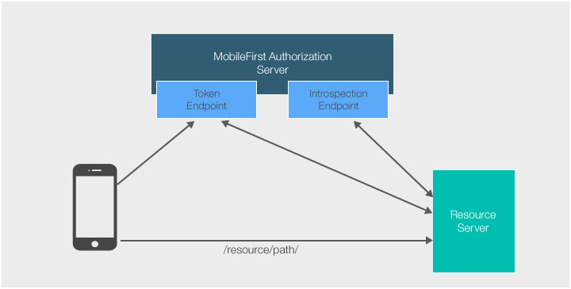
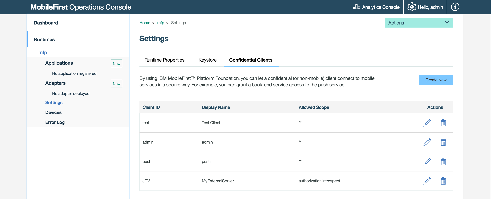

## Overview
While MobileFirst Platform Founation provides the ability to deploy **Adapters** to the MobileFirst Server in order to serve resources, you can also serve resources using your own provided server, using your preferred technology. You can protect and authenticate those **external resources** using the MobileFirst security framework.

This tutorial covers how a **resource server** can validate, and introspect (get token data) about a MobileFirst OAuth token.  
The validation/introspection of the token is done using a RESTful request to the MobileFirst Server's introspection endpoint.

This can either be done entirely with custom code, or using one of MobileFirst Platform Foundation's helper libraries that encapsulate part of the flow.

## Flow

1. An application with the MobileFirst Platform Foundation client SDK makes a resource request call (or any HTTP request) to a protected resource with or without the `Authorization` header (token).
2. The resource server obtains a token for the `authorization.introspect` scope and uses this token as authorization to the introspection endpoint.
3. The resource server takes the authorization token, and validates/introspects the client token.
4. If the MobileFirst Authorization Server determined that the token is invalid (or doesn’t exist), the resource server redirects the client to obtain a new token for the required scope. All of this happens internally when using the MobileFirst Client SDK.

## Confidential Client
For the external resource server to be able to use the `authorization.introspect` scope, the server needs to be registered as a **confidential client** via the MobileFirst Operations Console.  

In the MobileFirst Operations Console, under **Settings** → **Confidential Clients**, add a new entry. Choose a **client ID** and **API secret** value. Make sure to set `authorization.introspect` as the **Allowed Scope**.

Since the introspection endpoint is an internal protected resource, the resource server will need to obtain a token in order to send any data to it. If you attempt to make a request to the introspection endpoint without an authorization header, a 401 response will be returned.

## Implementations
