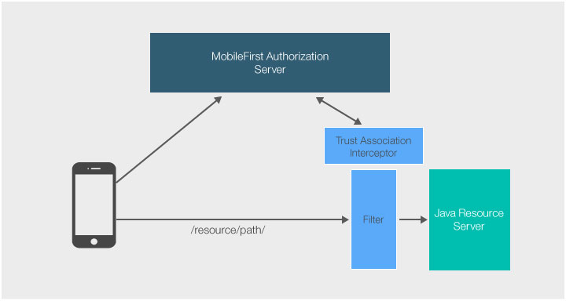

## Overview
MobileFirst Platform Foundation provides a Java library to facilitate the authentication of external resources through [IBM WebSphere's Trust Association Interceptors](https://www.ibm.com/support/knowledgecenter/SSHRKX_8.5.0/mp/security/sec_ws_tai.dita).
  
The Java library is provided as a .jar file (**com.ibm.mfp.oauth.tai-8.0.0.jar**).

This tutorial will show how to protect a simple Java Servlet, `TAI/GetBalance`, using a scope (`accessRestricted`).

**Prerequesite:**

* Make sure to read the [Using the MobileFirst Server to authenticate external resources](../) tutorial.
* Understanding of the [MobileFirst Platform Foundation security framework](../../).



## Server setup

1. Obtain the Java library from Maven Central.  
	Downloading the dependency via a pom:

	```xml
	<dependency>
	  <groupId>com.ibm.mfp</groupId>
	  <artifactId>mfp-oauth-tai</artifactId>
	  <version>8.0.0</version>
	  <classifier>tai</classifier>
	  <type>zip</type>
	</dependency>
	```

	Download directly from the Maven Central [here](http://search.maven.org/#search%7Cga%7C1%7Cibm%20mfp)

    If Internet connectivity is not available while developing, prepare to work offline:  
    1. Make sure you have first installed Apache Maven.
    2. Download the [MobileFirst Platform Foundation Development Kit Installer]({{site.baseurl}}/downloads/).
    3. Start the MobileFirst Server and load the MobileFirst Operations Console.
    4. Click on **Get Starter Code → Tools tab** and download &amp; extract the **mfp-maven-central-artifacts-filter.zip** file from the Adapter tooling section.
    5. Add the filters to the local Maven repository by running the **install.sh** script for Linux and Mac, or the **install.bat** script for Windows.


2. Add the `com.ibm.mfp.oauth.tai-8.0.0.jar` file to the WebSphere application server inside **usr/extension/lib**.

3. Add the `OAuthTai-8.0.mf` file to the WebSphere applicaiton server inside **usr/extension/lib/features**.

### web.xml setup
Add a security constraint and a security role to the `web.xml` file of the WebSphere application server:

```xml
<security-constraint>
   <web-resource-collection>
      <web-resource-name>TrustAssociationInterceptor</web-resource-name>
      <url-pattern>/TAI/GetBalance</url-pattern>
   </web-resource-collection>
   <auth-constraint>
      <role-name>TAIUserRole</role-name>
   </auth-constraint>
</security-constraint>

<security-role id="SecurityRole_TAIUserRole">
   <description>This is the role that MFP OAuthTAI uses to protect the resource, and it is required to be mapped to 'All Authenticated in Application' in WAS and 'ALL_AUTHENTICATED_USERS' in Liberty</description>
   <role-name>TAIUserRole</role-name>
</security-role>
```

### server.xml
Modify the WebSphere application server's `server.xml` file to your external resource.

* Configure the feature manager to include the following features:

    ```xml
    <featureManager>
           <feature>jsp-2.2</feature>
           <feature>appSecurity-2.0</feature>
           <feature>usr:OAuthTai-8.0</feature>
           <feature>servlet-3.0</feature>
           <feature>jndi-1.0</feature>
    </featureManager>
    ```

* Add a security role:

    ```xml
    <application contextRoot="TAI" id="TrustAssociationInterceptor" location="TAI.war" name="TrustAssociationInterceptor"/>
       <application-bnd>
          <security-role name="TAIUserRole">
             <special-subject type="ALL_AUTHENTICATED_USERS"/>
          </security-role>
       </application-bnd>
    </application>
    ```

* Configure OAuthTAI. this is where URLs are set to be protected:

    ```xml
    <usr_OAuthTAI id="myOAuthTAI" authorizationURL="http://localhost:9080/mfp/api" clientId="ExternalResource" clientSecret="password" cacheSize="500">
            <securityConstraint httpMethods="GET POST" scope="accessRestricted" securedURLs="/TAI/GetBalance"></securityConstraint>
    </usr_OAuthTAI>
    ```
    - **authorizationURL**:  Either your MobileFirst Server (`http(s):/your-hostname:port/runtime-name/api`), or an external AZ Server such as IBM DataPower.
    - **clientID**: The Resource server must be a registered confidential client, to learn how to register a confidential client read the [Confidential Clients](../../confidential-clients/) tutorial.
    - **clientSecret**: The Resource server must be a registered confidential client, to learn how to register a confidential client
    - **cacheSize (optional)**: TAI uses the Java-Token-Validator cache to cache tokens and introspection data data as values so that a token that comes in the request from the client won't need to be introspected again in a short time interval.
    	
        The default size is 50,000 tokens.  
        
        If the you want to guarantee that the tokens are introspected on each request you should set cache to 0.  
    
    - **scope**: The resource server authenticates against scope(s). A scope could be a security check or a scope element mapped to security checks.
    
## Sample
You can deploy the project on supported application servers (WebSphere Full profile and WebSphere Liberty profile).  
[Download the simple Java servlet](https://github.com/MobileFirst-Platform-Developer-Center/TrustAssociationInterceptor/tree/release80).

### Sample usage

1. Make sure to [update the confidential client](../#confidential-client) and secret values in the MobileFirst Operations Console.
2. Deploy either of the security checks: **[UserLogin](../../user-authentication/security-check/)** or **[PinCodeAttempts](../../credentials-validation/security-check/)**.
3. Register the matching application.
4. Map the `accessRestricted` scope to the security check.
5. Update the client application to make the `WLResourceRequest` to your servlet URL.
6. Set the scope of your securityConstraint scope to be the security check that your client needs to authenticate against.