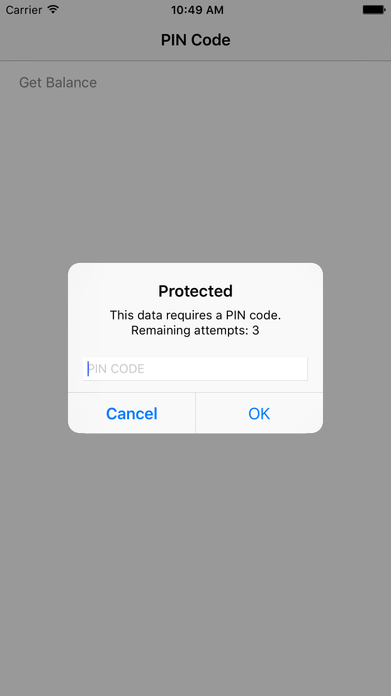
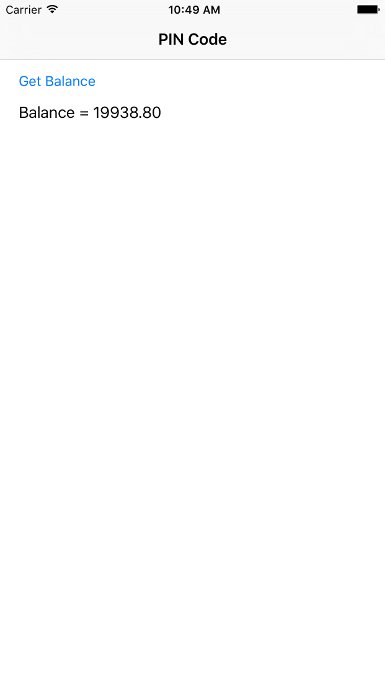

## Overview
When trying to access a protected resource, the server (the `SecurityCheck`) will send back the client one or more **challenges** for the client to handle.

This list is received as a JSON object, listing the `SecurityCheck` name with an optional JSON of additional data:

```json
{
  "challenges": {
    "SomeSecurityCheck1":null,
    "SomeSecurityCheck2":{
      "some property": "some value"
    }
  }
}
```

The client must then register a **challenge handler** for each `SecurityCheck`, which will know how to handle the challenge (eg. show a login screen).

## Creating the challenge handler

A **challenge handler** is a class responsible for handling challenges sent by the MobileFirst server, such as collecting credentials and submitting them back to the `SecurityCheck`.

In this example, the `SecurityCheck` is `PinCodeAttempts` defined in [Implementing Security Check with Attempts Security Adapter](../adapter). The challenge sent by this `SecurityCheck` contains the number of remaining attempts to login (`remainingAttempts`), and an optional `errorMsg`.

Create a Swift class that extends `WLChallengeHandler`:

```swift
class PinCodeChallengeHandler : WLChallengeHandler {

}
```

## Handling the challenge
The minimum requirement from the `WLChallengeHandler` protocol is to implement `handleChallenge(challenge: [NSObject : AnyObject]!)`.
`handleChallenge` receives the challenge JSON as a `Dictionary`. It is responsible for asking the user to provide the credentials.

In this example, an alert is displayed asking to enter the PIN code:

```swift
override func handleChallenge(challenge: [NSObject : AnyObject]!) {
    NSLog("%@",challenge)
    var errorMsg : String
    if challenge["errorMsg"] is NSNull {
        errorMsg = "This data requires a PIN code."
    }
    else{
        errorMsg = challenge["errorMsg"] as! String
    }
    let remainingAttempts = challenge["remainingAttempts"] as! Int

    showPopup(errorMsg,remainingAttempts: remainingAttempts)
}
```

> The implementation of `showPopup` is included in the sample application and not covered here.

If the credentials are incorrect, you can expect the framework to call `handleChallenge` again.

## Submitting the challenge's answer
Once the credentials have been collected from the UI, use `WLChallengeHandler`'s `submitChallengeAnswer(answer: [NSObject : AnyObject]!)` to send an answer back to the `SecurityCheck`. In this example `PinCodeAttempts` expects a property called `pin` containing the submitted PIN code:

```swift
self.submitChallengeAnswer(["pin": pinTextField.text!])
```

## Cancelling the challenge
In some cases, such as clicking a "Cancel" button in the UI, you want to tell the framework to discard this challenge completely.

To achieve this, call:

```swift
self.submitFailure(nil)
```

## Handling failures
Some scenarios may trigger a failure (such as maximum attempts reached). To handle these, implement `WLChallengeHandler`'s `handleFailure(failure: [NSObject : AnyObject]!)`.
The structure of the `Dictionary` passed as a parameter greatly depends on the nature of the failure.

```swift
override func handleFailure(failure: [NSObject : AnyObject]!) {
    if let errorMsg = failure["failure"] as? String {
        showError(errorMsg)
    }
    else{
        showError("Unknown error")
    }
}
```

> The implementation of `showError` is included in the sample application and not covered here.

## Handling successes
In general successes are automatically processed by the framework to allow the rest of your application to continue.

Optionally you can also choose to do something before the framework closes the challenge handler flow, by implementing `WLChallengeHandler`'s `handleSuccess(success: [NSObject : AnyObject]!)`. Here again, the content and structure of the `success` Dictionary depends on what the `SecurityCheck` sends.

In the `PinCodeAttempts` example, the success does not contain any additional data.

## Registering the challenge handler

In order for the challenge handler to listen for the right challenges, you must tell the framework to associate the challenge handler with a specific `SecurityCheck` name.

This is done by initializing the challenge handler with the `SecurityCheck` like this:

```swift
var someChallengeHandler = SomeChallengeHandler(securityCheck: "securityCheckName")
```

You must then **register** the challenge handler instance:

```swift
WLClient.sharedInstance().registerChallengeHandler(someChallengeHandler)
```

In this example, in one line:

```swift
WLClient.sharedInstance().registerChallengeHandler(PinCodeChallengeHandler(securityCheck: "PinCodeAttempts"))
```

## Using the sample application

The sample **PinCodeSwift** is an iOS Swift application that uses `WLResourceRequest` to get a bank balance.

The method is protected with a PIN code, with a maximum of 3 attempts.

1. Deploy **ResourceAdapter**
2. Deploy **PinCodeAttempts**
3. Register the application **PinCodeSwift**
4. In the MobileFirst console, under **Applications** → **PinCodeSwift** → **Security** → **Map scope elements to security checks.**, add a mapping from `accessRestricted` to `PinCodeAttempts`.



