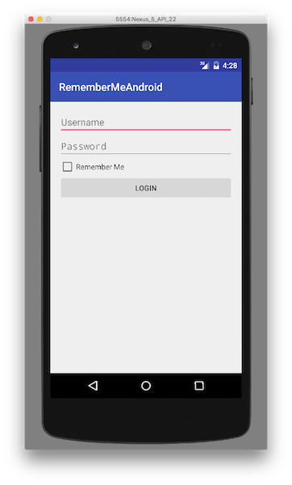
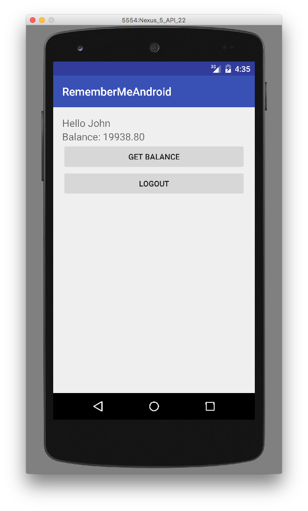

## Overview
**Prerequisite:** This tutorial is a continuation of the **CredentialsValidationSecurityCheck**'s [challenge handler implementation](../../credentials-validation/android) tutorial. Make sure to read it first.

The challenge handler implementation will be modified to fit the `UserLoginSecurityCheck` created in the matching [security check tutorial](../security-check), and will demonstrate a few additional features (APIs) such as the preemptive `login`, `logout` and `obtainAccessToken`.

## Creating the challenge handler
1. Create a Java class that extends `WLChallengeHandler`:

    ```java
    public class UserLoginChallengeHandler extends WLChallengeHandler {

    }
    ```

2. Add a constructor method:

    ```java
    public UserLoginChallengeHandler(String securityCheck) {
        super(securityCheck);
    }
    ```

3. Register the challenge handler:

    ```java
    WLClient client = WLClient.createInstance(this);
    client.registerChallengeHandler(myUserLoginChallengeHandler);
    ```

## Handling the challenge
In this example, the challenge sent by `UserLoginSecurityCheck` is the same one sent by `PinCodeAttempts`: the number of remaining attempts to login (`remainingAttempts`), and an optional `errorMsg`. The `handleChallenge` method is responsible for collecting the username and password from the user.

## Submitting the credentials
Once the credentials have been collected, use the `WLChallengeHandler`'s `submitChallengeAnswer(JSONObject answer)` method to send an answer back to the security check. In this example, `UserLoginSecurityCheck` expects *key:value*s called `username` and `password`. Optionally, it also accepts a boolean `rememberMe` key that will tell the security check to remember this user for a longer period. In the sample application, this is collected using a boolean value from a checkbox in the login form.

`credentials` is a `JSONObject` containing `username`, `password` and `rememberMe`:

```java
submitChallengeAnswer(credentials);
```

You may also want to login a user without any challenge being received. For examples, showing a login screen as the first screen of the application, or showing a login screen after a logout, or a login failure. We call those scenarios **preemptive logins**.

You cannot call the `submitChallengeAnswer` API if there is no challenge to answer. For those scenarios, the MobileFirst Platform Foundation SDK includes a different API:

```java
WLAuthorizationManager.getInstance().login(securityCheckName, credentials, new WLLoginResponseListener() {
    @Override
    public void onSuccess() {
        Log.d(securityCheckName, "Login Preemptive Success");

    }

    @Override
    public void onFailure(WLFailResponse wlFailResponse) {
        Log.d(securityCheckName, "Login Preemptive Failure");
    }
});
```

If the credentials are wrong, the security check will send back a **challenge**.

It is the developer's responsibility to know when to use `login` vs `submitChallengeAnswer` based on the application's needs. One way to achieve this is to define a boolean flag, for example `isChallenged`, and set it to `true` when reaching `handleChallenge` or set it to `false` in any other cases (failure, success, initializing, etc).

When the user clicks the **Login** button, you can dynamically choose which API to use:

```java
public void login(JSONObject credentials){
    if(isChallenged){
        submitChallengeAnswer(credentials);
    }
    else{
        WLAuthorizationManager.getInstance().login(securityCheckName, credentials, new WLLoginResponseListener() {
            @Override
            public void onSuccess() {
                Log.d(securityCheckName, "Login Preemptive Success");

            }

            @Override
            public void onFailure(WLFailResponse wlFailResponse) {
                Log.d(securityCheckName, "Login Preemptive Failure");
            }
        });
    }
}
```

## Obtaining an access token
Since this security check supports *remember me* functionality, it would be useful to check if the user is currently logged in, during the application startup.

The MobileFirst Platform Foundation SDK provides an API to ask the server for a valid token:

```java
WLAuthorizationManager.getInstance().obtainAccessToken(scope, new WLAccessTokenListener() {
    @Override
    public void onSuccess(AccessToken accessToken) {
        Log.d(securityCheckName, "auto login success");
    }

    @Override
    public void onFailure(WLFailResponse wlFailResponse) {
        Log.d(securityCheckName, "auto login failure");
    }
});
```

If the user is already logged-in or is in the *remembered* state, the API will trigger a success. If the user is not logged in, the security check will send back a challenge.

The `obtainAccessToken` API takes in a **scope**. The scope here can be the name of your **security check**.

> Learn more about **scope** here: [Authorization concepts](../../authorization-concepts)

## Handling success and failure
As noted in the **CredentialsValidationSecurityCheck**'s [challenge handler implementation](../../credentials-validation/android) tutorial, `WLChallengeHandler` will call the  `handleSuccess` or `handleFailure` methods upon success or failure of the challenge. You can choose to update your UI based on those events.

> **Notes:**
>
> * `WLAuthorizationManager`'s `login()` API has its own `onSuccess` and `onFailure` methods, the relevant challenge handler's `handleSuccess` or `handleFailure` will **also** be called.
> * `WLAuthorizationManager`'s `obtainAccessToken()` API has its own `onSuccess` and `onFailure` methods, the relevant challenge handler's `handleSuccess` or `handleFailure` will  **also** be called.

### Retrieving the authenticated user
The challenge handler's `handleSuccess` method receives a `JSONObject identity` as a parameter.
If the security check sets an `AuthenticatedUser`, this object will contain the user's properties. You can use `handleSuccess` to save the current user:

```java
@Override
public void handleSuccess(JSONObject identity) {
    super.handleSuccess(identity);
    isChallenged = false;
    try {
        //Save the current user
        SharedPreferences preferences = context.getSharedPreferences(Constants.PREFERENCES_FILE, Context.MODE_PRIVATE);
        SharedPreferences.Editor editor = preferences.edit();
        editor.putString(Constants.PREFERENCES_KEY_USER, identity.getJSONObject("user").toString());
        editor.commit();
    } catch (JSONException e) {
        e.printStackTrace();
    }
}
```

Here, `identity` has a key called `user` which itself contains a `JSONObject` representing the `AuthenticatedUser`:

```json
{
  "user": {
    "id": "john",
    "displayName": "john",
    "authenticatedAt": 1455803338008,
    "authenticatedBy": "UserLoginSecurityCheck"
  }
}
```

## Logout
The MobileFirst Platform Foundation SDK also provides a `logout` API to logout from a specific security check:

```java
WLAuthorizationManager.getInstance().logout(securityCheckName, new WLLogoutResponseListener() {
    @Override
    public void onSuccess() {
        Log.d(securityCheckName, "Logout Success");
    }

    @Override
    public void onFailure(WLFailResponse wlFailResponse) {
        Log.d(securityCheckName, "Logout Failure");
    }
});
```

## Sample applications
There are two samples associated with this tutorial:

- **PreemptiveLoginAndroid**: An application that always starts with a login screen, using the preemptive `login` API.
- **RememberMeAndroid**: An application with a *Remember Me* checkbox. The user can bypass the login screen the next time the application is opened.

Both samples use the same `UserLoginSecurityCheck` from the **SecurityCheckAdapters** adapter Maven project.

[Click to download](https://github.com/MobileFirst-Platform-Developer-Center/SecurityCheckAdapters/tree/release80) the SecurityAdapters Maven project.  
[Click to download](https://github.com/MobileFirst-Platform-Developer-Center/RememberMeAndroid/tree/release80) the Remember Me project.
[Click to download](https://github.com/MobileFirst-Platform-Developer-Center/PreemptiveLoginAndroid/tree/release80) the Remember Me project.

### Sample usage

* Use either Maven or MobileFirst Developer CLI to [build and deploy the available **ResourceAdapter** and **UserLogin** adapters](../../creating-adapters/).
* Ensure the sample is registered in the MobileFirst Server by running the command: `mfpdev app register` from a **command-line** window.
* Map the `accessRestricted` scope to the `UserLogin` security check:
    * In the MobileFirst Operations Console, under **Applications** → **APP_NAME** → **Security** → **Map scope elements to security checks.**, add a mapping from `accessRestricted` to `UserLogin`.
    * Alternatively, from the **Command-line**, navigate to the project's root folder and run the command: `mfpdev app push`.  

        > Learn more about the mfpdev app push/push commands in the [Using MobileFirst Developer CLI to manage MobilefFirst artifacts](../../../using-the-mfpf-sdk/using-mobilefirst-developer-cli-to-manage-mobilefirst-artifacts).



