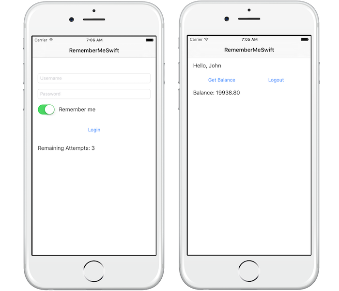

<!-- NLS_CHARSET=UTF-8 -->
## Overview
**Prerequisite:** Make sure to read the **CredentialsValidationSecurityCheck** [challenge handler implementation](../../credentials-validation/ios/) tutorial.

The challenge handler tutorial demonstrates a few additional features (APIs) such as preemptive `login`, `logout`, and `obtainAccessTokenForScope`.

## Login
In this example, `UserLogin` expects *key:value*s called `username` and `password`. Optionally, it also accepts a Boolean `rememberMe` key, which tells the security check to remember this user for a longer period. In the sample application, this is collected by a Boolean value from a checkbox in the login form.

The `credentials` argument is a `JSONObject` containing `username`, `password`, and `rememberMe`:

```swift
self.submitChallengeAnswer(credentials);
```

You might also want to log in a user without any challenge being received. For example, you can show a login screen as the first screen of the application, or show a login screen after a logout or a login failure. Those scenarios are called **preemptive logins**.

You cannot call the `submitChallengeAnswer` API if no challenge to answer. For those scenarios, the MobileFirst Foundation SDK includes the `login` API:

```swift
WLAuthorizationManager.sharedInstance().login(self.securityCheckName, withCredentials: credentials) { (error) -> Void in
  if(error != nil){
    NSLog("Login Preemptive Failure: " + String(error))
  }
  else {
    NSLog("Login Preemptive Success")
  }
}
```

If the credentials are wrong, the security check sends back a **challenge**.

It is the developer's responsibility to know when to use `login`, as opposed to `submitChallengeAnswer`, based on the application's needs. One way to achieve this is to define a Boolean flag, for example `isChallenged`, and set it to `true` when `handleChallenge` is reached, or set it to `false` in any other cases (failure, success, initialization, etc).

When the user clicks the **Login** button, you can dynamically choose which API to use:

```swift
if(!self.isChallenged){
  WLAuthorizationManager.sharedInstance().login(self.securityCheckName, withCredentials: credentials) { (error) -> Void in}
}
else{
  self.submitChallengeAnswer(credentials)
}
```

> **Note:**
> The `WLAuthorizationManager` `login()` API has its own completion handler, the relevant  `handleSuccess` or `handleFailure` methods of the relevant challenge handler ore **also** called.

## Obtaining an access token
Because this security check supports the **RememberMe** functionality (as the`rememberMe` Boolean key), it would be useful to check whether the client is currently logged in when the application starts.

The MobileFirst Foundation SDK provides the `obtainAccessTokenForScope` API to ask the server for a valid token:

```swift
WLAuthorizationManager.sharedInstance().obtainAccessTokenForScope(scope) { (token, error) -> Void in
  if(error != nil){
    NSLog("obtainAccessTokenForScope failed: " + String(error))
  }
  else{
    NSLog("obtainAccessTokenForScope success")
  }
}
```

> **Note:**
> The `WLAuthorizationManager` `obtainAccessTokenForScope()` API has its own completion handler, the `handleSuccess` or `handleFailure` of the relevant challenge handler are **also** called.

If the client is already logged-in or is in the *remembered* state, the API triggers a success. If the client is not logged in, the security check sends back a challenge.

The `obtainAccessTokenForScope` API takes in a **scope**. The scope can be the name of your **security check**.

> Learn more about **scopes** in the [Authorization concepts](../../) tutorial.

## Retrieving the authenticated user
The challenge handler `handleSuccess` method receives a dictionary `success` as a parameter.
If the security check sets an `AuthenticatedUser`, this object contains the user's properties. You can use `handleSuccess` to save the current user:

```swift
override func handleSuccess(success: [NSObject : AnyObject]!) {
  self.isChallenged = false
  self.defaults.setObject(success["user"]!["displayName"]! as! String, forKey: "displayName")
}
```

Here, `success` has a key called `user` which itself contains a dictionary representing the `AuthenticatedUser`:

```json
{
  "user": {
    "id": "john",
    "displayName": "john",
    "authenticatedAt": 1455803338008,
    "authenticatedBy": "UserLogin"
  }
}
```

## Logout
The MobileFirst Foundation SDK also provides a `logout` API to logout from a specific security check:

```swift
WLAuthorizationManager.sharedInstance().logout(self.securityCheckName){ (error) -> Void in
  if(error != nil){
    NSLog("Logout Failure: " + String(error))
  }
}
```

## Sample applications
Two samples are associated with this tutorial:

- **PreemptiveLoginSwift**: An application that always starts with a login screen, using the preemptive `login` API.
- **RememberMeSwift**: An application with a *Remember Me* checkbox. The user can bypass the login screen the next time the application is opened.

Both samples use the same `UserLogin` security check from the **SecurityCheckAdapters** adapter Maven project.

[Click to download](https://github.com/MobileFirst-Platform-Developer-Center/SecurityCheckAdapters/tree/release80) the SecurityCheckAdapters Maven project.  
[Click to download](https://github.com/MobileFirst-Platform-Developer-Center/RememberMeSwift/tree/release80) the Remember Me project.  
[Click to download](https://github.com/MobileFirst-Platform-Developer-Center/PreemptiveLoginSwift/tree/release80) the Preemptive Login project.  

### Sample usage
Follow the sample's README.md file for instructions.  
The username/password for the app must match, i.e. "john"/"john".



