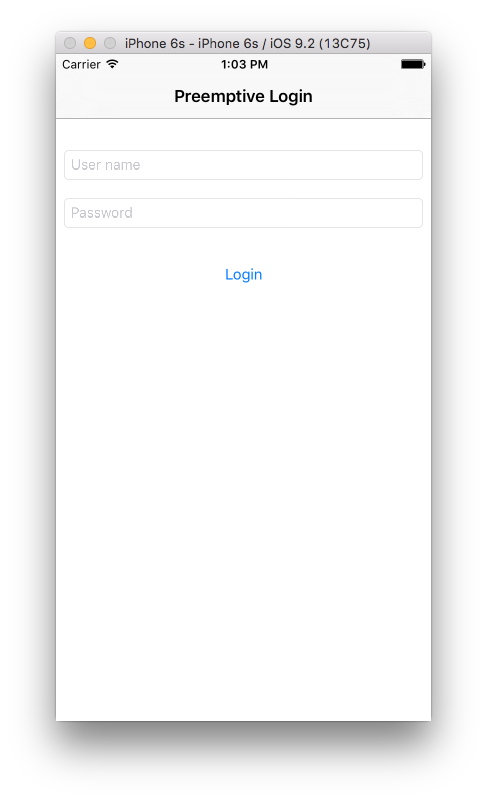
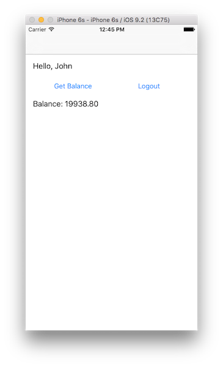

## Overview
**Prerequisite:** Make sure to read the **CredentialsValidationSecurityCheck**'s [challenge handler implementation](../../credentials-validation/ios/) tutorial.

The challenge handler will demonstrate a few additional features (APIs) such as the preemptive `login`, `logout` and `obtainAccessToken`.

## Login
In this example, `UserLoginSecurityCheck` expects *key:value*s called `username` and `password`. Optionally, it also accepts a boolean `rememberMe` key that will tell the security check to remember this user for a longer period. In the sample application, this is collected using a boolean value from a checkbox in the login form.

`credentials` is a `JSONObject` containing `username`, `password` and `rememberMe`:

```swift
self.submitChallengeAnswer(credentials);
```

You may also want to login a user without any challenge being received. For example, showing a login screen as the first screen of the application, or showing a login screen after a logout, or a login failure. We call those scenarios **preemptive logins**.

You cannot call the `submitChallengeAnswer` API if there is no challenge to answer. For those scenarios, the MobileFirst Platform Foundation SDK includes the `login` API:

```swift
WLAuthorizationManager.sharedInstance().login(self.securityCheck, withCredentials: credentials) { (error) -> Void in
  if(error != nil){
    NSLog("Login Preemptive Failure: " + String(error))
  }
  else {
    NSLog("Login Preemptive Success")
  }
}
```

If the credentials are wrong, the security check will send back a **challenge**.

It is the developer's responsibility to know when to use `login` vs `submitChallengeAnswer` based on the application's needs. One way to achieve this is to define a boolean flag, for example `isChallenged`, and set it to `true` when reaching `handleChallenge` or set it to `false` in any other cases (failure, success, initializing, etc).

When the user clicks the **Login** button, you can dynamically choose which API to use:

```swift
if(!self.isChallenged){
  WLAuthorizationManager.sharedInstance().login(self.securityCheck, withCredentials: credentials) { (error) -> Void in}
}
else{
  self.submitChallengeAnswer(credentials)
}
```

> **Note:**
> `WLAuthorizationManager`'s `login()` API has its own `onSuccess` and `onFailure` methods, the relevant challenge handler's `handleSuccess` or `handleFailure` will **also** be called.

## Obtaining an access token
Since this security check supports *remember me* functionality, it would be useful to check if the client is currently logged in, during the application startup.

The MobileFirst Platform Foundation SDK provides the `obtainAccessToken` API to ask the server for a valid token:

```swift
WLAuthorizationManager.sharedInstance().obtainAccessTokenForScope(scope) { (token, error) -> Void in
  if(error != nil){
    NSLog("auto login failure: " + String(error))
  }
  else{
    NSLog("auto login success")
  }
}
```

> **Note:**
> `WLAuthorizationManager`'s `obtainAccessToken()` API has its own `onSuccess` and `onFailure` methods, the relevant challenge handler's `handleSuccess` or `handleFailure` will  **also** be called.

If the client is already logged-in or is in the *remembered* state, the API will trigger a success. If the client is not logged in, the security check will send back a challenge.

The `obtainAccessToken` API takes in a **scope**. The scope can be the name of your **security check**.

> Learn more about **scope** in the [Authorization concepts](../../authorization-concepts) tutorial

## Retrieving the authenticated user
The challenge handler's `handleSuccess` method receives an Dictionary `success` as a parameter.
If the security check sets an `AuthenticatedUser`, this object will contain the user's properties. You can use `handleSuccess` to save the current user:

```swift
override func handleSuccess(success: [NSObject : AnyObject]!) {
  self.isChallenged = false
  self.defaults.setObject(success["user"]!["displayName"]! as! String, forKey: "displayName")
}
```

Here, `success` has a key called `user` which itself contains a Dictionary representing the `AuthenticatedUser`:

```json
{
  "user": {
    "id": "john",
    "displayName": "john",
    "authenticatedAt": 1455803338008,
    "authenticatedBy": "UserLogin"
  }
}
```

## Logout
The MobileFirst Platform Foundation SDK also provides a `logout` API to logout from a specific security check:

```swift
WLAuthorizationManager.sharedInstance().logout(self.securityCheck){ (error) -> Void in
  if(error != nil){
    NSLog("Logout Failure: " + String(error))
  }
}
```

## Sample applications
There are two samples associated with this tutorial:

- **PreemptiveLoginSwift**: An application that always starts with a login screen, using the preemptive `login` API.
- **RememberMeSwift**: An application with a *Remember Me* checkbox. The user can bypass the login screen the next time the application is opened.

Both samples use the same `UserLoginSecurityCheck` from the **SecurityCheckAdapters** adapter Maven project.

[Click to download](https://github.com/MobileFirst-Platform-Developer-Center/SecurityCheckAdapters/tree/release80) the SecurityAdapters Maven project.  
[Click to download](https://github.com/MobileFirst-Platform-Developer-Center/RememberMeSwift/tree/release80) the Remember Me project.
[Click to download](https://github.com/MobileFirst-Platform-Developer-Center/PreemptiveLoginSwift/tree/release80) the Remember Me project.

### Sample usage

* Use either Maven or MobileFirst Developer CLI to [build and deploy the available **ResourceAdapter** and **UserLogin** adapters](../../creating-adapters/).
* Ensure the sample is registered in the MobileFirst Server by running the command: `mfpdev app register` from a **command-line** window.
* Map the `accessRestricted` scope to the `UserLogin` security check:
    * In the MobileFirst Operations Console, under **Applications** → **[your-application]** → **Security** → **Map scope elements to security checks**, add a mapping from `accessRestricted` to `UserLogin`.
    * Alternatively, from the **Command-line**, navigate to the project's root folder and run the command: `mfpdev app push`.  

        > Learn more about the mfpdev app push/push commands in the [Using MobileFirst Developer CLI to manage MobilefFirst artifacts](../../../using-the-mfpf-sdk/using-mobilefirst-developer-cli-to-manage-mobilefirst-artifacts).

<div style="text-align:center">
    
</div>
