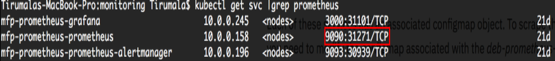
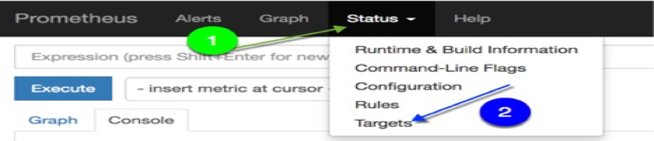
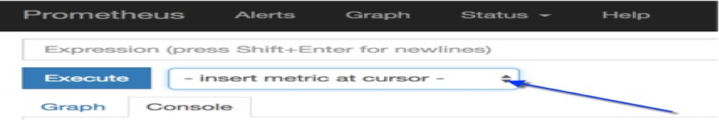
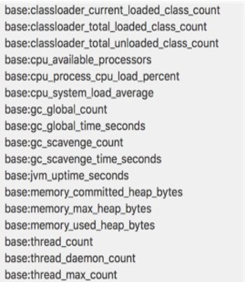

<!-- NLS_CHARSET=UTF-8 -->
## Overview
{: #overview }

This tutorial outlines how to integrate **Prometheus** to monitor Mobile Foundation running on IBM Cloud Private.

IBM Mobile Foundation provides monitoring capability by enabling `mpMetrics-1.0` feature to monitor Mobile Foundation Server, Analytics and Application Center that are instrumented with the *MicroProfile metrics* API. This helps to monitor the JVM and system level metrics of your Mobile Foundation containers deployed on ICP.

The default response formats to `/metrics` API request is a text format, which is compatible with **Prometheus**.


## Procedure
{: #procedure}

Complete the steps below to set up the monitoring of Mobile Foundation on {{ site.data.keys.prod_icp }}.

### Step 1: Deploy the IBM Monitoring service
a.  Deploy the Monitoring service from {{ site.data.keys.prod_icp }} catalog.<br/>
b.  Go to **Catalog** , select **ibm-icpmonitoring** helm chart and install. The helm chart will get installed in your {{ site.data.keys.prod_icp }}.<br/>
    

### Step 2: Update **Prometheus** *configmap* configuration

Run the following command, from a properly sourced terminal, which is a CLI instance having the contextual configuration information of the ICP cluster:<br/>
```bash
kubectl get svc | grep prometheus
```
<br/>
You will see a number of services getting deployed by the `ibm-icpmonitoring` chart. In this tutorial, we will focus on and use the service named `<name used for the helm release>-promethues` (mfp-prometheus-prometheus), as shown in the screenshot below:<br/>


<br/>
Each of these services has an associated *configmap* object. To get the metrics data of the Mobile Foundation pods, you need to modify the *configmap* associated with the **mfp-prometheus-prometheus** service by adding the `mfpfserver` annotation for Mobile Foundation server, `mfpfanalytics` annotation for Analytics and `mfpfappcenter` annotation for Application Center to the service deployment, along with a few other attributes.<br/>
The simplest way to achieve this is to edit the intended *configmap* object from a sourced terminal using the command below:<br/>
```bash
  kubectl edit configmap mfp-prometheus-prometheus
  ```
<br/>
This command will bring up the requested YAML file in the vi editor.  Scroll down to the end of the file and insert the text below, just before the line `kind: ConfigMap`.

Mobile Foundation server Metrics configuration, YAML snippet below:<br/>

```yaml
# Configuration for MFP Server Monitoring
- job_name: 'mfpf-server'
scheme: 'https'
basic_auth:
  username: 'mfpRESTUser'
  password: 'mpadmin'
tls_config:
  insecure_skip_verify: true
kubernetes_sd_configs:
  - role: endpoints
relabel_configs:
  - source_labels: [__meta_kubernetes_service_annotation_mfpfserver]
    action: keep
    regex: true
  - source_labels: [__address__, __meta_kubernetes_service_annotation_prometheus_io_port]
    action: replace
    target_label: __address__
    regex: (.+)(?::\d+);(\d+)
    replacement: $1:$2
  - action: labelmap
    regex: __meta_kubernetes_service_label_(.+)
```    
<br/>

Configuration for Mobile Foundation server health check monitoring,YAML snippet below:<br/>

```yaml
# Configuration for MFP Health check  Monitoring<br/>
- job_name: 'mfp-healthcheck'
metrics_path: /mfpadmin/management-apis/2.0/diagnostic/healthCheck
scheme: 'https'
basic_auth:
  username: 'admin'
  password: 'admin'
tls_config:
  insecure_skip_verify: true
kubernetes_sd_configs:
  - role: endpoints
relabel_configs:
  - source_labels: [__meta_kubernetes_service_annotation_mfpfserver]
    action: keep
    regex: true
  - source_labels: [__address__, __meta_kubernetes_service_annotation_prometheus_io_port]
    action: replace
    target_label: __address__
    regex: (.+)(?::\d+);(\d+)
    replacement: $1:$2
  - action: labelmap
    regex: __meta_kubernetes_service_label_(.+)
```
<br/>
> **Note:** Mobile Foundation Analytics and Application Center deployments follow the similar Metrics configuration.

Value of *job_name* and *source_labels* changes as described earlier.
  
### Step 3: Reload **Prometheus** configuration after updating the jobs
Execute the curl command below:<br/>
```cURL
curl -s -XPOST http://<ip address of the proxy node>:31271/-/reload
```
<br/>


### Step 4: Monitoring the Mobile Foundation statistics

a. Browse to the **Prometheus** console from a browser using the URL: <br/>
```
http://<ip address of the Proxy Node>:31271
```
b. In the **Prometheus** console, first click on **Status** and then select **Targets** from the drop-down as shown in the screenshot below:<br/>
  
c. You should see all the **Targets** whose statistics is being obtained by Prometheus.<br/>
  <br/>
  
<br/>
  This screenshot above clearly shows the Mobile Foundation Server, Analytics and Application Center **Targets**. Refer to the value of *job_name* attribute of the *configmap* YAML file shown in step 2.<br/>
  We scaled up our deployment sample to two replicas, and which is why **Prometheus** shows two endpoints getting scraped for Server.<br/>

  If you click on **Graph** in the **Prometheus** console and in the subsequent panel, click the **insert metric at cursor** as shown in screenshot below:<br/>
  

  You will see a number of metrics that can be monitored by the present **Prometheus** configuration. Among the metrics in the long list, the metric names starting with **base:** are from the Mobile Foundation containers contributed by the `mpMetrics-1.0` feature.<br/>
  

  Selecting any Liberty metric (eg: **base:thread_count**), you can see the values from both the Mobile foundation Server pods in the Prometheus graph, as shown in screenshot below:<br/>
  

  You can explore other relevant metrics in **Prometheus** in graphical as well as in numeric form by clicking **Console**.<br/>
  You can also scale your deployments. Within a short period of time the number of endpoints in the Prometheus console will match the number of replicas.  <br/>

  >**Note:** Though we have used clear text for password in the *configmap* file of Prometheus, Prometheus will not display the password when its configuration is viewed in the Prometheus panel.

### Step 5: View Metrics on **Grafana** dashboard
Mobile Foundation helm charts contains sample Grafana dashboard json files, Monitoring service deployed in step 1 has Grafana in place.<br/>

Importing a Grafana dashboard from a JSON file is as below:<br/>

* Launch Grafana from the deployed monitoring service.<br/>
  <b>Workloads -> Helm releases -> `<name used for the helm release>`(ex: mfp-prometheus) ->Launch)</b>

* Download the JSON dashboard file from [GitHub](https://github.ibm.com/IBMPrivateCloud/charts/tree/master/stable/ibm-mfpf-server-prod/additionalFiles/ibm-mfpf-server-prod-grafanadashboard.json) to your local workstation.   <br/>

* Click the *Home* button in the Grafana interface, then click **Import Dashboard**.<br/>

* Click the **Upload .json file** button and select the Grafana dashboard JSON file from your local filesystem.<br/>

* Select **prometheus** from the **Select a data source** menu, if it is not already selected.<br/>

* Click **Import**.<br/>

Sample Monitoring Dashboard for Mobile Foundation Server is shown in the screenshot below:<br/>


