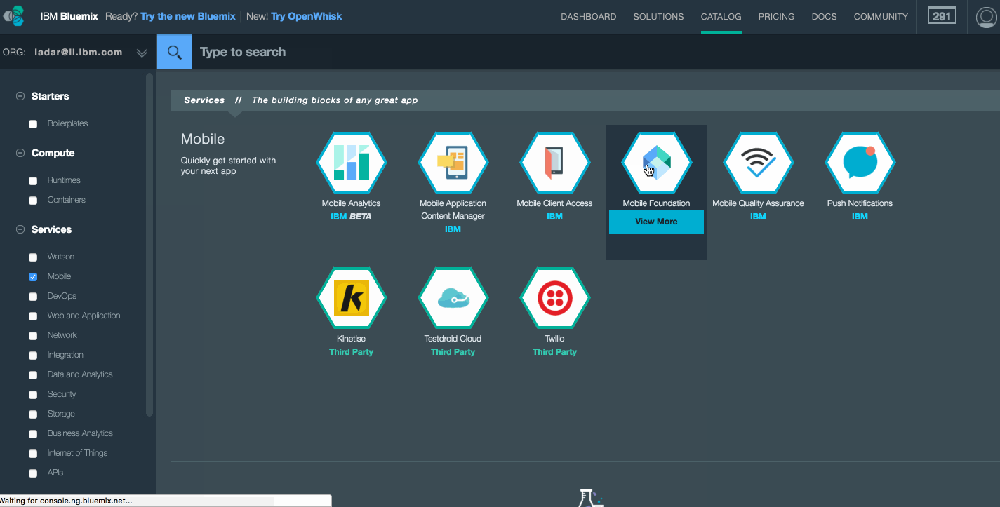
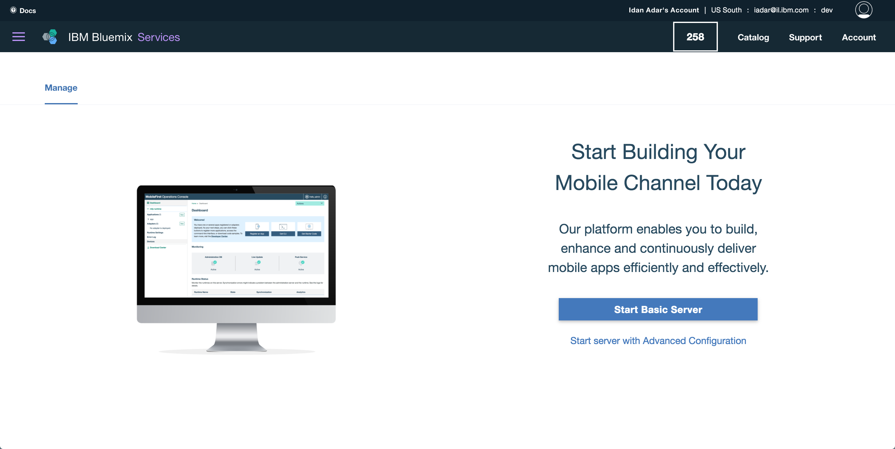
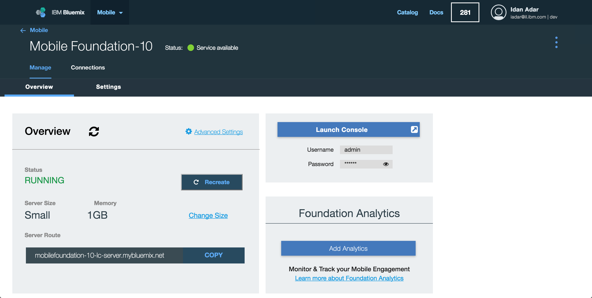
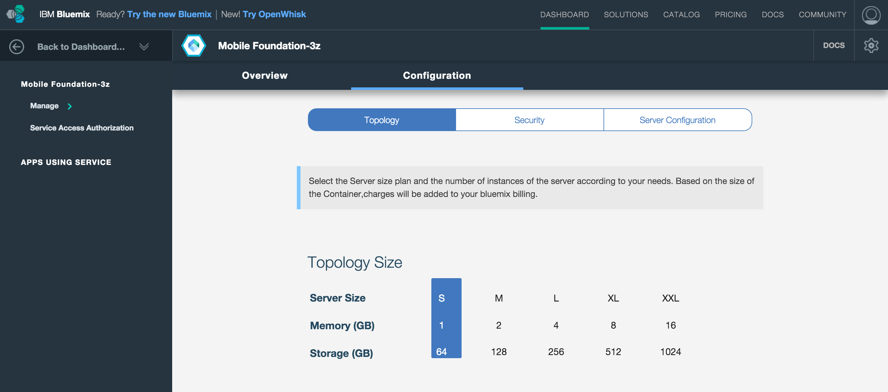
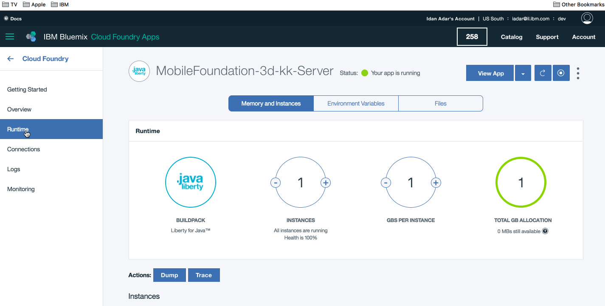

<!-- NLS_CHARSET=UTF-8 -->
## Overview
{: #overview }
This tutorial provides step-by-step instructions to set up a {{ site.data.keys.mf_server }} instance on IBM Cloud by using the {{ site.data.keys.mf_bm_full }} (**{{ site.data.keys.mf_bm_short }}**) service.  
{{ site.data.keys.mf_bm_short }} is a IBM Cloud service that enables quick and easy stand-up of scalable Developer or Production environments of Mobile Foundation v8.0 on **Liberty for Java runtime**.

The {{ site.data.keys.mf_bm_short }} service offers the following plan options:

1. **Developer**: This plan provisions a {{ site.data.keys.mf_server }} as a Cloud Foundry application on a Liberty for Java runtime. Liberty for Java charges are billed separately and are not included in this plan. The plan does not support the use of external databases and is restricted to development and testing. The {{ site.data.keys.mf_bm_short }} server *Developer plan* instance allows you to register any number of Mobile applications for development and testing, but it restricts the number of connected devices to 10 per day. This plan also includes {{ site.data.keys.mf_analytics_service }} service instance. If your usage exceeds the Mobile Analytics free tier entitlements, then charges apply as per Mobile Analytics basic plan.

    > **Note:** the Developer plan does not offer a persistent database, as such be sure to backup your configuration as explained [in the Troubleshooting section](#troubleshooting).

2. **Professional Per Device**: This plan allows users to build, test and run mobile applications in production. You are billed based on the number of client devices connected per day. This plan supports large deployments and high availability. This plan requires you to have an instance of IBM Db2 on Cloud service, which is created and billed separately. This plan provisions a Mobile Foundation server on Liberty for Java, starting with a minimum of 2 nodes of 1 GB. Liberty for Java charges are billed separately and are not included as part of this plan. Optionally, you can add  Mobile Analytics service instance. The Mobile Analytics service is billed separately.

3. **Professional 1 Application**: This plan allows users to build and manage a single mobile application with a predictable price, regardless of the number of mobile app users or devices. The single mobile application can be of multiple flavors, such as iOS, Android, Windows and Mobile Web. This plan provisions a Mobile Foundation server in a scalable environment as a Cloud Foundry application on Liberty for Java starting with a minimum of 2 nodes of 1 GB. Liberty for Java charges are billed separately and are not included as part of this plan. This plan also requires an IBM Db2 on Cloud service instance, which is created and billed separately. Optionally, you can add {{ site.data.keys.mf_analytics_service }} service instance by clicking the **Add Analytics** button. The Mobile Analytics service is billed separately.

4. **Developer Pro**: This plan provisions a {{ site.data.keys.mf_server }} as a Cloud Foundry app on a Liberty for Java runtime, and allows users to develop and test any number of mobile applications. This plan requires you to have a **Db2 on Cloud** service instance. The Db2 on Cloud service instance is created and billed separately. This plan is limited in size and is intended to be used for team-based development and testing activities, not production. Charges depend on the total size of your environment. Optionally, you can add a {{ site.data.keys.mf_analytics_service }} service by clicking the **Add Analytics** button.
>_The **Developer Pro** plan is now deprecated._

5. **Professional Per Capacity:** This plan allows users to build, test and run any number of mobile applications in production, regardless of the number of mobile users or devices. It supports large deployments and High Availability. The plan requires you to have a **Db2 on Cloud** service instance. The Db2 on Cloud service instance is created and billed separately. Charges depend on the total size of your environment. Optionally, you can add a {{ site.data.keys.mf_analytics_service }} service by clicking the **Add Analytics** button.
>_The **Professional Per Capacity** plan is now deprecated._

> [See the service details](https://console.bluemix.net/catalog/services/mobile-foundation/) for more information about the available plans and their billing.

#### Jump to:
{: #jump-to}
* [Setting up the {{ site.data.keys.mf_bm_short }} service](#setting-up-the-mobile-foundation-service)
* [Using the {{ site.data.keys.mf_bm_short }} service](#using-the-mobile-foundation-service)
* [Server configuration](#server-configuration)
* [Advanced server configuration](#advanced-server-configuration)
* [Adding Analytics support](#adding-analytics-support)
* [Removing Analytics support](#removing-analytics-support)
* [Switching from Analytics deployed with IBM Containers to Analytics service](#switching-from-analytics-container-to-analytics-service)
* [Applying {{ site.data.keys.mf_server }} fixes](#applying-mobilefirst-server-fixes)
* [Accessing server logs](#accessing-server-logs)
* [Troubleshooting](#troubleshooting)
* [Further reading](#further-reading)

## Setting up the {{ site.data.keys.mf_bm_short }} service
{: #setting-up-the-mobile-foundation-service }
To set up the available plans, first follow these steps:

1. Go to [bluemix.net](http://bluemix.net), login, and click on **Catalog**.
2. Search for **Mobile Foundation** and click on the resulting tile option.
3. *Optional*. Enter a custom name for the service instance, or use the default provided name.
4. Select the desired pricing plan, then click **Create**.

    

### Setting up the *developer* plan
{: #setting-up-the-developer-plan }

Creating the {{ site.data.keys.mf_bm_short }} service creates the {{ site.data.keys.mf_server }}.
  * You can instantly access and work with the {{ site.data.keys.mf_server }}.
  * To access the {{ site.data.keys.mf_server }} using CLI you will need the credentials, which are available when you click **Service credentials** available in the left navigation panel of the IBM Cloud console.

  

### Setting up the *Developer Pro*, *Professional Per Capacity* and *Professional 1 Application* plans
{: #setting-up-the-developer-pro-professional-percapacity-and-professional-1-application-plans }
1. These plans require an external [dashDB transactional database instance](https://console.ng.bluemix.net/catalog/services/dashdb/).

    > Learn more about [setting up a dashDB database instance]({{site.baseurl}}/blog/2016/11/02/using-dashdb-service-with-mobile-foundation/).

    If you have an existing dashDB service instance (DashDB Enterprise Transactional 2.8.500 or Enterprise Transactional 12.128.1400), select the **Use Existing Service** option, and provide your credentials:

    

    1.b. If you do not currently have a dashDB service instance, select the **Create New Service** option and follow the on-screen instructions:

    

2. Start the {{ site.data.keys.mf_server }}.
    - You can either keep the server configuration at its basic level and click on **Start Basic Server**, or
    - Update the server configuration in the [Settings tab](#advanced-server-configuration), and click on **Start advanced server**.

    During this step a Cloud Foundry app is generated for the {{ site.data.keys.mf_bm_short }} service, and the MobileFirst Foundation environment is being initialized. This step can take between 5 to 10 minutes.

3. With the instance ready, you can now [use the service](#using-the-mobile-foundation-service).

    

## Using the {{ site.data.keys.mf_bm_short }} service
{: #using-the-mobile-foundation-service }

With the {{ site.data.keys.mf_server }} now running, you are presented with the following Dashboard:



Click on **Add Analytics** to add {{ site.data.keys.mf_analytics_service }} support to your server instance.
Learn more in the [Adding Analytics support](#adding-analytics-support) section.

Click on **Launch Console** to open the {{ site.data.keys.mf_console }}. The default user name is "admin" and the password can be revealed by clicking on the "eye" icon.


### Server configuration
{: #server-configuration }
The basic server instance consists of:

* A single node (server size: "small")
* 1GB memory
* 2GB storage capacity

### Advanced server configuration
{: #advanced-server-configuration }
Through the **Settings** tab, you can further customize the server instance with

* Varying node, memory, and storage combinations
* {{ site.data.keys.mf_console }} admin password
* LTPA keys
* JNDI configuration
* User registry
* TrustStore
* {{ site.data.keys.mf_analytics_service }} configuration
* DashDB Enterprise Transactional 2.8.500 or Enterprise Transactional 12.128.1400 database selection (available in the *Professional 1 Application* plan)
* VPN



## Adding {{ site.data.keys.mf_analytics_service }} support
{: #adding-analytics-support }
You can add {{ site.data.keys.mf_analytics_service }} support to your {{ site.data.keys.mf_bm_short }} service instance by clicking on **Add Analytics** from the service's Dashboard page. This action provisions a {{ site.data.keys.mf_analytics_service }} service instance.

>When you create or recreate the **Developer** plan instance of {{ site.data.keys.mf_bm_short }} service, the {{ site.data.keys.mf_analytics_service }} service instance is added by default.

<!--* When using the **Developer** plan this action will also automatically hook the {{ site.data.keys.mf_analytics_service }} service instance to your {{ site.data.keys.mf_server }} instance.  
* When using the **Developer Pro**, **Professional Per Capacity** or **Professional 1 Application** plans, this action will require additional input from you to select: amount of available Nodes, available Memory and a storage volume. -->

Once the operation finishes, reload the {{ site.data.keys.mf_console }} page in your browser to access the {{ site.data.keys.mf_analytics_service_console }}.  

> Learn more about {{ site.data.keys.mf_analytics_service }} in the [{{ site.data.keys.mf_analytics_service }} category](../../analytics).

##  Removing {{ site.data.keys.mf_analytics_service }} support
{: #removing-analytics-support}

You can remove the {{ site.data.keys.mf_analytics_service }} support for your {{ site.data.keys.mf_bm_short }} service instance by clicking on **Delete Analytics**  from the service’s Dashboard page. This action deletes the {{ site.data.keys.mf_analytics_service }} service instance.

Once the operation finishes, reload the {{ site.data.keys.mf_console }} page in your browser.

##  Switching from Analytics deployed with IBM Containers to Analytics service
{: #switching-from-analytics-container-to-analytics-service}

>**Note**: Deleting {{ site.data.keys.mf_analytics_service }} will remove all available analytics data. This data will not be available in the new {{ site.data.keys.mf_analytics_service }} instance.

User can delete current container by clicking on **Delete Analytics** button from service dashboard. This will remove the analytics instance and enable the **Add Analytics** button, which the user can click to add a new {{ site.data.keys.mf_analytics_service }} service instance.

## Applying {{ site.data.keys.mf_server }} fixes
{: #applying-mobilefirst-server-fixes }
Updates to the {{ site.data.keys.mf_bm }} services are applied automatically without a need for human intervention, other than agreeing to perform the update. When an update is available, a banner is displayed in the service's Dashboard page with instructions and action buttons.

## Accessing server logs
{: #accessing-server-logs }
To access server logs, follow the steps described below.

**Scenario 1:**

1. Set up your host machine.<br/>
   To manage the IBM Cloud Cloud Foundry app, you need to install the Cloud Foundry CLI.<br/>
   Install the [Cloud Foundry CLI](https://github.com/cloudfoundry/cli/releases).
2. Open the terminal and log in to your *Organization* and *Space* using `cf login`.
3. Execute the following command in the CLI:
```bash
  cf ssh <mfp_Appname> -c "/bin/cat logs/messages.log" > messages.log
```
4. Only if trace is enabled, execute the following command:
```bash
cf ssh <mfp_Appname> -c "/bin/cat logs/trace.log" > trace.log
 ```

**Scenario 2:**      

* To access server logs, open the sidebar navigation and click on **Apps → Dashboard → Cloud Foundry Apps**.
* Select your App and click on **Logs → View in Kibana**.
* Select and copy the logs messages.


#### Tracing
{: #tracing }
To enable tracing, in order to view DEBUG-level messages in the **trace.log** file:

1. In **Runtime → SSH**, select your service instance from the combobox (instance IDs start with **0**).
2. Go to each instance in the console and open the file `/home/vcap/app/wlp/usr/servers/mfp/configDropins/overrides/tracespec.xml` using the vi editor.
3. Update the following trace statement: `traceSpecification="=info:com.ibm.mfp.*=all"` and save the file.

The **trace.log** file is now available in the above specified location.



## Troubleshooting
{: #troubleshooting }
The Developer plan does not offer a persistent database, which could cause at times loss of data. To quickly onboard in such cases, be sure to follow these best practices:

* Every time you make any of the following server-side actions:
    * Deploy an adapter or update any adapter configuration or property value
    * Perform any security configuration such scope-mapping and alike

    Run the following from the command-line to download your configuration to a .zip file:

  ```bash
  $curl -X GET -u admin:admin -o export.zip http://<App Name>.mybluemix.net/mfpadmin/management-apis/2.0/runtimes/mfp/export/all
  ```

* In case you recreate your server or lose your configuration, run the following from the command-line to import the configuration to the server:

  ```bash
  $curl -X POST -u admin:admin -F file=@./export.zip http://<App Name>.mybluemix.net/mfpadmin/management-apis/2.0/runtimes/mfp/deploy/multi
  ```

## Further reading
{: #further-reading }
Now that the {{ site.data.keys.mf_server }} instance is up and running,

* Familiarize yourself with the [{{ site.data.keys.mf_console }}](../../product-overview/components/console).
* Experience MobileFirst Foundation with these [Quick Start tutorials](../../quick-start).
* Read through all [available tutorials](../../all-tutorials/).
