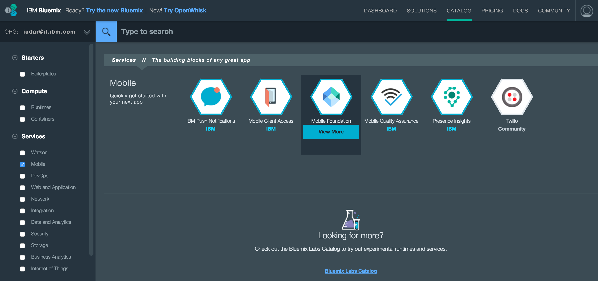
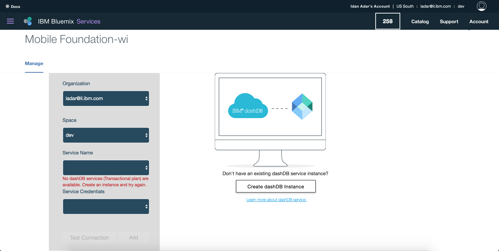

## Overview
This tutorial provides step-by-step instructions to set up a MobileFirst Server instance on Bluemix by using the **Mobile Foundation** service.  
Mobile Foundation is a **Bluemix service** that enables quick and easy stand-up of scalable Developer or Production environments of MobileFirst Foundation v8.0 on **Liberty for Java runtime**.

The Mobile Foundation service offers two plan options:

1. **Developer**: This plan provisions a Mobile Foundation server as a Cloud Foundry app on a Liberty for Java runtime. The plan does not support the use of external databases or define multiple nodes *and is restricted to development and testing only*. The server instance allows you to register any number of Mobile application for development and testing.
2. **Professional 1 Application**: This plan provisions a Mobile Foundation server in a scalable Cloud Foundry app on a Liberty for Java runtime. The plan also requires a database service, which is created and billed separately. The plan allows users to build and manage a single mobile application. A single mobile application can consist of multiple flavors, such as iOS, Android, Windows, and Mobile Web.

> [See the service page on Bluemix.net](https://console.ng.bluemix.net/catalog/services/mobile-foundation/) for more information regarding billing.

#### Jump to:

* [Setting up the Mobile Foundation Service](#setting-up-the-mobile-foundation-service)
* [Using the Mobile Foundation Service](#using-the-mobile-foundation-service)
* [Server configuration](#server-configuration)
* [Advanced server configuration](#advanced-server-configuration)
* [Adding Analytics support](#adding-analytics-support)
* [Applying MobileFirst Server Fixes ](#applying-mobilefirst-server-fixes)
* [Further reading](#further-reading)

## Setting up the Mobile Foundation Service
To set up the available plans, first follow these steps:

1. Load [bluemix.net](http://bluemix.net) and visit the **Catalog** page.

2. From the left sidebar, tick the **Mobile** checkbox under **Services**. Then, click on the **Mobile Foundation** tile to begin the service creation process.

    

3. Select a **space** to use and optionally set a **Service name**.
4. Select the desired plan option, then click **Create**.

### Setting up the *developer* plan

1. Start the MobileFirst Server.
    - You can either keep the server configuration at its basic level and click on **Start Basic Server**, or
    - Update the server configuration in the [Configuration tab](#advanced-server-configuration), and click on **Start advanced server**.

    During this step a Cloud Foundry app is generated for the Mobile Foundation service, and the MobileFirst Foundation environment is being initialized. This takes between 5 to 10 minutes.

    

### Setting up the *Professional 1 Application* plan

1. The plan requires an external [dashDB transactional database instance](https://console.ng.bluemix.net/catalog/services/dashdb/). After you have set up your dashDB *Transactional plan* instance (DashDB Enterprise Transactional 2.8.500 or Enterprise Transactional 12.128.1400), select your credentials in the plan entry page:

    

3. Start the MobileFirst Server.
    - You can either keep the server configuration at its basic level and click on **Start Basic Server**, or
    - Update the server configuration in the [Configuration tab](#advanced-server-configuration), and click on **Start advanced server**.

    During this step a Cloud Foundry app is generated for the Mobile Foundation service, and the MobileFirst Foundation environment is being initialized. This takes between 5 to 10 minutes.

    

## Using the Mobile Foundation Service
With the MobileFirst Server now running, you are presented with the following Dashboard:

Click on **Add Analytics** to add MobileFirst Foundation Operational Analytics support to your server instance.
Learn more in the [Adding Analytics support](#adding-analytics-support) section.

Click on **Launch Console** to open the MobileFirst Operations Console.  The default user name is "admin" and the password can be revealed by clicking on the "eye" icon.

### Server configuration
The basic server instance consists of:

* A single node (server size: "small")
* 1GB memory
* 2GB storage capacity

### Advanced server configuration
Through the **Configuration** tab, you can further customize the server instance with:

* Varying node, memory, and storage combinations
* MobileFirst Operations Console admin password
* LTPA keys
* JNDI configuration
* User registry
* TrustStore
* Operational Analytics configuration
* DashDB Enterprise Transactional 2.8.500 or Enterprise Transactional 12.128.1400 database selection (available in the *Professional 1 Application* plan)
* VPN

## Adding Analytics support
You can add MobileFirst Foundation Operational Analytics support to your Mobile Foundation service instance by clicking on **Add Analytics** from the service's Dashboard page.  
This action provisions an IBM Container with an instance of MobileFirst Foundation Operational Analytics server.

When using the **Developer** plan this action will also automatically hook the Analytics service instance to your MobileFirst Server instance.  
When using the **Proffessional 1 Application** plan this action will require additional input from you to select: amount of available Nodes, available Memory and a storage volume.

Once the operation finishes, reload the MobileFirst Operations Console page in your browser to access the Analytics console.  

> Learn more about analytics in the [MobileFirst Operational Analytics category](../../analytics).

## Applying MobileFirst Server Fixes
Updates to the Mobile Foundation Bluemix services are applied automatically without a need for human interverntion, other than agreeing to perform the update.  
When an update is availabe, a banner is displayed in the service's Dashboard page with instructions and action buttons.

## Further reading
Now that the MobileFirst Server instance is up and running:

* Familiarize with the [MobileFirst Operations Console](../../setting-up-your-development-environment/console).
* Experience MobileFirst Foundation with these [Quick Start tutorials](../../quick-start).
* Read through all [available tutorials](../../all-tutorials/).
