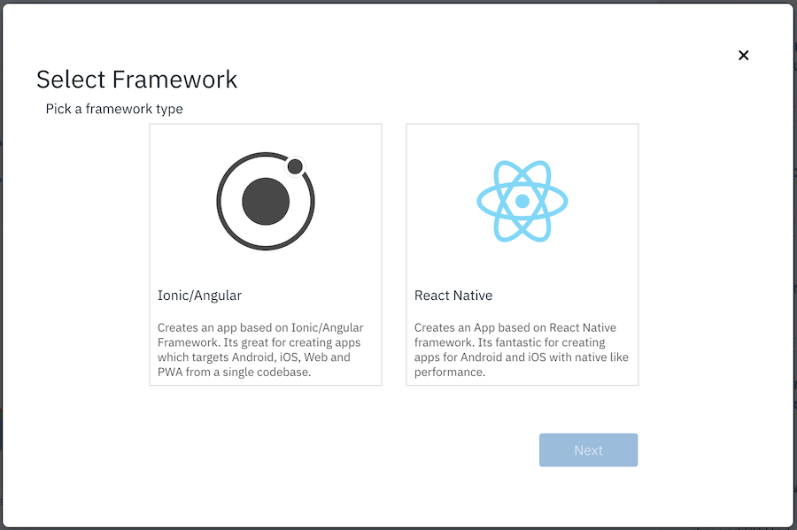
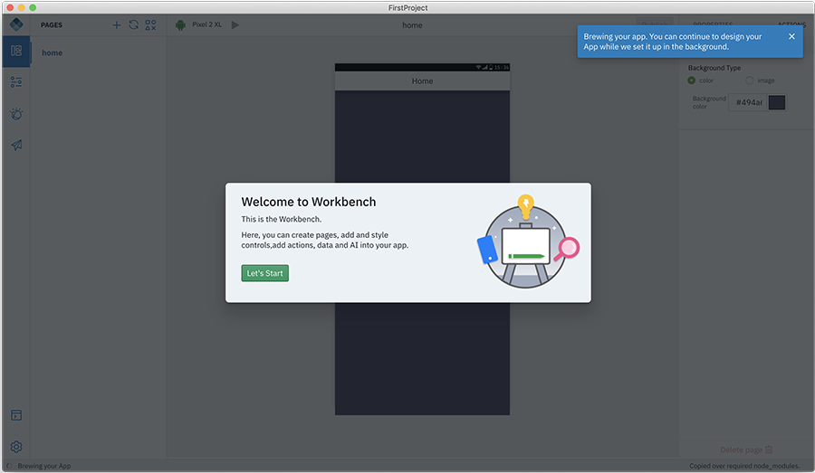

<!-- NLS_CHARSET=UTF-8 -->
## Overview
{: #getting-started }

Launch the Digital App Builder from:

* In **MacOS**, double click the **IBM Digital App Builder icon** to open the Digital App Builder.
* In **Windows**, launch the Digital App Builder by selecting **Start > Programs > IBM Digital App Builder**.

>**Note**: If the Digital App Builder is opened for the first time, **Accept** the **License to use IBM Digital App Builder** in the flash screen to proceed further. After accepting the license agreement, the **Prerequisites Check** runs automatically for the first time. Click **OK** to proceed, if no errors found otherwise fix the errors and then restart the Digital App Builder.

**Create new app** or **Open an app** or use the available Templates to further build the app.
>**Note**: Recently created apps will be displayed under **Recent** section. For new installation, **Recent** section will not be displayed.

## Create new app
{: #create-new-app }

>**Note**: Create new app in two modes: **Design** mode - helps to design the app by drag-and-drop method and **Code** mode - helps to disign the app in code editor mode.

Creating a new app supports two frameworks, Ionic/Angular and React Native.

Follow the steps below to create a new app.

1. Choose the framework for your app.

   

   For either of the supported frameworks, you can choose the target platforms in the subsequent step. Additional platforms can be added to the project at a later time from the settings.

   >**Note**: Projects built using the Ionic framework can be chosen to work in the **Design** or **Code** mode. However, projects built using the React Native framework will only work in the **Code** mode.

2. Click **Create new app** icon from the Builder dashboard. This will display the **Select Channel** window.

    

3. Select the channel for which you want to develop the app, by clicking the respective icon. You can later add more channels to the same app.

    * **Android**: Select this option if you are creating an android app.
    * **iOS**: Select this option if you are creating an iOS app.
        >**Note**: You can build and run the iOS apps only on MacOS.
    * **Web**: Select this option if you are creating the app for the Web.
    * **PWA**: Select this option if you are creating a Progressive Web App.

4. Once the integrated development server is up and running, the server details gets automatically fetched. In the event of the development server not running, you can connect to your own IBM Mobile Foundation server instance either created on IBM Cloud or local.

    In the **Configure IBM Mobile Foundation instance** window you can either select an existing server or create a new server.

    >**Note**: To easily get an instance of Mobile Foundation Server, you can provision it on IBM Cloud. You can refer to the documentation on how to provision and use the Mobile Foundation Server on IBM Cloud [here](https://cloud.ibm.com/docs/services/mobilefoundation?topic=mobilefoundation-getting-started).

    

    The **Configure IBM Mobile Foundation instance** window displays the list of Mobile Foundation server instances you have defined previously. On selecting the server, the **Server URL**, **Admin username**, **Admin password**, is displayed. To define a new server, you can click **Create new server** link. This will display the new **Configure IBM Mobile Foundation instance** window.

    

    * Enter the new IBM Mobile Foundation instance details, like **Server name**, **Server URL**, **Admin username**, **Admin password**.
        >**Note**: You can get the server url and login credentials from the Mobile Foundation server dashboard for the selected server instance.
    * Optionally, provide a **Username** (Confidential client username) and **Admin password**, for previewing the data in the Data viewer.
    * Click **Connect**.

5. On successful login/connect, the **Create App** window is displayed where you can select an existing app definition that you may have created or create a new one by entering the details.
    * For a new app:
        * Provide the **Name** of the application, **Location** where the project files will be stored, **Project/Bundle Id**, and **Version** of the application.

            

        * Click **Create** to create the application. This displays the **Select Mode** windows.

            

        * Select the Design or Code mode and click **Get started**.
            * Design mode - enables you to create the app by dragging and dropping controls to a canvas.
            * Code mode - enables you to create the app by writing code or using the Code Snippets.
        * If you have seleced Design mode, clicking **Get started** displays **Welcome to Workbench** popup screen.
            
        * Click **Let's Start** to display the Digital App Builder workspace for creating a new application in the Design mode.

            

        * If you have seleced Code mode, clicking **Get started** displays the Digital App Builder workspace for creating a new application in the Code mode.

            

## Open an existing app
{: #open-an-existing-app }

>**Note**: You can open an existing app developed using the Digital App Builder only. By default, the application is opens in design mode.

You can open an existing app in one of the following ways:

* Click **Open an app** from the home page opens the file explorer. Navigate to your app project folder and click **OK** to open the app for further edits.
* Optionally you can open the app from the Recent app list, if listed, by double clicking the app name.

    >**Note**: If you have selected an existing project developed using design mode, it will get opened in design mode. If you have the project developed in code mode, then the project will open in code mode.

* Select an existing application and specify the **Location** where the project files will be stored, **Project/Bundle Id**, and **Version** of the application.
* Click **Open**. This displays the **Select Mode** windows.

    

* Select the Design or Code mode and click **Get Started**.
    * Design mode - enables you to create the app by dragging and dropping controls to a canvas.
    * Code mode - enables you to create the app by writing code or using the Code Snippets.
* If you have seleced Design mode, clicking **Get started** displays the Digital App Builder workspace for updating an existing application.

    

* If you have seleced Code mode, clicking **Get started** displays the Digital App Builder workspace for updating an existing application.

    
