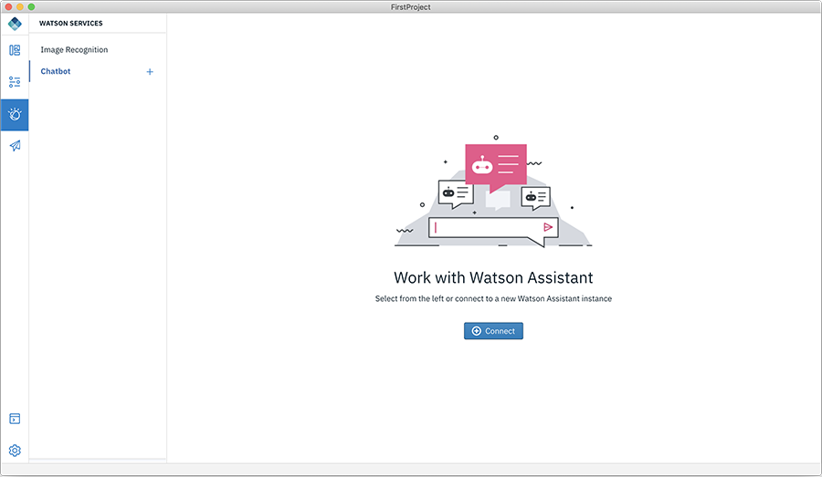
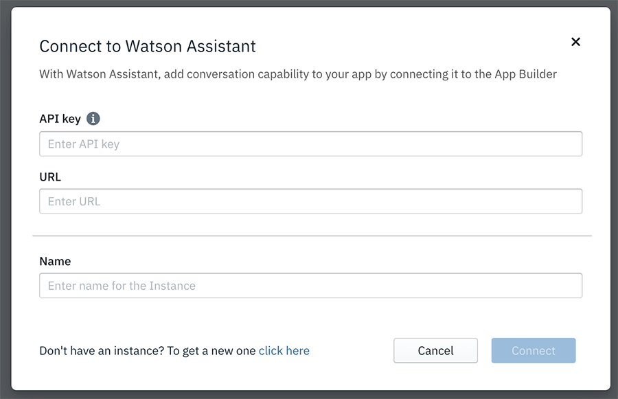

<!-- NLS_CHARSET=UTF-8 -->
## Watson Chatbot
{: #dab-chatbot }

Chatbots are powered by Watson Assistant service on IBM Cloud. Create a Watson Assistant instance on IBM Cloud. For more information, see [here](https://cloud.ibm.com/catalog/services/watson-assistant-formerly-conversation).

Once configured you can create a new **Workspace**. The workspace is a set of conversations that make up a chatbot. After creating a Workspace, start creating the dialogs. Provide a set of questions for a intent and a set of answers for that intent. Watson Assistant uses Natural Language Understand to interpret the intent based on the sample questions you provided. It can then try to interpret the question that a user asks in various styles and map it to the intent.

To enable a chatbot in your app, perform the following steps:

1. Click **Watson** and then click **Chatbot**. This displays the **Work with Watson Assistant** screen.

    

2. Click **Connect** to your Watson Assistance instance.

    

3. Enter the **API key** details and specify the **URL** of your Watson Assistance instance. 
4. Provide a **Name** to your chatbot and click **Connect**. This displays your chat service dashboard of the **Name** given.

    

5. Add a workspace by clicking **Add a workspace** which displays the **Create a new model** popup.

    

6. Enter the **Workspace name** and **Workspace description** and click **Create**. This creates three **Conversation** workspace (Welcome, No match found, and New conversation).

    

7. Click **New conversation** to educate the new chatbot model. 

    

8. Add questions and the response either as a csv file or as an individual questions and the response. For example, **Add a user statement** for If the user intends to ask, and then **Add a bot response** for the **Then, the bot should respond with**. or you can upload questions and the responses for the bot to respond.
9. Click **Save**.
10. Click the Chatbot icon at the botton right-hand side to test the chatbot.

    
