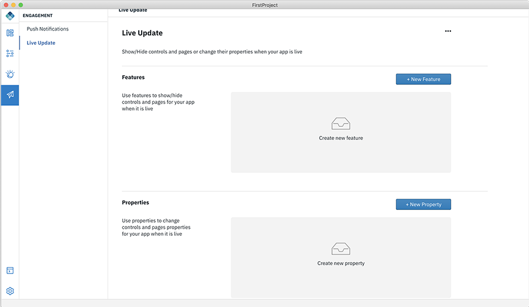

<!-- NLS_CHARSET=UTF-8 -->
## Feature Toggle using Live Update
{: #dab-feature-toggle-live-update }

Use Live Update to make different aspects of your app configurable, to turn features on or off, remotely. Also dynamically control the properties of the app by changing the values of variables directly from the MobileFirst Operations Console.

Feature is an on/off binary value that is used to turn an app's feature on or off.

Properties are name value pairs which can be used to control the behaviour of the app.

>**Note**: Live Update will be available only when the app is ready.

### Adding Live Update in Design mode

To add Live Update to your app:

1. Select **Engagement**. This will display the list of available services.

    

2. Select **Live Update** and click **Enable**. This will configure the live update in the Mobile Foundation server. On successful enablement of the live update, a popup will be displayed.

    

3. Click **+ New Feature** to define a new feature in the Mobile Foundation server. This displays the below screen.

    

4. Enter the **Feature ID** and **Feature Name** and set the default **Visibility**.

    * **Feature ID** - A unique identifier for your feature.
    * **Feature Name** - Give a name to describe your feature

    

5. Click **Create**.

6. Similarly, define a Live Update property by providing the following details:

    * **PropertyID**
    * **Property Name**
    * **Property Value**

### Adding Live Update in Code mode

To add Live Update to your app:

**Method 1**

1. Open the app in code mode
2. Navigate to you `projectname/ionic/src/app/app.component.ts`

    

3. Go to initialize live update method.
4. Edit the code to show/hide a control and property to set the property of the control.

**Method 2**

1. Open the app in code mode.
2. Go and click the Code Snippet **</>**.
3. under Live Update > Live Update Configuration.

    

4. Drag and drop the **LiveUpdate Configuration** code snippet.
5. Edit the code to show/hide a control and property to set the property of the control.

