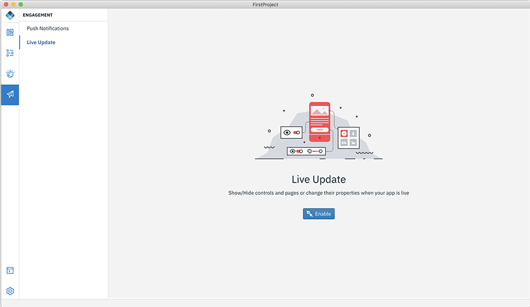
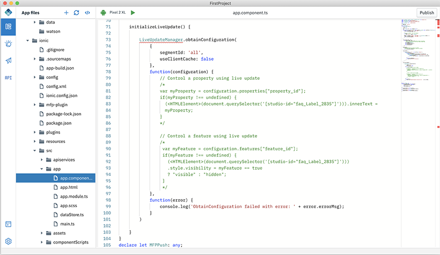

<!-- NLS_CHARSET=UTF-8 -->
## Feature Toggle using Live Update
{: #dab-feature-toggle-live-update }

Use Live Update to make different aspects of your app configurable, to turn features on or off, remotely. Also dynamically control the properties of the app by changing the values of variables directly from the MobileFirst Operations Console.

* **Feature** is an on/off binary value that is used to turn an app's feature on or off.
* **Properties** are name value pairs which can be used to control the behaviour of the app.

>**Note**: Live Update will be available only when the app is ready.

### Enabling Live Update

You can enable the Live Update feature by the following method:

1. Select **Engagement**. This will display the list of available services.

    

2. Select **Live Update** and click **Enable**. This will configure the Live Update in the Mobile Foundation server. Upon successfully enabling Live Update, a popup will be displayed.

    

3. Click **+ New Feature** to define a new feature in the Mobile Foundation server. This displays the below screen.

    

4. Enter the **Feature ID** and **Feature Name** and set the default **Visibility**.

    * **Feature ID** - A unique identifier for your feature.
    * **Feature Name** - Give a name to describe your feature

5. Click **Create**.

6. Similarly, define a Live Update property by providing the following details:

    * **Property ID**
    * **Property Name**
    * **Property Value**

### Working with Live Update in Design mode

In the Design mode, after enabling the Live Update option, you can modify **Text Value** or **Text Color** or **Background Color** for the selected control and update the changes live by defining a new property or select and edit an existing property. You can modify the property value at the Live Updates table that lists the list of features and properties associated to them.

#### Associate a control to a feature

To associate a control to a feature:

1. Select a control by clicking on it. 
2. Define a New Feature by clicking the **+** sign for the **Select a feature** option in the **Show/Hide controls** section. 
3. For the new feature, provide values for **Feature ID** and **Feature Name** and enable or disable visibility using the feature toggle **on/off** switch.

#### Modify the property of a control

To modify the property of a control:

Select a control and and type **${property_name}** or select the property to be associated from the list or create a new property by selecting **Add new property** and provide values for **Property ID**, **Property Name**, **Property Value**.
 
You can use the following controls and properties with Live Update:

* **Button** - Text Value, Text Color, Background Color
* **Heading** - Text Value, Text Color
* **Label** - Text Value, Text Color

### Adding Live Update in Code mode

To add Live Update to your app:

**Method 1**

1. Open the app in code mode
2. Navigate to you `projectname/ionic/src/app/app.component.ts`

    

3. Go to initialize live update method.
4. Edit the code to show/hide a control and property to set the property of the control.

**Method 2**

1. Open the app in code mode.
2. Go and click the Code Snippet **</>**.
3. Under **Live Update**, drag-and-drop **Live Update Feature** or **Live Update Property** code snippet.

    

4. Edit the code to show/hide a control and property to set the property of the control.
