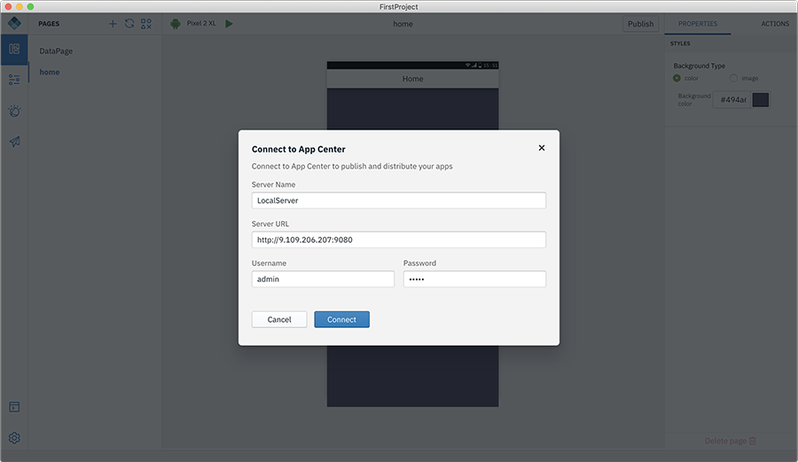

<!-- NLS_CHARSET=UTF-8 -->

## Publishing an app
{: #dab-app-publish }

With the Publish option, you can build and publish your app for Android/iOS to App Center or Publish Direct Updates of your app “over-the-air” with refreshed web resources.

### Publishing an app to App Center
{: #dab-app-publish-to-app-center }

IBM MobileFirst Foundation Application Center is a repository of mobile applications similar to public app stores but focused on the needs of an organization or a team. It is a private app store. For more information about App Center, refer [here](http://mobilefirstplatform.ibmcloud.com/tutorials/en/foundation/8.0/appcenter/app-center-tutorial/).

You can add your app to the repository on the server by using the **Publish** function in the Digital App Builder.

>**Note**: Make sure your app is built without any error before publishing to app center.

1. From your app project, click **Publish**. This will open up a popup with the platforms selected.

    

2. Select the **Platform** for which your app need to be published.

3. Click **Web Checksum** to enable the web resources checksum feature. For more details refer to [Enabling the web resources checksum feature](https://mobilefirstplatform.ibmcloud.com/tutorials/en/foundation/8.0/application-development/cordova-apps/securing-apps/#enabling-the-web-resources-checksum-feature).

4. Click **Web Resource Encryption** to encrypt the web resources of your Cordova packages. For more details refer to [Encrypting the web resources of your Cordova packages](https://mobilefirstplatform.ibmcloud.com/tutorials/en/foundation/8.0/application-development/cordova-apps/securing-apps/#encrypting-the-web-resources-of-your-cordova-packages).

2. Click **Publish to App Center**.

    

3. Select an existing App Center or click **Connect New**. Click **Connect**.
4. This will build the package for the selected platform.
5. *For iOS only*: Edit the *app-build.json* file and update the `developmentTeam` field with your Apple Developer Team ID. To find out the Team ID, login to [Apple Developer Account](https://developer.apple.com/account/#/membership). 

    

6. Click **Publish** once the packages are ready.
7. On successful publishing, QR code is generated.

    

8. You can verify the app is available in the App Center by logging into **App Center** > **Application Management**.

>**Note**: You can reselect the platform required and build and publish the app to **App Center**.

### Publish Direct Update
{: #dab-publish-direct-update }

With [Direct Update](https://mobilefirstplatform.ibmcloud.com/tutorials/en/foundation/8.0/application-development/direct-update/), Cordova applications can be updated “over-the-air” with refreshed web resources, such as changed, fixed or new applicative logic (JavaScript), HTML, CSS or images. Organizations are thus able to ensure that end-users always use the latest version of the application.

>**Note**: Make sure your app is built without any error before publishing to app center.

1. From your app project, click **Publish**. This will open up a popup with the platforms selected.

    

2. Select the **Platform** for which your app need to be published.

3. Click **Web Checksum** to enable the web resources checksum feature. For more details refer to [Enabling the web resources checksum feature](https://mobilefirstplatform.ibmcloud.com/tutorials/en/foundation/8.0/application-development/cordova-apps/securing-apps/#enabling-the-web-resources-checksum-feature).

4. Click **Web Resource Encryption** to encrypt the web resources of your Cordova packages. For more details refer to [Encrypting the web resources of your Cordova packages](https://mobilefirstplatform.ibmcloud.com/tutorials/en/foundation/8.0/application-development/cordova-apps/securing-apps/#encrypting-the-web-resources-of-your-cordova-packages).
5. Click **Publish Direct Update**. When users launch the app and connect to the mobile foundation server, a prompt to update the web resources will appear. Upon confirmation, the updated web resources will be available to the user.
