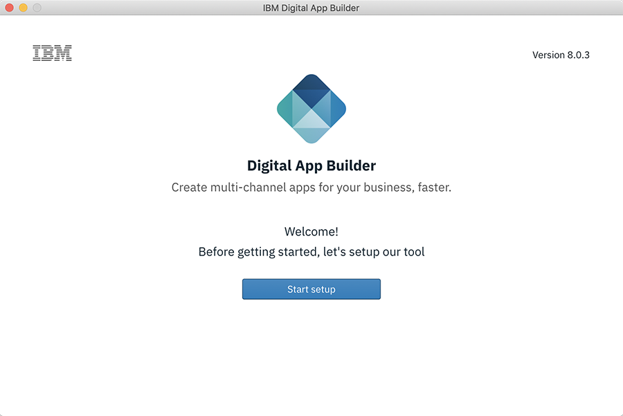
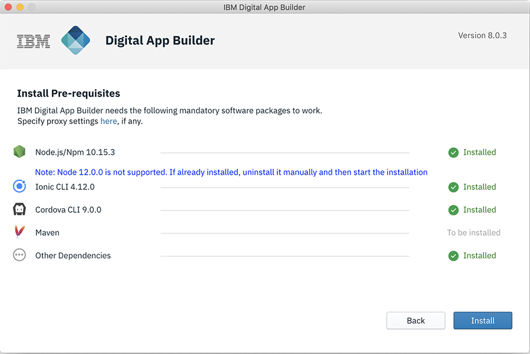

<!-- NLS_CHARSET=UTF-8 -->
## Overview
{: #installation-and-configuration }

Digital App Builder can be installed on MacOS and Windows platform. The installation also includes prerequisites software installed during the first time installation and verified. Install Java, Xcode, and Android Studio for adapter generation and previewing the app during development.

### Installing on MacOS
{: #installing-on-macos }

1. Download the .dmg (**IBM.Digital.App.Builder-n.n.n.dmg**, where `n.n.n` is the version number) from [IBM passport advantage](https://www.ibm.com/software/passportadvantage/) or from [here](https://github.com/MobileFirst-Platform-Developer-Center/Digital-App-Builder/releases).
2. Double click on .dmg file to mount the installer.
3. In the window that the installer opens, drag and drop the IBM Digital App Builder to the **Applications** folder.
4. Double click the IBM Digital App Builder icon or executable to open the Digital App Builder.
    >**Note**: When the Digital App Builder is installed for the first time, the Digital App Builder opens up the interface to install the prerequisite software. In case a previous version of Digital App Builder exists, a pre-requisites check is performed and may need to upgrade or downgrade some software to meet the pre-requisites.
    
    >Beginning from version 8.0.6, the installer contains Mobile Foundation development server. During the installation, the development server gets installed alongwith other pre-requisites. The lifecycle of the development server (like server start/stop) is handled within the Digital App Builder.
    
    

5. Click **Start setup**. This displays the license agreement screen.

    

6. Accept the license agreement and click **Next**. This displays the **Install Pre-requisites** screen.
    >**Note**: A check is done to find if any of the prerequisites software is already installed and the status is displayed against each of them.

    

7. Click **Install** to setup the prerequisite software, if any of the prerequisites are in **To be installed** status.

    

8. *Optional* - After installing the prerequisite software, the installer checks for JAVA as the Digital App Builder needs JAVA to work with datasets. 
    >**Note**: Manual installation of Java may be needed, if not already installed. For installing Java, refer to [Installing Java](https://www.java.com/en/download/help/download_options.xml).

9. After installing the software required, the Digital App Builder startup screen is displayed. Click **Start building**.

    

10. *Optional* - The installer also checks for optional installation of Xcode (for previewing app on iOS simulator during development, for MacOS only) and Android Studio (for previewing your Android app, for MacOS and Windows).
    >**Note**: Manual install of Xcode and Android Studio may be needed. For Cocoapods installation, refer to [Using CocoaPods](https://guides.cocoapods.org/using/using-cocoapods). For Android Studio installation, refer to [Installing Android Studio](https://developer.android.com/studio/). 

>**Note**: At any given point of time perform a [Prerequisites Check](#prerequisites-check) to verify the installation is fine to develop the app. In case of any error, rectify the error and restart the Digital App Builder before creating an app.

### Installing on Windows
{: #installing-on-windows }

1. Download the .exe (**IBM.Digital.App.Builder.Setup.n.n.n.exe**, where `n.n.n` is the version number)) from [IBM passport advantage](https://www.ibm.com/software/passportadvantage/) or from [here](https://github.com/MobileFirst-Platform-Developer-Center/Digital-App-Builder/releases).
2. Run the downloaded executable (**IBM.Digital.App.Builder.Setup.n.n.n.exe**) in administrative mode.
    >**Note**: When the Digital App Builder is installed for the first time, the Digital App Builder opens up the interface to install the prerequisite software. In case a previous version of Digital App Builder exists, a pre-requisites check is performed and may need to upgrade or downgrade some software to meet the pre-requisites.
    
    >Beginning from version 8.0.6, the installer contains Mobile Foundation development server. During the installation, the development server gets installed alongwith other pre-requisites. The lifecycle of the development server (like server start/stop) is handled within the Digital App Builder.

    

3. Click **Start setup**. This displays the license agreement screen.

    

4. Accept the license agreement and click **Next**. This displays the **Install Pre-requisites** screen.
    >**Note**: A check is done to find if any of the prerequisites software is already installed and the status is displayed against each of them.

    

5. Click **Install** to setup the prerequisite software, if any of the prerequisites are in **To be installed** status.

    

6. *Optional* - After installing the prerequisite software, the installer checks for JAVA as the Digital App Builder needs JAVA to work with your datasets. 
    >**Note**: Manual installation of Java may be needed, if not already installed. For installing Java, refer to [Installing Java](https://www.java.com/en/download/help/download_options.xml).

7. After installing the prerequisite software, the Digital App Builder startup screen is displayed. Click **Start building**.

    

    >**Note**: A short cut is also created in the **Start > Programs** in the desktop. The default installation folder is `<AppData>\Local\IBMDigitalAppBuilder\app-8.0.3`.

8. *Optional* - The installer also checks for optional installation of Xcode (for previewing your app on iOS simulator during development, for MacOS only) and Android Studio (for previewing your Android app, for MacOS and Windows).
    >**Note**: Manually install Android Studio. For Android Studio installation, refer to [Installing Android Studio](https://developer.android.com/studio/). 

>**Note**: At any given point of time perform a [Prerequisites Check](#prerequisites-check) to verify the installation is fine to develop the app. In case of any error, rectify the error and restart the Digital App Builder before creating an app.

### Prerequisites Check
{: #prerequisites-check }

Perform a prerequisites check by selecting **Help > Prerequisites Check** before developing an app.

In case of any error, rectify the error and restart the Digital App Builder before creating an app.

>**Note**: [CocoaPods](https://guides.cocoapods.org/using/using-cocoapods) are required for MacOS only.
