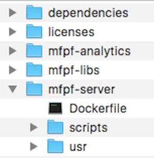

## Overview
This tutorial demonstrates how to take a locally developed IBM MobileFirst Foundation project and run it on Bluemix. To achieve this result, you go through the following steps: set up your host computer with the required tools (Cloud Foundry CLI, Docker, and IBM Containers Extension (cf ic) Plug-in), set up your Bluemix environment, build a MobileFirst Foundation Server image and push it to the Bluemix repository. Finally, you run the image on IBM Containers as a single Container or a Container group and update it with the MobileFirst project application and adapter.

**Note:** Windows OS is currently not supported.

**Note:** The MobileFirst Server Configuration Tools cannot be used for deployments to IBM Containers.

**Prerequisite:** Make sure to read the [IBM MobileFirst Foundation on IBM Containers](../) tutorial.

#### Jump to:

* [Register an account at Bluemix](#register-an-account-at-bluemix)
* [Set up your host machine](#set-up-your-host-machine)
* [Download the ibm-mfpf-container-8.0.0.0 zip](#download-the-ibm-mfpf-container-8-0-0-0-zip)
* [Prerequisites](#prerequisites)
* [Setting Up the MovileFirst and Analytics Servers on IBM Containers](#setting-up-the-movilefirst-and-analytics-servers-on-ibm-containers)

## Register an account at Bluemix
If you do not yet have an account, visit the [Bluemix website] and click **Get Started Free** or **Sign Up**. You'll need to fill up a registration form before you can move on to the next step.

### The Bluemix Dashboard
After signing in to Bluemix, you are presented with the Bluemix Dashboard, which provides an overview of the active Bluemix **space**. By default, this work area  receives the name "dev". You can create multiple work areas/spaces if needed.

## Set up your host machine
To manage containers and images, you need to install the following tools: Docker, Cloud Foundry CLI and IBM Containers (cf ic) plugin.

### Docker
Go to the [Docker Documentation](https://docs.docker.com/) on the left menu, select **Install > Docker Engine**, select your OS type and follow the instructions to install the Docker Toolbox.

**Note:** IBM does not support Docker's Kitematic software.

In OS X there are two options to run Docker commands:

* From the OS X Terminal
* From the Docker Quickstart Terminal

If you choose to work from the Docker Quickstart Terminal no further setup is needed. You must work only from it.
If you choose to work from the OS X Terminal, do the following:

* Run the command:

    ```bash
    docker-machine env default
    ```

* Set the result as environment variables, for example:

    ```bash
    $ docker-machine env default
    export DOCKER_TLS_VERIFY="1"
    export DOCKER_HOST="tcp://192.168.99.101:2376"
    export DOCKER_CERT_PATH="/Users/mary/.docker/machine/machines/default"
    export DOCKER_MACHINE_NAME="default"
    ```

>For further information consult the Docker documentation.

### Cloud Foundry Plugin and IBM Containers plugin

1. Install the [Cloud Foundry CLI](https://github.com/cloudfoundry/cli/releases?cm_mc_uid=85906649576514533887001&cm_mc_sid_50200000=1454307195).
2. Install the [IBM Containers Plugin (cf ic)](https://www.ng.bluemix.net/docs/containers/container_cli_ov.html#container_cli_cfic).

## Download the ibm-mfpf-container-8.0.0.0 zip
To setup IBM MobileFirst Foundation on IBM Containers, you must first create an image that will later be pushed to Bluemix.

<a class="custombtn btn-lg btn-default" style="width:700px; font-size: 100%" href="http://www-01.ibm.com/support/docview.wss?uid=swg2C7000005" target="blank">Follow the instructions and download the IBM MobileFirst Container v8.0 .zip (search for )</a>

### Structure of the mfp-cloud-container-8.0.0.zip archive


The extracted ZIP file contains the files for building an image (**dependencies** and **mfpf-libs**), the files for building and deploying an IBM MobileFirst Foundation Operational Analytics Container (**mfpf-analytics**) and files for configuring an IBM MobileFirst Foundation Server Container (**mfpf-server**).

#### The mfpf-server and mfpf-analytics folders

* **Dockerfile**: Text document that contains all the commands in order to build an image.
* **scripts** folder: This folder contains the **args** folder, which contains a set of configuration files. It also contains scripts to run for logging into Bluemix, building a Mobilefirst Foundation Server/MobileFirst Foundation Operational Analytics image and for pushing and running the image on Bluemix.
You can choose to run the scripts interactively or by pre-configuring the configuration files as will be further explained.
* **usr** folder:
  * **bin** folder: Contains the script file that gets executed on the start of the container. You can add your own custom code to be executed.
  * **config** folder: Contains the server configuration fragments (keystore, server properties, user registry) used by MobileFirst Server Foundation/MobileFirst Foundation Operational Analytics.
  * **env** folder: Contains the environment properties used for server initialization (server.env) and custom JVM options (jvm.options).
  * **jre-security** folder: You can update the JRE security related files (truststore, policy jars etc) by placing them in this folder.
  * **security** folder: The key store, trust store and the LTPA keys files (ltpa.keys) should be placed here.
  * **ssh** folder: The SSH public key file should be placed here to enable SSH access to the Container.
  * **wxs** folder (only for the MobileFirst Server Foundation): Contains the data cache / extreme scale client library when Data Cache is used as attribute store for the server.

## Prerequisites
1. Login to the IBM Bluemix environment.  
This step is mandatory because you will be running IBM Containers commands during the following steps.  
Run: `cf login`.  
When prompted, enter the following information:
  * Bluemix API endpoint
  * Email
  * Password
  * Organization, if you have more than one
  * Space, if you have more than one

2. To run IBM Containers commands, you must first log in into the IBM Container Cloud Service.  
Run: `cf ic login`.

3. Make sure that the `namespace` for container registry is set. The `namespace` is a unique name to identify your private repository on the Bluemix registry. The namespace is assigned once for an organization and cannot be changed.  
Choose a namespace according to following rules:
 * It can contain only lowercase letters, numbers, or underscores.
 * It can be 4 - 30 characters. If you plan to manage containers from the command line, you might prefer to have a short namespace that can be typed quickly.
 * It must be unique in the Bluemix registry.

    To set a namespace, run the command: `cf ic namespace set <new_name>`.  
    To get the namespace that you have set, run the command: `cf ic namespace get`.

>To learn more about IC commands, use the `ic help` command.

## Setting Up the MobileFirst and Analytics Servers on IBM Containers
As explained above you can choose to run the scripts interactively or by using the configuration files:

* Using the configuration files - run the scripts and pass the respective configuration file as an argument.
* Interactively - run the scripts without any arguments.

**Note:** If you choose to run the scripts interactively, you can skip the configuration but it is strongly suggested to at least read and understand the arguments you will need to provide.
### MobileFirst Foundation Operational Analytics
If you intend to use analytics with your MobileFirst Server start here.

<div class="panel-group accordion" id="scripts" role="tablist" aria-multiselectable="false">
    <div class="panel panel-default">
        <div class="panel-heading" role="tab" id="step1">
            <h4 class="panel-title">
                <a class="preventScroll" role="button" data-toggle="collapse" data-parent="#scripts" data-target="#collapseStep1" aria-expanded="false" aria-controls="collapseStep1">Using the configuration files</a>
            </h4>
        </div>

        <div id="collapseStep1" class="panel-collapse collapse" role="tabpanel" aria-labelledby="setupCordova">
            <div class="panel-body">
            The <strong>args</strong> folder contains a set of configuration files which contain the arguments that are required to run the scripts. Fill in the arguments' values in the following files.<br/>
            <strong>Note:</strong> We only include the required arguments. To learn about         the additional arguments, see the documentation inside the properties files.
              <h4>initenv.properties</h4>
              <ul>
                  <li><strong>BLUEMIX_USER - </strong>Your Bluemix username (email).</li>
                  <li><strong>BLUEMIX_PASSWORD - </strong>Your Bluemix password.</li>
                  <li><strong>BLUEMIX_ORG - </strong>Your Bluemix organization name.</li>
                  <li><strong>BLUEMIX_SPACE - </strong>Your Bluemix space (as explained previously).</li>
              </ul>
              <h4>prepareanalytics.properties</h4>
              <ul>
                  <li><strong>ANALYTICS_IMAGE_TAG - </strong>A tag for the image. Should be of the form: <em>registry-url/namespace/your-tag</em>.</li>
              </ul>
              <h4>startanalytics.properties</h4>
              <ul>
                  <li><strong>ANALYTICS_IMAGE_TAG - </strong>Same as in <em>prepareserver.sh</em>.</li>
                  <li><strong>ANALYTICS_CONTAINER_NAME - </strong>A name for your Bluemix Container.</li>
                  <li><strong>ANALYTICS_IP - </strong>An IP address that the Bluemix Container should be bound to.<br/>
                  To assign an IP address, run: <code>cf ic ip request</code>.<br/>
                  IP addresses can be reused in multiple containers in a space.<br/>
                  If you've already assigned one, you can run: <code>cf ic ip list</code>.</li>
              </ul>
              <h4>startanalyticsgroup.properties</h4>
              <ul>
                  <li><strong>ANALYTICS_IMAGE_TAG - </strong>Same as in <em>prepareserver.sh</em>.</li>
                  <li><strong>ANALYTICS_CONTAINER_GROUP_NAME - </strong>A name for your Bluemix Container group.</li>
                  <li><strong>ANALYTICS_CONTAINER_GROUP_HOST - </strong>Your host name.</li>
                  <li><strong>ANALYTICS_CONTAINER_GROUP_DOMAIN - </strong>Your domain name. The default is: <code>mybluemix.net</code>.</li>
              </ul>
            </div>
        </div>
    </div>

    <div class="panel panel-default">
        <div class="panel-heading" role="tab" id="step2">
            <h4 class="panel-title">
                <a class="preventScroll" role="button" data-toggle="collapse" data-parent="#scripts" data-target="#collapseStep2" aria-expanded="false" aria-controls="collapseStep2">Running the scripts</a>
            </h4>
        </div>

        <div id="collapseStep2" class="panel-collapse collapse" role="tabpanel" aria-labelledby="setupCordova">
            <div class="panel-body">
              The following demonstrate running the scripts by using the configuration files:
              <ol>
                  <li><strong>initenv.sh – Logging in to Bluemix </strong><br />
                      Run the <strong>initenv.sh</strong> script in order to create an environment for building and running IBM MobileFirst Foundation Operational Analytics on the IBM Containers:

./initenv.sh args/initenv.properties

                  </li>
                  <li><strong>prepareanalytics.sh - Prepare a MobileFirst Foundation Operational Analytics image</strong><br />
                      Run the <strong>prepareanalytics.sh</strong> script in order to build a MobileFirst Foundation Operational Analytics image and push it to to your Bluemix repository:


./prepareanalytics.sh args/prepareanalytics.properties


                  To view all available images in your Bluemix repository run: <code>cf ic images</code><br/>
                  The list contains the image name, date of creation and ID.
                  </li>
                  <li><strong>startanalytics.sh - Running the image on an IBM Container</strong><br />
                  The <strong>startanalytics.sh</strong> script is used to run the MobileFirst Foundation Operational Analytics image on an IBM Container. It also binds your image to the public IP you configured in the <strong>ANALYTICS_IP</strong> property.</p>

                  Run:

./startanalytics.sh args/startanalytics.properties

                  </li>
                  <li><strong>startanalyticsgroup.sh - Running the image on an IBM Container group</strong><br />
                  The <strong>startanalyticsgroup.sh</strong> script is used to run the MobileFirst Foundation Operational Analytics image on an IBM Container group. It also binds your image to the Host name you configured in the <strong>ANALYTICS_CONTAINER_GROUP_HOST</strong> property.</p>

                  Run:

./startanalyticsgroup.sh args/startanalyticsgroup.properties

                  </li>
              </ol>
            </div>
        </div>
    </div>
</div>

### MobileFirst Foundation Server
<div class="panel-group accordion" id="scripts2" role="tablist" aria-multiselectable="false">
    <div class="panel panel-default">
        <div class="panel-heading" role="tab" id="step-foundation-1">
            <h4 class="panel-title">
                <a class="preventScroll" role="button" data-toggle="collapse" data-parent="#scripts2" data-target="#collapse-step-foundation-1" aria-expanded="false" aria-controls="collapse-step-foundation-1">Using the configuration files</a>
            </h4>
        </div>

        <div id="collapse-step-foundation-1" class="panel-collapse collapse" role="tabpanel" aria-labelledby="setupCordova">
            <div class="panel-body">
            The <strong>args</strong> folder contains a set of configuration files which contain the arguments that are required to run the scripts. Fill in the arguments' values in the following files:
              <h4>initenv.properties</h4>
              <ul>
                  <li><strong>BLUEMIX_USER - </strong>Your Bluemix username (email).</li>
                  <li><strong>BLUEMIX_PASSWORD - </strong>Your Bluemix password.</li>
                  <li><strong>BLUEMIX_ORG - </strong>Your Bluemix organization name.</li>
                  <li><strong>BLUEMIX_SPACE - </strong>Your Bluemix space (as explained previously).</li>
              </ul>
              <h4>prepareserverdbs.properties</h4>
              The Mobile Foundation requires an external <a href="https://console.ng.bluemix.net/catalog/services/dashdb/" target="\_blank">dashDB database instance </a>. After you have set-up your dashDB instance, provide the required arguments:
              <ul>
                  <li><strong>ADMIN_DB_SRV_NAME - </strong>Your dashDB service instance name for storing admin data.</li>
                  <li><strong>ADMIN_SCHEMA_NAME - </strong>Your schema name for admin data. The default is MFPDATA.</li>
                  <li><strong>RUNTIME_DB_SRV_NAME - </strong>Your dashDB service instance name for runtime data.</li>
                  <li><strong>RUNTIME_SCHEMA_NAME - </strong>Your schema name for runtime data. The default is MFPDATA.</li>
              </ul>
              <h4>prepareserver.properties</h4>
              <ul>
                  <li><strong>SERVER_IMAGE_TAG - </strong>A tag for the image. Should be of the form: <em>registry-url/namespace/your-tag</em>.</li>
              </ul>
              <h4>startserver.properties</h4>
              <ul>
                  <li><strong>SERVER_IMAGE_TAG - </strong>Same as in <em>prepareserver.sh</em>.</li>
                  <li><strong>SERVER_CONTAINER_NAME - </strong>A name for your Bluemix Container.</li>
                  <li><strong>SERVER_IP - </strong>An IP address that the Bluemix Container should be bound to.<br/>
                  To assign an IP address, run: <code>cf ic ip request</code>.<br/>
                  IP addresses can be reused in multiple containers in a space.<br/>
                  If you've already assigned one, you can run: <code>cf ic ip list</code>.</li>
              </ul>
              <h4>startservergroup.properties</h4>
              <ul>
                  <li><strong>SERVER_IMAGE_TAG - </strong>Same as in <em>prepareserver.sh</em>.</li>
                  <li><strong>SERVER_CONTAINER_GROUP_NAME - </strong>A name for your Bluemix Container group.</li>
                  <li><strong>SERVER_CONTAINER_GROUP_HOST - </strong>Your host name.</li>
                  <li><strong>SERVER_CONTAINER_GROUP_DOMAIN - </strong>Your domain name. The default is: <code>mybluemix.net</code>.</li>
              </ul>
            </div>
        </div>
    </div>

    <div class="panel panel-default">
        <div class="panel-heading" role="tab" id="step-foundation-2">
            <h4 class="panel-title">
                <a class="preventScroll" role="button" data-toggle="collapse" data-parent="#scripts2" data-target="#collapse-step-foundation-2" aria-expanded="false" aria-controls="collapse-step-foundation-2">Running the scripts</a>
            </h4>
        </div>

        <div id="collapse-step-foundation-2" class="panel-collapse collapse" role="tabpanel" aria-labelledby="setupCordova">
            <div class="panel-body">
              The following demonstrate running the scripts by using the configuration files:
              <ol>
                  <li><strong>initenv.sh – Logging in to Bluemix </strong><br />
                      Run the <strong>initenv.sh</strong> script in order to create an environment for building and running IBM MobileFirst Platform Foundation on the IBM Containers:

./initenv.sh args/initenv.properties

                  </li>
                  <li><strong>prepareserverdbs.sh - Prepare the MobileFirst Server database</strong><br />
                  The <strong>prepareserverdbs.sh</strong> script is used to configure Run:

./prepareserverdbs.sh args/prepareserverdbs.properties

                  </li>
                  <li><strong>prepareserver.sh - Prepare a Mobilefirst Platform Foundation Server image</strong><br />
                  Run the <strong>prepareserver.sh</strong> script in order to build a MobileFirst Platform Foundation Server image and push it to to your Bluemix repository:

./prepareserver.sh args/prepareserver.properties


                  To view all available images in your Bluemix repository run: <code>cf ic images</code><br/>
                  The list contains the image name, date of creation and ID.
                  </li>
                  <li><strong>startserver.sh - Running the image on an IBM Container</strong><br />
                  The <strong>startserver.sh</strong> script is used to run the Mobilefirst Server image on an IBM Container. It also binds your image to the public IP you configured in the <strong>SERVER_IP</strong> property.</p>
                  Run:

./startserver.sh args/startserver.properties

                  </li>
                  </li>
                  <li><strong>startservergroup.sh - Running the image on an IBM Container group</strong><br />
                  The <strong>startservergroup.sh</strong> script is used to run the Mobilefirst Server image on an IBM Container group. It also binds your image to the Host name you configured in the <strong>SERVER_CONTAINER_GROUP_HOST</strong> property.</p>
                  Run:

./startservergroup.sh args/startservergroup.properties

                  </li>
              </ol>
            </div>
        </div>
    </div>
</div>

With the MobileFirst Server running on IBM Bluemix, You can now start your application development. Review the MobileFirst Foundation [tutorials](../../all-tutorials).
