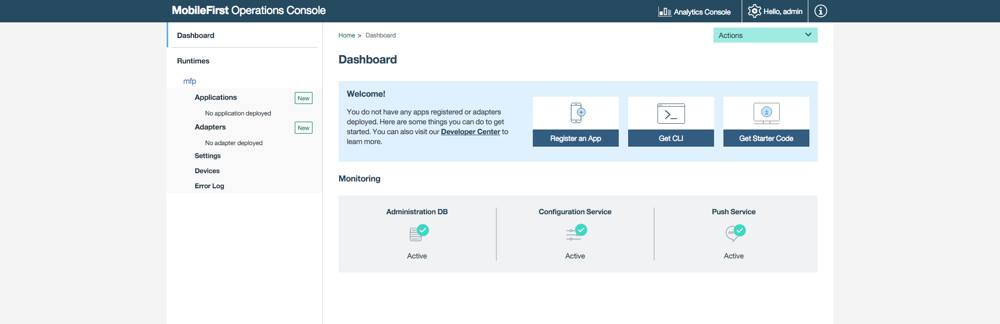
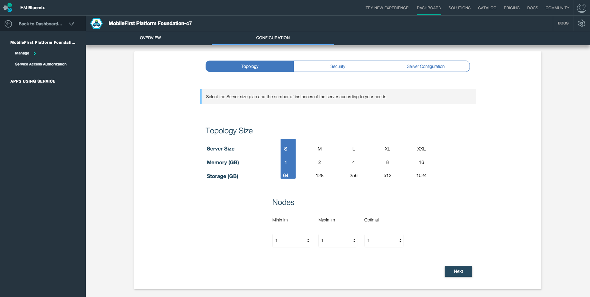

## Overview
This tutorial provides step-by-step instructions to set-up a MobileFirst Server instance on IBM Containers using **MobileFirst Platform Foundation Tile** *beta*.

IBM MobileFirst Platform Foundation Tile is a **Bluemix service** that enables quick and easy stand-up of scaleable Developer or Production environments of MobileFirst Platform Foundation v8.0 Beta.

> **Prerequisite:** Make sure to read the [Introduction to IBM MobileFirst Platform Foundation on IBM Containers]("../") tutorial.

#### Jump to:

* [Using MobileFirst Platform Foundation Tile](#using-mobilefirst-platform-foundation-tile)
* [Basic Server](#basic-server)
* [Advanced server configuration](#advanced-server-configuration)
* [Further reading](#further-reading)

## Using MobileFirst Platform Foundation Tile

1. Load [bluemix.net](http://bluemix.net) and visit the **Catalog** page.

2. From the left sidebar, tick the "Mobile" checkbox under **Services**. Then, click on **MobileFirst Platform Foundation** to begin the service creation process.

    

3. Select a **space** to use and optionally set a **Service name**. Then, click **Create**.

    

4. Agree to the Early Beta license terms, provide your Bluemix username and password, and click **Continue**.

5. Optionally update the server configuration in the [Configuration tab](#configuring-the-server-instance), and click on **Start advanced server**.

6. Click in **Start Basic Server** to start the MobileFirst Server.

    

7. After starting the server you are presented with the MobileFirst Platform Operations Console.

    

## Basic Server
The created server instance baseline is made of:

* A single node
* 512MB memory
* 32GB storage capacity

## Advanced server configuration
Through the Configuration tab, the server instance can be further customized with:

* Varying node, memory and storage combinations
* console username &amp; password
* LTPA keys
* JNDI configuration
* user registry 
* TrustStore
* MobileFirst Platform Foundation Analytics configuration
* Database selection
* VPN

> **Note:** The beta release does not support all mentioned features.

## Further reading
Now that the MobileFirst Server instance is up &amp; running, you can learn more about the MobileFirst Operations Console, how to create applications and adapters and enhance applications with push notifications, security and more.

* Experience MobileFirst Platform Foundation with these [Quick Start tutorials](../../quick-start)
* Or [read through all available tutorials](../../all-tutorials/).
