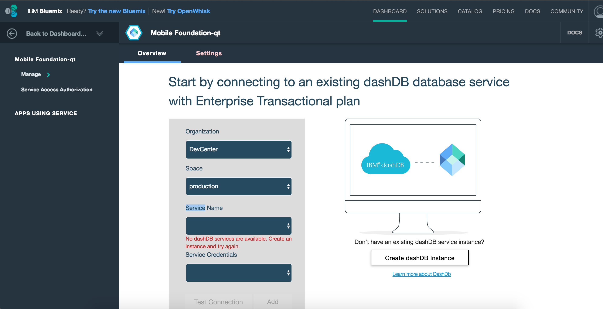

## Overview
This tutorial provides step-by-step instructions to set-up a MobileFirst Server instance on IBM Containers using the **Mobile Foundation** service.  
Mobile Foundation is a **Bluemix service** that enables quick &amp; easy stand-up of scaleable Developer or Production environments of MobileFirst Foundation v8.0 on **IBM Containers**.

The Mobile Foundation service offers two plan options:

1. **Developer**: This plan provisions a Mobile Foundation server in a container in IBM Containers. The plan does not support the use of container groups or external databases *and is restricted to development and testing only*. The server instance allows registering only a single (1) application.
2. **Professional 1 Application**: This plan provisions a Mobile Foundation server in a scalable container environment. The plan also requires a database service, which is created and billed separately. The plan allows users to build and manage a single mobile application. A single mobile application can consist of multiple flavors, such as iOS, Android, Windows and Mobile Web.

> [See the service page on Bluemix.net](https://console.ng.bluemix.net/catalog/services/mobile-foundation/) for more information regarding billing.

#### Jump to:

* [Setting up the Mobile Foundation Service](#setting-up-the-mobile-foundation-service)
* [Using the Mobile Foundation Service](#using-the-mobile-foundation-service)
* [Server configuration](#server-configuration)
* [Advanced server configuration](#advanced-server-configuration)
* [Further reading](#further-reading)

## Setting up the Mobile Foundation Service
To setup the available plans, first follow these steps: 

1. Load [bluemix.net](http://bluemix.net) and visit the **Catalog** page.

2. From the left sidebar, tick the "Mobile" checkbox under **Services**. Then, click on the **Mobile Foundation** tile to begin the service creation process.

    

3. Select a **space** to use and optionally set a **Service name**.
4. Select the desired plan option, then click **Create**.
    
### Setting up the *developer* plan

1. Agree to the Early license terms, provide your Bluemix username and password, and click **Continue**.
2. Start the MobileFirst Server.
    - You can either keep the server configuration at its basic level and click on **Start Basic Server**, or
    - Update the server configuration in the [Configuration tab](#advanced-server-configuration), and click on **Start advanced server**.

    During this step an IBM Container is generated for the Mobile Foundation service, and the MobileFirst Foundation environment is being initialized. This takes between 5 to 10 minutes.

    

### Setting up the *Professional 1 Application* plan

1. Agree to the Early license terms, provide your Bluemix username and password, and click **Continue**.
2. The plan requires an external [dashDB transactional database instance](https://console.ng.bluemix.net/catalog/services/dashdb/). After you have set-up your dashDB *Transactional plan* instance, enter your credentials in the plan entry page:

    

3. Start the MobileFirst Server.
    - You can either keep the server configuration at its basic level and click on **Start Basic Server**, or
    - Update the server configuration in the [Configuration tab](#advanced-server-configuration), and click on **Start advanced server**.

    During this step an IBM Container is generated for the Mobile Foundation service, and the MobileFirst Foundation environment is being initialized. This takes between 5 to 10 minutes.

    

## Using the Mobile Foundation Service
With the MobileFirst Server now running, you are presented with the following Dashboard:

Click on **Launch Console** to open the MobileFirst Operations Console.  The username is "admin" and the password can be revealed by clicking on the "eye" icon.

### Server configuration
The basic server instance consists of:

* A single node (server size: "small")
* 1GB memory
* 2GB storage capacity

### Advanced server configuration
Through the Configuration tab, the server instance can be further customized with:

* Varying node, memory and storage combinations
* MobileFirst Operations Console admin password
* LTPA keys
* JNDI configuration
* User registry 
* TrustStore
* Operational Analytics configuration
* Database selection (available in the *Professional 1 Application* plan)
* VPN

## Further reading
Now that the MobileFirst Server instance is up &amp; running, you can learn more about:

* [MobileFirst Operations Console](../../setting-up-your-development-environment/console)
* Experience MobileFirst Foundation with these [Quick Start tutorials](../../quick-start)
* Or [read through all available tutorials](../../all-tutorials/)
