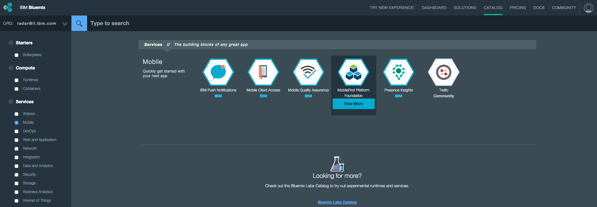
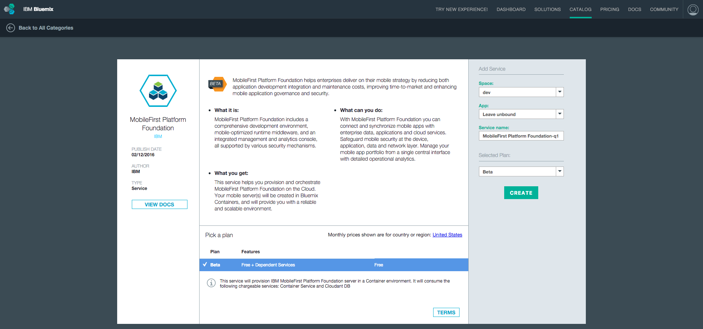
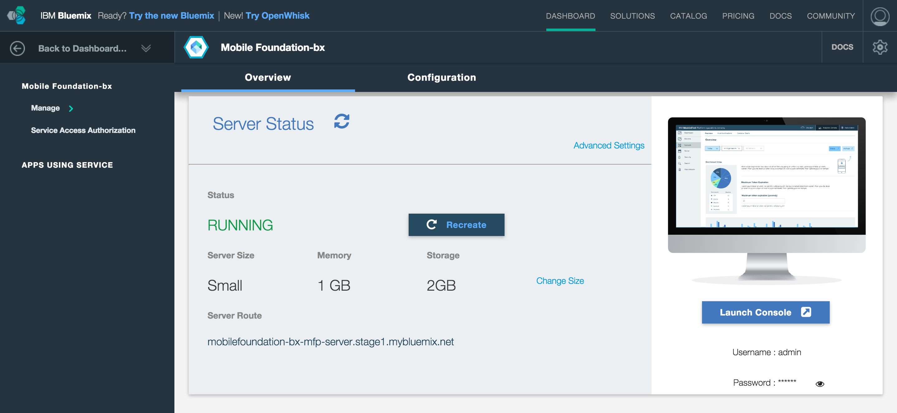

## Overview
This tutorial provides step-by-step instructions to set-up a MobileFirst Server instance on IBM Containers using the **Mobile Foundation** service.  
Mobile Foundation is a **Bluemix service** that enables quick &amp; easy stand-up of scaleable Developer or Production environments of MobileFirst Platform Foundation v8.0 Beta on **IBM Containers**.

> **Prerequisite:** Make sure to read the [Introduction to IBM MobileFirst Platform Foundation on IBM Containers](../) tutorial.

#### Jump to:

* [Using the Mobile Foundation Bluemix service](#using-the-mobile-foundation-bluemix-service)
* [Server configuration](#server-configuration)
* [Advanced server configuration](#advanced-server-configuration)
* [Further reading](#further-reading)

## Using the Mobile Foundation Bluemix service

1. Load [bluemix.net](http://bluemix.net) and visit the **Catalog** page.

2. From the left sidebar, tick the "Mobile" checkbox under **Services**. Then, click on the **Mobile Foundation** tile to begin the service creation process.

    

3. Select a **space** to use and optionally set a **Service name**. Then, click **Create**.

    

4. Agree to the Early Beta license terms, provide your Bluemix username and password, and click **Continue**.

5. Start the MobileFirst Server.
    - You can either keep the server configuration at its basic level and click on **Start Basic Server**, or
    - Update the server configuration in the [Configuration tab](#advanced-server-configuration), and click on **Start advanced server**.

    During this step an IBM Container is generated for the Mobile Foundation service, and the MobileFirst Platform Foundation environment is being initialized.  
    This takes between 5 to 10 minutes.

    

6. With the MobileFirst Server now running, you are presented with the following Dashboard:

    

7. Click on **Launch Console** to open the MobileFirst Operations Console.  The username is "admin" and the password can be revealed by clicking on the "eye" icon.

    

## Server configuration
The basic server instance consists of:

* A single node (server size: "small")
* 1GB memory
* 2GB storage capacity

## Advanced server configuration
Through the Configuration tab, the server instance can be further customized with:

* Varying node, memory and storage combinations
* MobileFirst Operations Console admin password
* LTPA keys
* JNDI configuration
* User registry 
* TrustStore
* Operational Analytics configuration*
* Database selection*
* VPN*

> **Note:** The beta release does not support all mentioned features.

## Further reading
Now that the MobileFirst Server instance is up &amp; running, you can learn more about:

* [MobileFirst Operations Console](../../setting-up-your-development-environment/console)
* Experience MobileFirst Platform Foundation with these [Quick Start tutorials](../../quick-start)
* Or [read through all available tutorials](../../all-tutorials/)
