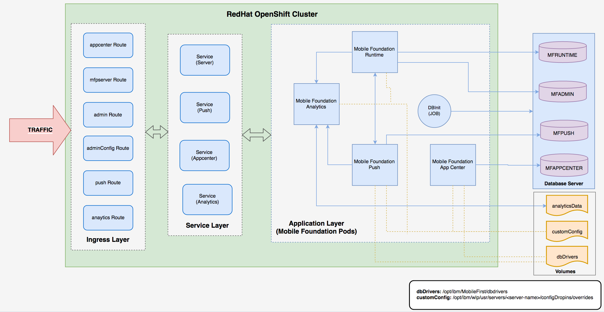

<!-- NLS_CHARSET=UTF-8 -->

Learn how to install the Mobile Foundation instance on an OpenShift cluster using the IBM Mobile Foundation Operator.

There are two ways of getting the entitlement to OpenShift Container Platform.

* You have the entitlement to IBM Cloud Pak for Applications, which includes the OpenShift Container Platform entitlement.
* You have an existing OpenShift Container Platform (bought from Red Hat).

The steps to deploy Mobile Foundation on OCP are the same irrespective of how you have obtained the OCP entitlement.

## Prerequisites
{: #prereqs}

Following are the prerequisites before you begin the process of installing Mobile Foundation instance using the Mobile Foundation Operator.

- OpenShift cluster v3.11 or above.
- [OpenShift client tools](https://docs.openshift.com/container-platform/3.11/cli_reference/get_started_cli.html) (`oc`).
- Mobile Foundation requires a database. Create a supported database and keep the database access details handy for further use. See [here](https://mobilefirstplatform.ibmcloud.com/tutorials/ru/foundation/8.0/installation-configuration/production/prod-env/databases/).
- Mobile Foundation Analytics requires mounted storage volume for persisting Analytics data (NFS recommended).

## Architecture
{: #architecture}

Image below shows the internal architecture of Mobile services on Red Hat OpenShift.



## Installing an IBM Mobile Foundation instance

### Download the IBM Mobile Foundation package
{: #download-mf-package}

Download the IBM Mobile Foundation package for Openshift from [IBM Passport Advantage (PPA)](https://www-01.ibm.com/software/passportadvantage/pao_customer.html). Unpack the archive to a directory called `workdir`.

  > **NOTE:** Refer [here](./additional-docs/validating-ppa/) if you want to validate the PPA package and verify the signature.

### Setup the OpenShift project for Mobile Foundation
{: #setup-openshift-for-mf}

1. Log in to OpenShift cluster and create a new project.   
   ```bash
   export MFOS_PROJECT=<project-name>
   oc login -u <username> -p <password> <cluster-url>
   oc new-project $MFOS_PROJECT
   ```
2. Unpack the IBM Mobile Foundation package for Openshift using the following command.
  ```bash
  tar xzvf IBM-MobileFoundation-Openshift-Pak-<version>.tar.gz -C <workdir>/
  ```
3. Load and push the images to OpenShift registry from local.   
   ```bash
    docker login -u <username> -p $(oc whoami -t) $(oc registry info)
    cd <workdir>/images
    ls * | xargs -I{} docker load --input {}

    for file in * ; do
      docker tag ${file/.tar.gz/} $(oc registry info)/$MFOS_PROJECT/${file/.tar.gz/}
      docker push $(oc registry info)/$MFOS_PROJECT/${file/.tar.gz/}
    done
   ```
4. Create a secret with database credentials.

    ```yaml
    cat <<EOF | oc apply -f -
    apiVersion: v1
    data:
      MFPF_ADMIN_DB_USERNAME: <base64-encoded-string>
      MFPF_ADMIN_DB_PASSWORD: <base64-encoded-string>
      MFPF_RUNTIME_DB_USERNAME: <base64-encoded-string>
      MFPF_RUNTIME_DB_PASSWORD: <base64-encoded-string>
      MFPF_PUSH_DB_USERNAME: <base64-encoded-string>
      MFPF_PUSH_DB_PASSWORD: <base64-encoded-string>
      MFPF_APPCNTR_DB_USERNAME: <base64-encoded-string>
      MFPF_APPCNTR_DB_PASSWORD: <base64-encoded-string>
    kind: Secret
    metadata:
      name: mobilefoundation-db-secret
    type: Opaque
    EOF
    ```
  > **NOTE**: An encoded string can be obtained using `echo -n <string-to-encode> | base64`.

5. For Mobile Foundation Analytics, configure a persistent volume (PV).
    ```yaml
    cat <<EOF | kubectl apply -f -
    apiVersion: v1
    kind: PersistentVolume
    metadata:
      labels:
        name: mfanalyticspv  
      name: mfanalyticspv
    spec:
      capacity:
        storage: 20Gi
      accessModes:
        - ReadWriteMany
      persistentVolumeReclaimPolicy: Retain
      nfs:
        path: <nfs-mount-volume-path>
        server: <nfs-server-hostname-or-ip>
    EOF
    ```

6. For Mobile Foundation Analytics, configure a persistent volume claim (PVC).
   ```yaml
   cat <<EOF | kubectl apply -f -
    apiVersion: v1
    kind: PersistentVolumeClaim
    metadata:
      name: mfanalyticsvolclaim
      namespace: <projectname-or-namespace>
    spec:
      accessModes:
        - ReadWriteMany
      resources:
        requests:
          storage: 20Gi
      selector:
        matchLabels:
          name: mfanalyticspv
      volumeName: mfanalyticspv
    EOF
   ```

### Deploy the IBM Mobile Foundation Operator
{: #deploy-mf-operator}

1. Ensure the Operator image name (*mf-operator*) with tag is set for the operator in `deploy/operator.yaml` (**REPO_URL**).

    ```bash
    sed -i 's|REPO_URL|<image-repo-url>:<image-tag>|g' deploy/operator.yaml
    ```

2. Ensure the namespace is set for the cluster role binding definition in `deploy/cluster_role_binding.yaml` (**REPLACE_NAMESPACE**).

    ```bash
    sed -i 's|REPLACE_NAMESPACE|$MFOS_PROJECT|g' deploy/cluster_role_binding.yaml
    ```

    **For Operator image tag 1.0.11 onwards, use the command below.**

    ```bash
    sed -i 's|REPLACE_NAMESPACE|$MFOS_PROJECT|g' deploy/role_binding.yaml
    ```

3. Run the following commands to deploy CRD, operator and install Security Context Constraints (SCC).

    ```bash
    oc create -f deploy/crds/charts_v1_mfoperator_crd.yaml
    oc create -f deploy/
    oc adm policy add-scc-to-group mf-operator system:serviceaccounts:$MFOS_PROJECT
    ```
    **For Operator image tag 1.0.11 onwards, use the commands below.**

    ```bash
    oc create -f deploy/crds/charts_v1_mfoperator_crd.yaml
    oc create -f deploy/
    oc adm policy add-scc-to-group mf-operator system:serviceaccounts:$MFOS_PROJECT
    oc adm policy add-cluster-role-to-user cluster-admin system:serviceaccount:$MFOS_PROJECT:mf-operator
    ```


### Deploy IBM Mobile Foundation components
{: #deploy-mf-components}

1. To deploy any of the Mobile Foundation components, modify the custom resource configuration `deploy/crds/charts_v1_mfoperator_cr.yaml` according to your requirements. Complete reference to the custom configuration is found [here](./additional-docs/cr-configuration/).

   > **IMPORTANT NOTE** : To access the Mobile Foundation instances after deployment we need to configure ingress hostname. Please make sure ingress is configured in the custom resource configuration. Refer this [link](./additional-docs/enable-ingress/) on configuring the same.

    ```bash
    oc apply -f deploy/crds/charts_v1_mfoperator_cr.yaml
    ```
2. Run the following command and ensure the pods are created and running successfully. In a deployment scenario where Mobile Foundation Server and push are enabled with 3 replicas each (default), the output looks as shown below.

      ```bash
      $ oc get pods
      NAME                           READY     STATUS    RESTARTS   AGE
      mf-operator-5db7bb7w5d-b29j7   1/1       Running   0          1m
      mfpf-server-2327bbewss-3bw31   1/1       Running   0          1m 20s
      mfpf-server-29kw92mdlw-923ks   1/1       Running   0          1m 21s
      mfpf-server-5woxq30spw-3bw31   1/1       Running   0          1m 19s
      mfpf-push-2womwrjzmw-239ks     1/1       Running   0          59s
      mfpf-push-29kw92mdlw-882pa     1/1       Running   0          52s
      mfpf-push-1b2w2s973c-983lw     1/1       Running   0          52s
      ```
    > **NOTE:** Pods in Running (1/1) status shows the service is available for access.
3. Check if the routes are created for accessing the Mobile Foundation endpoints by running the following command.

    ```bash
    $ oc get routes
    NAME                                      HOST/PORT               PATH        SERVICES             PORT      TERMINATION   WILDCARD
    ibm-mf-cr-1fdub-mfp-ingress-57khp   myhost.mydomain.com   /imfpush          ibm-mf-cr--mfppush     9080                    None
    ibm-mf-cr-1fdub-mfp-ingress-8skfk   myhost.mydomain.com   /mfpconsole       ibm-mf-cr--mfpserver   9080                    None
    ibm-mf-cr-1fdub-mfp-ingress-dqjr7   myhost.mydomain.com   /doc              ibm-mf-cr--mfpserver   9080                    None
    ibm-mf-cr-1fdub-mfp-ingress-ncqdg   myhost.mydomain.com   /mfpadminconfig   ibm-mf-cr--mfpserver   9080                    None
    ibm-mf-cr-1fdub-mfp-ingress-x8t2p   myhost.mydomain.com   /mfpadmin         ibm-mf-cr--mfpserver   9080                    None
    ibm-mf-cr-1fdub-mfp-ingress-xt66r   myhost.mydomain.com   /mfp              ibm-mf-cr--mfpserver   9080                    None
    ```

### Accessing the console of IBM Mobile Foundation components

Following are the endpoints for accessing the consoles of Mobile Foundation components

  * **Mobile Foundation Server Administration Console** - `http://<ingress_hostname>/mfpconsole`
  * **Operational Analytics Console** - `http://<ingress_hostname>/analytics/console`
  * **Application Center Console** - `http://<ingress_hostname>/appcenterconsole`

## Uninstall
{: #uninstall}

Use the following commands to perform a post installation clean up.

```bash
oc delete -f deploy/crds/charts_v1_mfoperator_cr.yaml
oc delete -f deploy/
oc delete -f deploy/crds/charts_v1_mfoperator_crd.yaml
oc patch crd/ibmmf.charts.helm.k8s.io -p '{"metadata":{"finalizers":[]}}' --type=merge
```

### Additional References

1. [Setting up of Mobile Foundation databases](../../installation-configuration/production/prod-env/databases/)
2. [Using Oracle (or) MySQL as IBM Mobile Foundation database](additional-docs/advanced-db-config/)
3. [Custom  Resource configuration parameters for Mobile Foundation](additional-docs/cr-configuration/)
4. [Scenarios in enabling Ingress](additional-docs/enable-ingress/)
