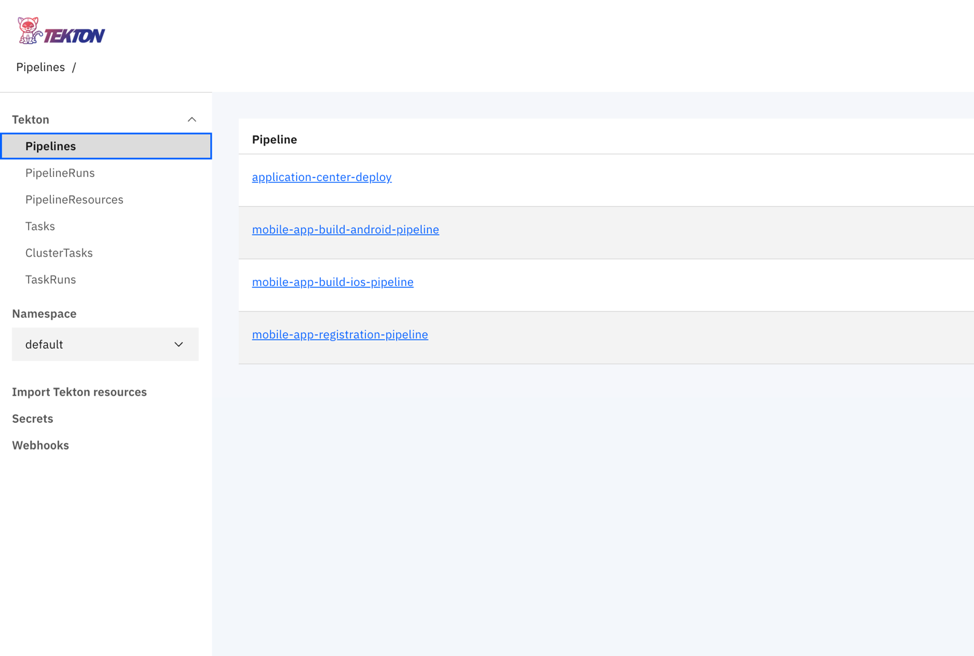
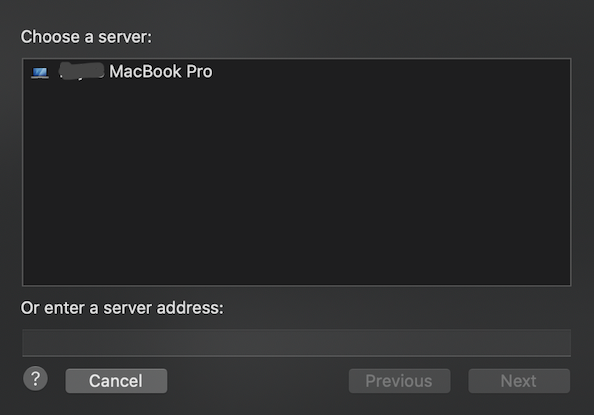
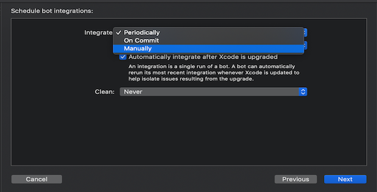
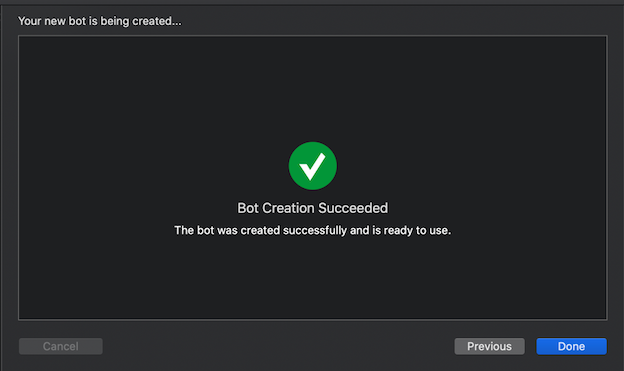

<!-- NLS_CHARSET=UTF-8 -->

Mobile Foundation for Cloud Pak for Apps is bundled with Tekton pipelines for automating common DevOps tasks related to Mobile Foundation.

>The steps to deploy Mobile Foundation on OpenShift Container Platform (OCP) are the same irrespective of how you have obtained the OCP entitlement.

## Prerequisites
{: #prereqs}

Following are the prerequisites before you begin the process of installing Mobile Foundation instance using the Mobile Foundation Operator.

- [Cloud Pak For Apps](https://cloud.ibm.com/catalog/content/ibm-cp-applications) instance with Mobile Foundation installed.
- [OpenShift CLI](https://docs.openshift.com/enterprise/3.1/cli_reference/get_started_cli.html#installing-the-cli) (`oc`).
- Tekton (available as part of Cloud Pak for Apps)


## Tekton pipelines
{: #tekton-pipelines}

Following Tekton Pipelines are available with Mobile Foundation on Cloud Pak for Apps.

1.	Mobile App Configuration Pipeline (*mobile-app-registration-pipeline*)
2.	Mobile App Build Pipeline for Android (*mobile-app-build-android-pipeline*)
3.	Mobile App Build Pipeline for iOS (*mobile-app-build-ios-pipeline*)
4.	Mobile App Distribution Pipeline (*application-center-deploy*)


### Steps for running the pipelines
{: #steps-for-running-the-pipelines}

* [Download](https://www.ibm.com/software/passportadvantage/pao_customer.html) the PPA for Mobile Foundation.
* Extract the `IBM-MobileFoundation-Openshift-Pak-<version>.tar.gz` file.
* `cd` to the location of the extracted folder
* Login to the Cloud Pak For Apps instance using the command below.
  ```bash
  oc login --token=<access_token> --server=<server_instance>
  ```


#### Mobile App Configuration Pipeline
{: #mobile-app-configuration-pipeline}

Execute the following command.
```bash
oc apply -f pipeline/mobile-app-registration -n <projectname>
```

Following is the output produced.

```text
pipelineresource.tekton.dev/mobile-app-registration-git-resource created
pipelineresource.tekton.dev/mobile-app-registration-image-resource created
pipeline.tekton.dev/mobile-app-registration-pipeline created
task.tekton.dev/mobile-app-registration-task created
```

#### Mobile App Build Pipeline for Android
{: #mobile-app-build-pipeline-android}

**Prerequisites**
Before using pipelines for android build a *github-token* needs to be added to the build tasks. Go to `pipeline/mobile-app-build-android/buildandroidapptask.yaml` file and edit the place holder with *{GITHUB_TOKEN}* with a valid *github-token* in the step **create-release**.

```yaml
  - name: create-release
    image: jimdo/github-release
    env:
      - name: "GITHUB_TOKEN"
        value: "{GITHUB_TOKEN}"
    command: ['/bin/bash']
```

Execute the following command once you have addressed the prerequisite.
```bash
oc apply -f pipeline/mobile-app-build-android -n <projectname>
```

Following is the output produced.

```text
pipelineresource.tekton.dev/mobile-app-build-android-git-sresource created
pipeline.tekton.dev/mobile-app-build-android-pipeline created
task.tekton.dev/mobile-app-build-android-task created
pipelineresource.tekton.dev/mobile-app-build-android-image-resource created
```

#### Mobile App Build Pipeline for iOS
{: #mobile-app-build-pipeline-ios}

**Prerequisites**
1. Similar to android a GitHub token needs to be added to the step *create-release* in the file `pipeline/mobile-app-build-ios/buildiosapptask.yaml` file.
2. You need to have a Xcode server setup on a publicly accessible Mac machine. Check the section *Xcode server setup for building iOS apps*.

Execute the following command once you have addressed the prerequisite.
```bash
oc apply -f pipeline/mobile-app-build-ios -n <projectname>
```

Following is the output produced.

```text
pipeline.tekton.dev/mobile-app-build-ios-pipeline created
task.tekton.dev/mobile-app-build-ios-task created
pipelineresource.tekton.dev/mobile-app-build-ios-git-resource created
pipelineresource.tekton.dev/mobile-app-build-ios-image-resource created
```

#### Mobile App Distribution Pipeline
{: #mobile-app-dist-pipeline}

Execute the following command.
```bash
oc apply -f pipeline/mobile-app-publish -n <projectname>
```

Following is the output produced.

```text
pipelineresource.tekton.dev/appcenter-git-resource created
pipelineresource.tekton.dev/appcenter-image-resource created
pipeline.tekton.dev/application-center-deploy created
task.tekton.dev/application-center-upload created
```

Above commands creates the tasks, pipelines and resources.
We can see the tasks, resources and pipelines in the Tekton Dashboard


### Running the pipeline with appropriate resources from the Tekton dashboard
{: #running-tekton-pipelines}

Edit the resource file with proper git repository URL of the application.

```text
pipeline/mobile-app-registration/appregistrationgitresource.yaml
pipeline/mobile-app-build-android/ buildandoridgitresource.yaml
pipeline/mobile-app-build-ios/ buildiosgitresource.yaml
pipeline/mobile-app-publish/mobileapppublishgitresource.yaml
```

Run the command to update the resources of the Tekton pipeline.

```bash
oc apply -f pipeline/mobile-app-registration/appregistrationgitresource.yaml -n <projectname>
```
Following is the output produced.

```text
pipelineresource.tekton.dev/mobile-app-registration-git-resource configured
```

Run the command to update the resources of the Tekton pipeline.

```bash
oc apply -f pipeline/mobile-app-build-andorid/buildandoridgitresource -n <projectname>
```
Following is the output produced.

```text
pipelineresource.tekton.dev/mobile-app-build-android-git-resource configured
```

Run the command to update the resources of the Tekton pipeline.

```bash
oc apply -f pipleline/mobile-app-build-ios/buildiosgitresource -n <projectname>
```
Following is the output produced.

```text
pipelineresource.tekton.dev/mobile-app-build-ios-git-resource configured
```

Run the command to update the resources of the Tekton pipeline.

```bash
oc apply -f pipeline/mobile-app-publish/mobileapppublishgitresource.yaml -n <projectname>
```

Following is the output produced.

```text
pipelineresource.tekton.dev/appcenter-git-resource configured
```

### Running the pipelines using PipelineRun
{: #running-pipelines-pipelinerun}

Go to the application Git Repository and edit the pipeline config file (i.e., p`ipelineconfig.json` file in the root folder of the project. If it does not exist create a json file `pipelineconfig.json` (within the  root directory of the GitHub repository) containing the Hostname, Port, Environment choice, XCode server details and GitHub details.

The pipeline config file should look something like this

```json
{
	  "env_choice": "default",
	  "development": {
	    "hostname": "184.173.5.44",
	    "port": "30989",
	    "servercred": "admin:admin"
	  },
	  "production": {
	    "hostname": "184.173.5.44",
	    "port": "30989",
	    "servercred": "admin:admin"
	  },
	  "default": {
	    "hostname": "184.173.5.44",
	    "port": "30989",
	    "servercred": "admin:admin"
	  },
	  "userName":"github_user_name",
	  "repoName": "github_repo_name",
	  "ios": {
	     "host": "9.109.199.108",
	     "botId": "1f4a17d56578a822a49567af88000ead"
	  }
	}
```

Open the Tekton dashboard and click the **Pipelines** section.

1. Click the Pipeline to run.
   

2. Click **Create PipelineRun**.
   

3. Select the **PipelineResources** git-source created above.
4. Select the **PipelineResources** docker-image created above.
5. Click **Create PipelineRun**.
   
6. To view the logs and status of the PipelineRun. Go to the Tekton dashboard and select the **PipelineRuns**.
   

### Triggering pipelines using webhook
{: #trigger-pipelines-webhook}

Run the pipeline with webhook to automatically trigger the *PipelineRun* whenever there are changes in the application git repository.

#### Creation of Webhooks
{: #creation-of-webhooks}

1. Go to Tekton dashboard and click **Webhooks** from the left navigation.
2. Click **Add Webhook**.
  
3. Enter the **Name** of the webhook and a random name to display on the Tekton dashboard.
4. Enter the application **Repository URL**.
5. Give the **Access Token** of the Git repository.
6. Select the **Namespace** where all you pipelines are created.
7. Select the **Pipeline** to trigger.
8. Select the **Service Account** as default if you are not using any other.
9. Give the details of the **Docker Registry** of the cluster.
  
10. Click **Create**.

Any pull request to the git repository shall trigger creation of a PipelineRun of the registered Pipeline.
To view the logs and status of the PipelineRun. Go to the Tekton dashboard and select the **PipelineRuns**.

### XCode Server setup for building iOS apps
{: #xcode-setup-ios-apps}

1. On a Mac machine, setup Xcode.
2. Open Xcode.
3. From the top menu select **Xcode Server**.

4. Turn on the Xcode Server to run integrations.

5. After the server is turned on go to **Permissions** section and change **Create and View Bots** option to `all users`.

6. Go to **Accounts** section and add a new account with the account type `Xcode Server` and then choose the server that is available.
  
  
7. After the Xcode Server is setup, the bot needs to be configured in order to run integrations and generate an `ipa`. Open the iOS project that you want to build in Xcode.
8. Go to the build log for the project and select **By Group** option. The configured server should be visible.

9. Right click the server and then click **Create Bot**.

10. Give a name for the bot and click **Next**. Please make sure that the bot name does not contain any spaces. Configure the source control for the bot and click **Next**.

11. In the build configuration under the **Actions** section, make sure **Archive** option is selected. Under the **Export** option select *Use Custom Export Options Plist*. Make sure you have a `plist` file in the following format.

12. In the **Schedule bot integrations** section, select the integrations to run *Manually* and then click **Next**.

13. Select the relevant build options for your project and click **Next**.
14. In the **Certificates and Profiles** sections make sure relevant certificates and profiles required for the generating the `ipa` are added to the server and click **Next**.
15. Click **Next** in the **Arguments and Environment Variables** section. In the **Triggers** section click **Add** and select *Pre-Integration script*, give it a name and add the following script in the script section that downloads the CocoaPod dependencies for the app (if any) and then click **Create**.
    ```bash
    #!/bin/sh
    cd $XCS_PRIMARY_REPO_DIR
    PATH="/usr/local/bin:/usr/bin:/bin:/usr/sbin:/sbin:/opt/X11/bin:/Library/Frameworks/Mono.framework/Versions/Current/Commands"
    . ~/.bash_profile
    bundle install
    pod install --repo-update
    ```

16. After the bot is successfully created wait for the integration to run. After the integration is successful, go to the integration and go to **Logs**. In the logs you should be able to see the *botId*. The *botId* is needed for running the integrations from the Tekton pipelines.


   
17. Now the Xcode Server setup is successful. Update the application’s pipeline config file `pipelineconfig.json` with the *botId* and the Xcode server *host* in the iOS part of the json structure. Now you’ll be able to generate `ipa` from the Tekton pipelines.  
    ```json
    "ios": {
      "host": "9.109.199.108",
      "botId": "1f4a17d56578a822a49567af88000ead"
    }
    ```
