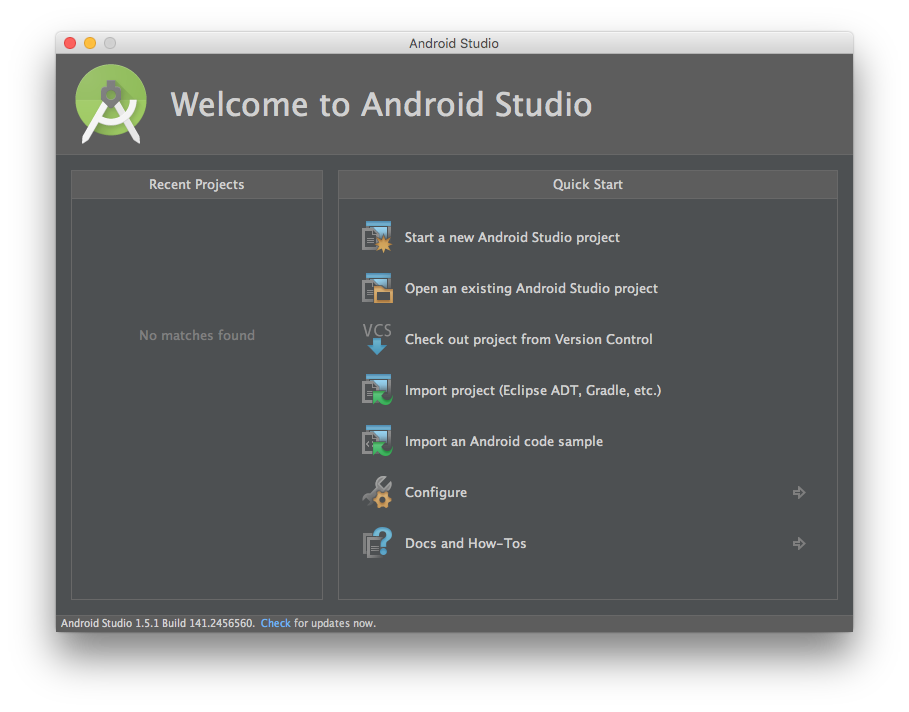

## Overview
This tutorial explains the steps a developer needs to follow in order to be able to develop and test Android applications. These steps include installing Android Studio and setting the Android SDK.

**Prerequisite:** As you setup your iOS development environment, make sure to also read the [Setting up the MobileFirst development environment](../mobilefirst/) tutorial.

#### Support level
MobileFirst SDK is compatible with Android version Ice Cream Sandwich (API level 14) and later.

### Android Studio
Follow the steps provided in the [Android Developers website](http://developer.android.com/develop/index.html) website to download and install Android Studio.

### Android SDK
The Android SDK provides the tools and APIs required to develop applications on the Android platform, using the Java programming language.

Once you open Android Studio for the time, you will be able to configure the Android SDK using the SDK Manager.

In the SDK Manager you can install required packages. For more information, [visit the Android Developer website](http://developer.android.com/sdk/index.html).

#### Android Virtual Devices
You can use an AVD to test your application. For a detailed explanation of all available options, see the [Managing Virtual Devices documentation topic](http://developer.android.com/tools/devices/index.html) in the Android Developers website.

## What's Next
Now that the MobileFirst and Android development environment are set up, continue to [Quick Start](../../../quick-start/android/) category to experience MobileFirst Platform, or to [All Tutorials](../../../all-tutorials) to learn specific aspects of MobileFirst Platform development.