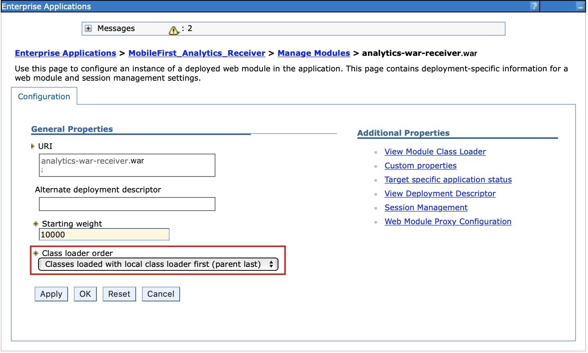

<!-- NLS_CHARSET=UTF-8 -->
## Overview
{: #overview }
{{ site.data.keys.mf_analytics_receiver_receiver_server }} is implemented and shipped as Java EE standard web application archive (WAR) file. Therefore, it can be installed in one of the following supported application servers: WebSphere  Application Server, WebSphere Application Server Liberty, or Apache Tomcat (WAR files only).

#### Jump to
{: #jump-to }

* [System requirements](#system-requirements)
* [Capacity considerations](#capacity-considerations)
* [Installing {{ site.data.keys.mf_analytics_receiver }} on WebSphere Application Server Liberty](#installing-mobilefirst-analytics-receiver-on-websphere-application-server-liberty)
* [Installing {{ site.data.keys.mf_analytics_receiver }} on Tomcat](#installing-mobilefirst-analytics-receiver-on-tomcat)
* [Installing {{ site.data.keys.mf_analytics_receiver }} on WebSphere Application Server](#installing-mobilefirst-analytics-receiver-on-websphere-application-server)
* [Installing {{ site.data.keys.mf_analytics_receiver }} with Ant tasks](#installing-mobilefirst-analytics-receiver-with-ant-tasks)

## System requirements
{: #system-requirements }

### Operating systems
{: #operating-systems }
* CentOS/RHEL 6.x/7.x
* Oracle Enterprise Linux 6/7 with RHEL Kernel only
* Ubuntu 12.04/14.04
* SLES 11/12
* OpenSuSE 13.2
* Windows Server 2012/R2
* Debian 7

### JVM
{: #jvm }
* Oracle JVM 1.7u55+
* Oracle JVM 1.8u20+
* IcedTea OpenJDK 1.7.0.55+

### Hardware
{: #hardware }
* RAM: More RAM is better, but no more than 64 GB per node. 32 GB and 16 GB are also acceptable. Less than 8 GB requires many small nodes in the cluster, and 64 GB is wasteful and problematic due to the way Java uses memory for pointers.
* Disk: Use SSDs when possible, or fast spinning traditional disks in RAID 0 configuration if SSDs are not possible.
* CPU: CPU tends not to be the performance bottleneck. Use systems with 2 to 8 cores.
* Network: When you cross into the need to scale out horizontally, you need a fast, reliable, data center with 1 GbE to 10 GbE supported speeds.

### Hardware configuration
{: #hardware-configuration }
* Give your JVM ample size to sale in memeory Queue with size of 10000 (i.e minimum Xmx as 6GB)
* Increase the allowed open file descriptors.
    * Linux typically limits a per-process number of open file descriptors to a small 1024.
    * Consult your operating system documentation for how to permanently increase this value to something much larger, like 64,000.
* If you use BSDs and Linux, ensure that your operating system I/O scheduler is set to **deadline** or **noop**, not **cfq**.

## Capacity considerations
{: #capacity-considerations }
Capacity is the single-most common question. How much RAM do you need? How much disk space? How many nodes? The answer is always: it depends.

IBM {{ site.data.keys.mf_analytics_receiver }} doesnt require a disk space since its just receives logs from mobile applications and forward them to analytics server. 

## Installing {{ site.data.keys.mf_analytics_receiver }} on WebSphere Application Server Liberty
{: #installing-mobilefirst-analytics-receiver-on-websphere-application-server-liberty }
Ensure that you already have the {{ site.data.keys.mf_analytics_receiver }} WAR file. For more information on the installation artifacts, see [Installing {{ site.data.keys.mf_server }} to an application server](../../prod-env/appserver). The **analytics-receiver.war** file is found in the `<mf_server_install_dir>\analyticsreceiver` folder. For more information about how to download and install WebSphere Application Server Liberty, see the [About WebSphere Liberty](https://developer.ibm.com/wasdev/websphere-liberty/) article on IBM  developerWorks .

1. Create a server by running the following command in your **./wlp/bin** folder.

   ```bash
   ./server create <serverName>
   ```

2. Install the following features by running the following command in your **./bin** folder.

   ```bash
   ./featureManager install jsp-2.2 ssl-1.0 appSecurity-1.0 localConnector-1.0
   ```

3. Add the **analytics-receiver.war** file to the `./usr/servers/<serverName>/apps` folder of your Liberty Server.
4. Replace the contents of the `<featureManager>` tag of the `./usr/servers/<serverName>/server.xml` file with the following content:

   ```xml
   <featureManager>
        <feature>jsp-2.2</feature>
        <feature>ssl-1.0</feature>
        <feature>appSecurity-1.0</feature>
        <feature>localConnector-1.0</feature>
   </featureManager>
   ```

5. Configure **analytics-receiver.war** as an application with role-based security in the **server.xml** file. The following example creates a basic hardcoded user registry, and assigns a user to each of the different analytics roles.

   ```xml
   <application id="analytics-receiver" name="analytics-receiver" location="analytics-receiver.war" type="war">
        <application-bnd>
            <security-role name="analytics_administrator">
                <user name="admin"/>
            </security-role>
            <security-role name="analytics_infrastructure">
                <user name="infrastructure"/>
            </security-role>
            <security-role name="analytics_support">
                <user name="support"/>
            </security-role>
            <security-role name="analytics_developer">
                <user name="developer"/>
            </security-role>
            <security-role name="analytics_business">
                <user name="business"/>
            </security-role>
        </application-bnd>
   </application>

   <basicRegistry id="worklight" realm="worklightRealm">
        <user name="business" password="demo"/>
        <user name="developer" password="demo"/>
        <user name="support" password="demo"/>
        <user name="infrastructure" password="demo"/>
        <user name="admin" password="admin"/>
   </basicRegistry>
   ```

   > For more information about how to configure other user registry types, such as LDAP, see the [Configuring a user registry for Liberty](http://ibm.biz/knowctr#SSAW57_8.5.5/com.ibm.websphere.wlp.nd.iseries.doc/ae/twlp_sec_registries.html) topic in the WebSphere Application Server product documentation.

6. Start the Liberty Server by running the following command inside your **bin** folder

   ```bash
   ./server start <serverName>
   ```

7. Verify the service by invoking health url

   ```bash
   http://localhost:9080/analytics-receiver/rest/data/health
   ```

For more information about administering WebSphere Application Server Liberty, see the [Administering Liberty from the command line](http://ibm.biz/knowctr#SSAW57_8.5.5/com.ibm.websphere.wlp.nd.multiplatform.doc/ae/twlp_admin_script.html) topic in the WebSphere Application Server product documentation.

## Installing {{ site.data.keys.mf_analytics_receiver }} on Tomcat
{: #installing-mobilefirst-analytics-receiver-on-tomcat }
Ensure that you already have the {{ site.data.keys.mf_analytics_receiver }} WAR files. For more information on the installation artifacts, see [Installing {{ site.data.keys.mf_server }} to an application server](../../prod-env/appserver). The **analytics-receiver.war** file is found in the **<mf_server_install_dir>\analyticsreceiver** folder. For more information about how to download and install Tomcat, see [Apache Tomcat](http://tomcat.apache.org/). Ensure that you download the version that supports Java 7 or higher. For more information about which version of Tomcat supports Java 7, see [Apache Tomcat Versions](http://tomcat.apache.org/whichversion.html).

1. Add **analytics-receiver.war** file to the Tomcat **webapps** folder.
2. Uncomment the following section in the **conf/server.xml** file, which is present, but commented out, in a freshly downloaded Tomcat archive.

   ```xml
   <Valve className ="org.apache.catalina.authenticator.SingleSignOn"/>
   ```

3. Declare the two war files in the **conf/server.xml** file, and define a user registry.

   ```xml
   <Context docBase ="analytics-receiver-service" path ="/analytics-receiver"></Context>
   <Realm className ="org.apache.catalina.realm.MemoryRealm"/>
   ```

   The **MemoryRealm** recognizes the users that are defined in the **conf/tomcat-users.xml** file. For more information about other choices, see [Apache Tomcat Realm Configuration HOW-TO](http://tomcat.apache.org/tomcat-7.0-doc/realm-howto.html).

4. Add the following sections to the **conf/tomcat-users.xml** file to configure a **MemoryRealm**.
    * Add the security roles.

      ```xml
      <role rolename="analytics_administrator"/>
      <role rolename="analytics_infrastructure"/>
      <role rolename="analytics_support"/>
      <role rolename="analytics_developer"/>
      <role rolename="analytics_business"/>
      ```
    * Add a few users with the roles you want.

      ```xml
      <user name="admin" password="admin" roles="analytics_administrator"/>
      <user name="support" password="demo" roles="analytics_support"/>
      <user name="business" password="demo" roles="analytics_business"/>
      <user name="developer" password="demo" roles="analytics_developer"/>
      <user name="infrastructure" password="demo" roles="analytics_infrastructure"/>
      ```    
    * Start your Tomcat Server and verify the service by invoking the health url

      ```xml
      http://localhost:8080/analytics-receiver/rest/data/health
      ```

    For more information about how to start the Tomcat Server, see the official Tomcat site. For example, [Apache Tomcat 7](http://tomcat.apache.org/tomcat-7.0-doc/introduction.html), for Tomcat 7.0.

## Installing {{ site.data.keys.mf_analytics_receiver }} on WebSphere Application Server
{: #installing-mobilefirst-analytics-receiver-on-websphere-application-server }
For more information on initial installation steps for acquiring the installation artificats (JAR and EAR files), see [Installing {{ site.data.keys.mf_server }} to an application server](../../prod-env/appserver). The **analytics-receiver.war** file is found in the **<mf_server_install_dir>\analyticsreceiver** folder.

The following steps describe how to install and run the Analytics EAR file on WebSphere Application Server. If you are installing the individual WAR files on WebSphere Application Server, follow only steps 2 - 7 on the **analytics-receiver** WAR file after you deploy.

1. Deploy the WAR file to the application server, but do not start it. . For more information about how to install an EAR file on WebSphere Application Server, see the [Installing enterprise application files with the console](http://ibm.biz/knowctr#SSAW57_8.5.5/com.ibm.websphere.nd.multiplatform.doc/ae/trun_app_instwiz.html) topic in the WebSphere Application Server product documentation.

2. Select the **MobileFirst Analytics Receiver** application from the **Enterprise Applications** list.

    

3. Click **Class loading and update detection**.

    

4. Set the class loading order to **parent last**.

    

5. Click **Security role to user/group mapping** to map the admin user.

    

6. Click **Manage Modules**.

    

7. Select the **analytics-receiver** module and change the class loader order to **parent last**.

    

8. Enable **Administrative security** and **application security** in the WebSphere Application Server administration console:
    * Log in to the WebSphere Application Server administration console.
    * In the **Security > Global Security** menu, ensure that **Enable administrative security** and **Enable application security** are both selected. Note: Application security can be selected only after **Administrative security** is enabled.
    * Click **OK** and save changes.

9. To enable the analytics service to be accessed via Swagger documentation, complete the following steps:
    * Click **Servers > Server Types > WebSphere application servers** and choose the server on which Analytics service is deployed, from the list of servers.
    * Under **Server Infrastructure**, click **Java** and then navigate to  **process management > Process definition > Java virtual machine > Custom
 properties**.
      - Set the following custom property<br/>
        **Property Name:** *com.ibm.ws.classloader.strict*<br/>
        **Value:** *true*

10. Start the {{ site.data.keys.mf_analytics_receiver }} application and verify the health url is accessible in the browser: `http://<hostname>:<port>/analytics-receiver/rest/data/health`.

## Installing {{ site.data.keys.mf_analytics_receiver }} with Ant tasks
{: #installing-mobilefirst-analytics-receiver-with-ant-tasks }
Ensure that you have the necessary WAR and configuration files: **analytics-receiver.war**. For more information on the installation artifacts, see [Installing {{ site.data.keys.mf_server }} to an application server](../../prod-env/appserver). The **analytics-receiver.war** file is found in the **MobileFirst_Platform_Server\AnalyticsReceiver**.

You must run the Ant task on the computer where the application server is installed, or the Network Deployment Manager for WebSphere  Application Server Network Deployment. If you want to start the Ant task from a computer on which {{ site.data.keys.mf_server }} is not installed, you must copy the file **\<mf_server_install_dir\>/MobileFirstServer/mfp-ant-deployer.jar** to that computer.

> Note: The **mf_server_install_dir** placeholder is the directory where you installed {{ site.data.keys.mf_server }}.

1. Edit the Ant script that you use later to deploy {{ site.data.keys.mf_analytics_receiver }} WAR files.
    * Review the sample configuration files in [Sample configuration files for {{ site.data.keys.mf_analytics_receiver }}](../../installation-reference/#sample-configuration-files-for-mobilefirst-analytics).
    * Replace the placeholder values with the properties at the beginning of the file.

    > Note: The following special characters must be escaped when they are used in the values of the Ant XML scripts:
    >
    > * The dollar sign ($) must be written as $$, unless you explicitly want to reference an Ant variable through the syntax ${variable}, as described in the  [Properties](http://ant.apache.org/manual/properties.html) section of the Apache Ant Manual.
    > * The ampersand character (&) must be written as &amp;, unless you explicitly want to reference an XML entity.
    > * Double quotation marks (") must be written as &quot;, except when it is inside a string that is enclosed in single quotation marks.

2. To deploy the WAR file, run the following command: `ant -f configure-appServer-analytics-receiver.xml install`
    You can find the Ant command in **mf_server_install_dir/shortcuts**. This installs a node of {{ site.data.keys.mf_analytics_receiver }}, on the server, or on each member of a cluster if you install on WebSphere Application Server Network Deployment.
3. Save the Ant file. You might need it later to apply a fix pack or perform an upgrade.
    If you do not want to save the passwords, you can replace them by "************" (12 stars) for interactive prompting.