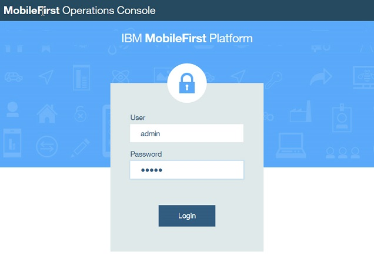

## Overview
Use the graphical mode of IBM® Installation Manager and the Server Configuration Tool to install MobileFirst Server.

#### Before you begin
* Make sure that one of the following databases and a supported Java version are installed. You also need the corresponding JDBC driver for the database to be available on your computer:
    * Database Management System (DBMS) from the list of supported database:
        * DB2®
        * MySQL
        * Oracle

        **Important:** You must have a database where you can create the tables that are needed by the product, and a database user who can create tables in that database.

        In the tutorial, the steps to create the tables are for DB2. You can find the DB2 installer as a package of IBM MobileFirst Foundation eAssembly [on IBM Passport Advantage](http://www.ibm.com/software/passportadvantage/pao_customers.htm).  
        
* JDBC driver for your database:
    * For DB2, use the DB2 JDBC driver type 4.
    * For MySQL, use the Connector/J JDBC driver.
    * For Oracle, use the Oracle thin JDBC driver.

* Java 7 or later.

* Download the installer of IBM Installation Manager V1.8.4 or later from [Installation Manager and Packaging Utility download links](http://www.ibm.com/support/docview.wss?uid=swg27025142).
* You must also have the installation repository of the MobileFirst Server and the installer of WebSphere® Application Server Liberty Core V8.5.5.3 or later. Download these packages from the IBM MobileFirst Foundation eAssembly on Passport Advantage:

**MobileFirst Server installation repository**  
IBM MobileFirst Foundation V8.0 .zip file of Installation Manager Repository for IBM MobileFirst Platform Server

**WebSphere Application Server Liberty profile**  
IBM WebSphere Application Server - Liberty Core V8.5.5.3 or later
    
You can run the installation in graphical mode if you are on one of the following operating systems:

* Windows x86 or x86-64
* macOS x86-64
* Linux x86 or Linux x86-64

On other operating systems, you can still run the installation with Installation Manager in graphical mode, but the Server Configuration Tool is not available. You need to use Ant tasks (as described in [Installing MobileFirst Server in command line mode](../command-line) to deploy MobileFirst Server to Liberty profile.

**Note:** The instruction to install and set up the database is not part of this tutorial. If you want to run this tutorial without installing a stand-alone database, you can use the embedded Derby database. However, the restrictions for using this database are as follows:

* You can run Installation Manager in graphical mode, but to deploy the server, you need to skip to the command line section of this tutorial to install with Ant tasks.
* You cannot configure a server farm. Embedded Derby database does not support access from multiple servers. To configure a server farm, you need DB2, MySQL, or Oracle.

#### Jump to

* [Installing IBM Installation Manager](#installing-ibm-installation-manager)
* [Installing WebSphere Application Server Liberty Core](#installing-websphere-application-server-liberty-core)
* [Installing MobileFirst Server](#installing-mobilefirst-server)
* [Creating a database](#creating-a-database)
* [Running the Server Configuration Tool](#running-the-server-configuration-tool)
* [Testing the installation](#testing-the-installation)
* [Creating a farm of two Liberty servers that run MobileFirst Server](#cerating-a-farm-of-two-liberty-servers-that-run-mobilefirst-server)
* [Testing the farm and see the changes in MobileFirst Operations Console](#testing-the-farm-and-see-the-changes-in-mobilefirst-operations-console)

### Installing IBM Installation Manager
You must install Installation Manager V1.8.4 or later. The older versions of Installation Manager are not able to install IBM MobileFirst Foundation V8.0 because the postinstallation operations of the product require Java 7. The older versions of Installation Manager come with Java 6.

1. Extract the IBM Installation Manager archive that is downloaded. You can find the installer at [Installation Manager and Packaging Utility download links](http://www.ibm.com/support/docview.wss?uid=swg27025142).
2. Install Installation Manager:
    * Run **install.exe** to install Installation Manager as administrator. Root is needed on Linux or UNIX. On Windows, the administrator privilege is needed. In this mode, the information about the installed packages is placed in a shared location on the disk and any user that is allowed to run Installation Manager can update the applications.
    * Run **userinst.exe** to install Installation Manager in user mode. No specific privilege is needed. However, in this mode, the information about the installed packages are placed in the user's home directory. Only that user can update the applications that are installed with Installation Manager.

### Installing WebSphere Application Server Liberty Core
The installer for WebSphere Application Server Liberty Core is provided as part of the package for IBM MobileFirst Foundation. In this task, Liberty profile is installed and a server instance is created so that you can install MobileFirst Server on it.

1. Extract the compressed file for WebSphere Application Server Liberty Core that you downloaded.
2. Launch Installation Manager.
3. Add the repository in Installation Manager.
    * Go to **File → Preferences and click Add Repositories...**.
    * Browse for the **repository.config** file of **diskTag.inf** file in the directory where the installer is extracted.
    * Select the file and click **OK**.
    * Click **OK** to close the Preferences panel.
4. Click **Install** to install Liberty.
    * Select **IBM WebSphere Application Server Liberty Core** and click **Next**.
    * Accept the terms in the license agreements, and click **Next**.
5. In the scope of this tutorial, do not need to install the additional assets when asked. Click **Install** for the installation process to start.
    * If the installation is successful, the program displays a message indicating that installation is successful. The program might also display important postinstallation instructions.
    * If the installation is not successful, click **View Log File** to troubleshoot the problem.
6. Move the **usr** directory that contains the servers in a location that does not need specific privileges.

    If you install Liberty with Installation Manager in administrator mode, the files are in a location where non-administrator or non-root users cannot modify the files. For the scope of this tutorial, move the **usr** directory that contains the servers in a place that does not need specific privileges. In this way, the installation operations can be done without specific privileges.
    * Go to the installation directory of Liberty.
    * Create a directory named **etc**. You need administrator or root privileges.
    * In **etc** directory, create a **server.env** file with the following content: `WLP_USER_DIR=<path to a directory where any user can write>`
    
    For example, on Windows: `WLP_USER_DIR=C:\LibertyServers\usr`
7. Create a Liberty server that will be used to install the first node of MobileFirst Server at the later part of the tutorial.
    * Start a command line.
    * Go to l**iberty\_install\_dir/bin**, and enter `server create mfp1`.
    
    This command creates a Liberty server instance named mfp1. You can see its definition at **liberty\_install\_dir/usr/servers/mfp1** or **WLP\_USER\_DIR/servers/mfp1** (if you modify the directory as described in step 6).
    
After the server is created, you can start this server with `server start mfp1` from **liberty\_install\_dir/bin/**. To stop the server, enter the command: `server stop mfp1` from **liberty\_install\_dir/bin/**.  
The default home page can be viewed at http://localhost:9080.

> **Note:** For production, you need to make sure that the Liberty server is started as a service when the host computer starts. Making the Liberty server start as a service is not part of this tutorial.

### Installing MobileFirst Server
Run Installation Manager to install the binary files of MobileFirst Server on your disk before you create the databases and deploy MobileFirst Server to Liberty profile. During the installation of MobileFirst Server with Installation Manager, an option is proposed to you to install IBM MobileFirst Platform Application Center. Application Center is a different component of the product. For this tutorial, it is not required to be installed with MobileFirst Server.

1. Launch Installation Manager.
2. Add the repository of MobileFirst Server in Installation Manager.
    * Go to **File → Preferences and click Add Repositories...**.
    * Browse for the repository file in the directory where the installer is extracted.

        If you decompress the IBM MobileFirst Foundation V8.0 .zip file for MobileFirst Server in **mfp\_installer\_directory** folder, the repository file can be found at **mfp\_installer\_directory/MobileFirst\_Platform\_Server/disk1/diskTag.inf**.

        You might also want to apply the latest fix pack that can be downloaded from [IBM Support Portal](http://www.ibm.com/support/entry/portal/product/other_software/ibm_mobilefirst_platform_foundation). Make sure to enter the repository for the fix pack. If you decompress the fix pack in **fixpack_directory** folder, the repository file is found in **fixpack_directory/MobileFirst_Platform_Server/disk1/diskTag.inf**.
    
        > **Note:** You cannot install the fix pack without the repository of the base version in the repositories of Installation Manager. The fix packs are incremental installers and need the repository of the base version to be installed.
    * Select the file and click **OK**.
    * Click **OK** to close the Preferences panel.

3. After you accept the license terms of the product, click **Next**.
4. Select the **Create a new package group** option to install the product in that new package group.
5. Click **Next**.
6. Select **Do not activate token licensing with the Rational License Key Server ** option in the **Activate token licensing** section of the **General settings** panel.

    In this tutorial, it is assumed that token licensing is not needed and the steps to configure MobileFirst Server for token licensing are not included. However, for production installation, you must determine whether you need to activate token licensing or not. If you have a contract to use token licensing with Rational® License Key Server, select Activate token licensing with the Rational License Key Server option. After you activate token licensing, you must do extra steps to configure MobileFirst Server.
7. Keep the default option (No) as-is in the Install **IBM MobileFirst Foundation for iOS** section of the **General settings** panel.
8. Select No option in the **Choose configuration** panel so that Application Center is not installed. For production installation, use Ant tasks to install Application Center. The installation with Ant tasks enables you to decouple the updates to MobileFirst Server from the updates to Application Center.
9. Click **Next** until you reach the **Thank You** panel. Then, proceed with the installation.

An installation directory that contains the resources to install MobileFirst components is installed.  
You can find the resources in the following folders:

* MobileFirstServer folder for MobileFirst Server
* PushService folder for MobileFirst Server push service
* ApplicationCenter folder for Application Center
* Analytics folder for MobileFirst Analytics

The goal of this tutorial is to install MobileFirst Server by using the resources in **MobileFirstServer** folder.  
You can also find some shortcuts for the Server Configuration Tool, Ant, and mfpadm program in the **shortcuts** folder.

### Creating a database
This task is to ensure that a database exists in your DBMS, and that a user is allowed to use the database, create tables in it, and use the tables.  
The database is used to store the technical data that is used by the various MobileFirst components:

* MobileFirst Server administration service
* MobileFirst Server live update service
* MobileFirst Server push service
* MobileFirst runtime

In this tutorial, the tables for all the components are placed under the same schema. The Server Configuration Tool creates the tables in the same schema. For more flexibility, you might want to use Ant tasks or a manual installation.

> **Note:** The steps in this task are for DB2. If you plan to use MySQL or Oracle, see [Database requirements](../../databases/#database-requirements).

1. Log on to the computer that is running the DB2 server. It is assumed that a DB2 user, for example named as **mfpuser**, exists.
2. Verify that this DB2 user has the access to a database with a page size 32768 or more, and is allowed to create implicit schemas and tables in that database.

    By default, this user is a user declared on the operating system of the computer that runs DB2. That is, a user with a login for that computer. If such user exists, the next action in step 3 is not needed. In the later part of the tutorial, the Server Configuration Tool creates all the tables that are required by the product under a schema in that database.

3. Create a database with the correct page size for this installation if you do not have one.
    * Open a session with a user that has `SYSADM` or `SYSCTRL` permissions. For example, use the user **db2inst1** that is the default admin user that is created by the DB2 installer.
    * Open a DB2 command line processor:
        * On Windows systems, click **Start → IBM DB2 → Command Line Processor**.
        * On Linux or UNIX systems, go to **~/sqllib/bin** (or **db2\_install\_dir/bin** if **sqllib** is not created in the administrator's home directory) and enter `./db2`.
        * Enter the following SQL statements to create a database that is called **MFPDATA**:
        
        ```sql
        CREATE DATABASE MFPDATA COLLATE USING SYSTEM PAGESIZE 32768
        CONNECT TO MFPDATA
        GRANT CONNECT ON DATABASE TO USER mfpuser
        GRANT CREATETAB ON DATABASE TO USER mfpuser
        GRANT IMPLICIT_SCHEMA ON DATABASE TO USER mfpuser
        DISCONNECT MFPDATA
        QUIT
        ```
        
If you defined a different user name, replace mfpuser with your own user name.  

> **Note:** The statement does not remove the default privileges granted to PUBLIC in a default DB2 database. For production, you might need to reduce the privileges in that database to the minimum requirement for the product. For more information about DB2 security and an example of the security practices, see [DB2 security, Part 8: Twelve DB2 security best practices](http://www.ibm.com/developerworks/data/library/techarticle/dm-0607wasserman/).

### Running the Server Configuration Tool
You use the Server Configuration Tool to run the following operations:

* Create the tables in the database that are needed by the MobileFirst applications
* Deploy the web applications of MobileFirst Server (the runtime, administration service, live update service, push service components, and MobileFirst Operations Console) to Liberty server.

The Server Configuration Tool does not deploy the following MobileFirst applications:

#### MobileFirst Analytics
MobileFirst Analytics is typically deployed on a different set of servers than MobileFirst Server because of its high memory requirements. MobileFirst Analytics can be installed manually or with Ant tasks. If it is already installed, you can enter its URL, the user name, and password to send data to it in the Server Configuration Tool. The Server Configuration Tool will then configure the MobileFirst apps to send data to MobileFirst Analytics. 

#### Application Center
This application can be used to distribute mobile apps internally to the employees that use the apps, or for test purpose. It is independent of MobileFirst Server and is not necessary to install together with MobileFirst Server.
    
1. Start the Server Configuration Tool.
    * On Linux, from **application shortcuts Applications → IBM MobileFirst Platform Server → Server Configuration Tool**.
    * On Windows, click **Start → Programs → IBM MobileFirst Platform Server → Server Configuration Tool**.
    * On macOS, open a shell console. Go to **mfp_server\_install\_dir/shortcuts and type ./configuration-tool.sh**.
    
    The mfp_server_install_dir directory is where you installed MobileFirst Server.
2. Select **File → New Configuration...** to create a MobileFirst Server Configuration.
3. Name the configuration "Hello MobileFirst" and click **OK**.
4. Leave the default entries of Configuration Details as-is and click **Next**.
    
    In this tutorial, the environment ID is not used. It is a feature for advanced deployment scenario.  
    An example of such scenario would be installing multiple instances of MobileFirst Server and administration service in the same application server or WebSphere Application Server cell.
5. Keep the default context root for the administration service and the runtime component.
6. Do not change the default entries in the **Console Settings** panel and click **Next** to install MobileFirst Operations Console with the default context root.
7. Select **IBM DB2** as a database and click **Next**.
8. In the **DB2 Database Settings** panel, complete the details:
    * Enter the host name that runs your DB2 server. If it is running on your computer, you can enter **localhost**.
    * Change the port number if the DB2 instance you plan to use is not listening to the default port (50000).
    * Enter the path to the DB2 JDBC driver. For DB2, the file that is named as **db2jcc4.jar** is expected. It is also needed to have the **db2jcc\_license\_cu.jar** file in the same directory. In a standard DB2 distribution, these files are found in **db2\_install\_dir/java**.
    * Click **Next**.

    If the DB2 server cannot be reached with the credentials that are entered, the Server Configuration Tool disables the **Next** button and displays an error. The **Next** button is also disabled if the JDBC driver does not contain the expected classes. If everything is correct, the **Next** button is enabled.
    
9. In the **DB2 Additional Settings** panel, complete the details:
    * Enter **mfpuser** as DB2 user name and its password. Use your own DB2 user name if it is not **mfpuser**.
    * Enter **MFPDATA** as the name of the database.
    * Leave **MFPDATA** as the schema in which the tables will be created. Click **Next**. By default, the Server Configuration Tool proposes the value **MFPDATA**.
10. Do not enter any values in the **Database Creation Request** panel and click **Next**.

    This pane is used when the database that is entered in the previous pane does not exist on the DB2 server. In that case, you can enter the user name and password of the DB2 administrator. The Server Configuration Tool opens an ssh session to the DB2 server and runs the commands as described in [Creating a database](#creating-a-database) to create the database with default settings and the correct page size.
11. In the **Application Server Selection** panel, select **WebSphere Application Server** option and click **Next**.
12. In the **Application Server Settings** panel, complete the details:
    * Enter the installation directory for WebSphere Application Server Liberty.
    * Select the server where you plan to install the product in the server name field. Select the **mfp1** server that is created in step 7 of [Installing WebSphere Application Server Liberty Core](#installing-websphere-application-server-liberty-core).
    * Leave the **Create a user** option selected with its default values.
    
    This option creates a user in the basic registry of the Liberty server, so that you can sign in to MobileFirst Operations Console or to the administration service. For a production installation, do not use this option and configure the security roles of the applications after the installation as described in Configuring user authentication for MobileFirst Server administration.
    * Select the Server farm deployment option for the deployment type.
    * Click **Next**.
13. Select **Install the Push service** option.

    When the push service is installed, HTTP or HTTPS flows are needed from the administration service to the push service, and from the administration service and the push service to the runtime component.
14. Select **Have the Push and Authorization Service URLs computed automatically** option.

    When this option is selected, the Server Configuration Tool configures the applications to connect to the applications installed on the same server. When you use a cluster, enter the URL that is used to connect to the services from your HTTP load balancer. When you install on WebSphere Application Server Network Deployment, it is mandatory to enter a URL manually.
15. Keep the default entries of **Credentials for secure communication between the Administration and the Push service** as-is.

    A client ID and a password are needed to register the push service and the administration service as the confidential OAuth clients for the authorization server (which is by default, the runtime component). The Server Configuration Tool generates an ID and a random password for each of the service, that you can keep as-is for this getting started tutorial.
16. Click **Next**.
17. Keep the default entries of **Analytics Setting** panel as-is.

    To enable the connection to the Analytics server, you need to first install MobileFirst Analytics. However, the installation is not in the scope of this tutorial.
18. Click **Deploy**.

You can see a detail of the operations done in **Console Window**.  
An Ant file is saved. The Server Configuration Tool helps you create an Ant file for installing and updating your configuration. This Ant file can be exported by using **File → Export Configuration as Ant Files...**. For more information about this Ant file, see Deploying MobileFirst Server to Liberty with Ant tasks in Installing MobileFirst Server [in command line mode](../command-line).

Then, the Ant file is run and does the following operations:

1. The tables for the following components are created in the database:
    * The administration service and the live update service. Created by the **admdatabases** Ant target.
    * The runtime. Created by the **rtmdatabases** Ant target.
    * The push service. Created by the pushdatabases Ant target.
2. The WAR files of the various components are deployed to Liberty server. You can see the details of the operations in the log under **adminstall**, **rtminstall**, and **pushinstall** targets.

If you have access to the DB2 server, you can list the tables that are created by using these instructions:

1. Open a DB2 command line processor with mfpuser as described in step 3 of Creating a database.
2. Enter the SQL statements:

```sql
CONNECT TO MFPDATA USER mfpuser USING mfpuser_password
LIST TABLES FOR SCHEMA MFPDATA
DISCONNECT MFPDATA
QUIT
```

Take note of the following database factors:

#### Database user consideration
In the Server Configuration Tool, only one database user is needed. This user is used to create the tables, but is also used as the data source user in the application server at run time. In production environment, you might want to restrict the privileges of the user that is used at run time to the strict minimum (`SELECT / INSERT / DELETE / UPDATE)`, and thus provide a different user for deployment in the application server. The Ant files that are provided as examples also use the same users for both cases. However, in the case of DB2, you might want to create your own versions of files. As such, you can distinguish the user that is used to create the databases from the user that is used for the data source in the application server with the Ant tasks.

#### Database tables creation
For production, you might want to create the tables manually. For example, if your DBA wants to override some default settings or assign specific table spaces. The database scripts that are used to create the tables are available in **mfp\_server\_install\_dir/MobileFirstServer/databases** and **mfp_server\_install\_dir/PushService/databases**. For more information, see [Creating the database tables manually](../../databases/#create-the-database-tables-manually).

The **server.xml** file and some application server setting are modified during the installation. Before each modification, a copy of the **server.xml** file is made, such as **server.xml.bak**, **server.xml.bak1**, and **server.xml.bak2**. To see everything that was added, you can compare the **server.xml** file with the oldest backup (server.xml.bak). On Linux, you can use the command diff `--strip-trailing-cr server.xml server.xml.bak` to see the differences. On AIX®, use the command `diff server.xml server.xml.bak` to find the differences.

#### Modification of the application server settings (specific to Liberty):
1. The Liberty features are added.

    The features are added for each application and can be duplicated. For example, the JDBC feature is used for both the administration service and the runtime components. This duplication allows the removal of the features of an application when it is uninstalled without breaking the other applications. For example, if you decide at some point to uninstall the push service from a server and install it on another server. However, not all topologies are possible. The administration service, the live update service, and the runtime component must be on the same application server with Liberty profile. For more information, see [Constraints on MobileFirst Server administration service, MobileFirst Server live update service and MobileFirst runtime](../../topologies/constraints). The duplication of features does not create issue unless the features that added are conflicting. Adding the jdbc-40 and jdbc-41 features would cause a problem, but adding twice the same feature does not.
    
2. `host='*'` is added in the `httpEndPoint` declaration.

    This setting is to allow the connection to the server from all network interfaces. In production, you might want to restrict the host value of the HTTP endpoint.
3. The **tcpOptions** element (**tcpOptions soReuseAddr="true"**) is added in the server configuration to enable immediate rebind to a port with no active listener and improve the throughput of the server.
4. A keystore with ID **defaultKeyStore** is created if it does not exist.

    he keystore is to enable the HTTPS port and more specifically, to enable the JMX communication between the administration service (mfp-admin-service.war) and the runtime component (mfp-server.war). The two applications communicate via JMX. In the case of Liberty profile, restConnector is used to communicate between the applications in a single server and also between the servers of a Liberty Farm. It requires the use of HTTPS. For the keystore that is created by default, Liberty profiles creates a certificate with a validity period of 365 days. This configuration is not intended for production use. For production, you need to reconsider to use your own certificate.    

    To enable JMX, a user with administrator role (named as MfpRESTUser) is created in the basic registry. Its name and password are provided as JNDI properties (mfp.admin.jmx.user and mfp.admin.jmx.pwd) and are used by the runtime component and the administration service to run JMX queries. In the global JMX properties, some properties are used to define the cluster mode (stand-alone server or working in a farm). The Server Configuration Tool sets the mfp.topology.clustermode property to Standalone in Liberty server. In the later part of this tutorial about the creation of a farm, the property is modified to Cluster.
5. The creation of users (Also valid for Apache Tomcat and WebSphere Application Server)
    * Optional Users: The Server Configuration Tool creates a test user (admin/admin) so that you can use this user to log to the console after the installation.
    * Mandatory Users: The Server Configuration Tool also creates a user (named as configUser_mfpadmin with a randomly generated password) to be used by the administration service to contact the local live update service. For Liberty server, MfpRESTUser is created. If your application server is not configured to use a basic registry (for example, an LDAP registry), the Server Configuration Tool is unable to request the name of an existing user. In this case, you need to use Ant tasks.
6. The **webContainer** element is modified.

    The `deferServletLoad` web container custom property is set to false. Both the runtime component and the administration service must start when the server starts. These components can thus register the JMX beans and start the synchronization procedure that allows the runtime component to download all the applications and adapters that it needs to serve.
7. The default executor is customized to set large values to `coreThreads` and `maxThreads` if you use Liberty V8.5.5.5 or earlier. The default executor is automatically tuned by Liberty as of V8.5.5.6.

    This setting avoids timeout issues that break the startup sequence of the runtime component and administration service on some Liberty versions. The absence of this statement can be the cause of these errors in the server log file:
    
    > Failed to obtain JMX connection to access an MBean. There might be a JMX configuration error: Read timed out 
FWLSE3000E: A server error was detected. 
    > FWLSE3012E: JMX configuration error. Unable to obtain MBeans. Reason: "Read timed out".

#### Declaration of applications
The following applications are installed:

* **mfpadmin**, the administration service
* **mfpadminconfig**, the live update service
* **mfpconsole**, MobileFirst Operations Console
* **mobilefirs**t, MobileFirst runtime component
* **imfpush**, the push service

The Server Configuration Tool installs all the applications on the same server. You can separate the applications in different application servers, but under certain constraints that are documented in [Topologies and network flows](../../topologies).  
For an installation on different servers, you cannot use the Server Configuration Tool. Use Ant tasks or install the product manually.

#### Administration service
The administration service is the service for managing MobileFirst applications, adapters, and their configurations. It is secured by security roles. By default, the Server Configuration Tool adds a user (admin) with the administrator role, that you can use to log in to the console for testing. The configuration of the security role must be done after an installation with the Server Configuration Tool (or with Ant tasks). You might want to map the users or the groups that come from the basic registry or an LDAP registry that you configure in your application server to each security role.

The class loader is set with delegation parent last for Liberty profile and WebSphere Application Server, and for all MobileFirst applications. This setting is to avoid conflicts between the classes packaged in the MobileFirst applications and the classes of the application server. Forgetting to set the class loader delegation to parent last is a frequent source of error in manual installation. For Apache Tomcat, this declaration is not needed.

In Liberty profile, a common library is added to the application for decrypting passwords that are passed as JNDI properties. The Server Configuration Tool defines two mandatory JNDI properties for the administration service: **mfp.config.service.user** and **mfp.config.service.password**. They are used by the administration service to connect to the live update service with its REST API. More JNDI properties can be defined to tune the application or adapt it to your installation particularities. For more information, see [List of JNDI properties for MobileFirst Server administration service](../../server-configuration/#list-of-jndi-properties-for-mobilefirst-server-administration-service).

The Server Configuration Tool also defines the JNDI properties (the URL and the OAuth parameters to register the confidential clients) for the communication with the push service.  
The data source to the database that contains the tables for the administration service is declared, as well as a library for its JDBC driver.

#### Live update service
The live update service stores information about the runtime and application configurations. It is controlled by the administration service and must always run on the same server as the administration service. The context root is **context\_root\_of\_admin\_serverconfig**. As such, it is **mfpadminconfig**. The administration service assumes that this convention is respected to create the URL of its requests to the REST services of the live update service.

The class loader is set with delegation parent last as discussed in the administration service section.

The live update service has one security role, **admin_config**. A user must be mapped to that role. Its password and login must be provided to the administration service with the JNDI property: **mfp.config.service.user** and **mfp.config.service.password**. For information about the JNDI properties, see [List of JNDI properties for MobileFirst Server administration service](../../server-configuration/#list-of-jndi-properties-for-mobilefirst-server-administration-service) and [List of JNDI properties for MobileFirst Server live update service](../../server-configuration/#list-of-jndi-properties-for-mobilefirst-server-live-update-service).

It also needs a data source with JNDI name on Liberty profile. The convention is **context\_root\_of\_config\_server/jdbc/ConfigDS**. In this tutorial, it is defined as **mfpadminconfig/jdbc/ConfigDS**. In an installation by the Server Configuration Tool or with Ant tasks, the tables of the live update service are in the same database and schema as the tables of the administration service. The user to access these tables is also the same.

#### MobileFirst Operations Console
MobileFirst Operations Console is declared with the same security roles as the administration service. The users that are mapped to the security roles of MobileFirst Operations Console must also be mapped to the same security role of the administration service. Indeed, MobileFirst Operations Console runs queries to the administration service on the behalf of the console user.

The Server Configuration Tool positions one JNDI property, **mfp.admin.endpoint**, that indicates how the console connects to the administration service. The default value set by the Server Configuration Tool is `*://*:*/mfpadmin`. The setting means that it must use the same protocol, host name, and port as the incoming HTTP request to the console, and the context root of the administration service is /mfpadmin. If you want to force the request to go though a web proxy, change the default value. For more information about the possible values for this URL, or for information about other possible JNDI properties, see [List of JNDI properties for MobileFirst Server administration service](../../server-configuration/#list-of-jndi-properties-for-mobilefirst-server-administration-service).

The class loader is set with delegation parent last as discussed in the administration service section.

#### MobileFirst runtime
This application is not secured by a security role. It is not required to log in with a user known by the Liberty server, to access this application. The mobile devices requests are routed to the runtime. They are authenticated by other mechanisms specific to the product (such as OAuth) and the configuration of the MobileFirst applications.

The class loader is set with delegation parent last as discussed in the administration service section.

It also needs a data source with JNDI name on Liberty profile. The convention is **context\_root\_of\_runtime/jdbc/mfpDS**. In this tutorial, it is defined as **mobilefirst/jdbc/mfpDS**. In an installation by the Server Configuration Tool or with Ant tasks, the tables of the runtime are in the same database and schema as the tables of the administration service. The user to access these tables is also the same.

#### Push service
This application is secured by OAuth. The valid OAuth tokens must be included in any HTTP request to the service.

The configuration of OAuth is made through the JNDI properties (such as the URL of the authorization server, the client ID, and the password of the push service). The JNDI properties also indicate the security plug-in (**mfp.push.services.ext.security**) and the fact that a relational database is used (**mfp.push.db.type**). The requests from the mobile devices to the push service are routed to this service. The context root of the push service must be /imfpush. The client SDK computes the URL of the push service based on the URL of the runtime with the context root (**/imfpush**). If you want to install the push service on a different server than the runtime, you need to have an HTTP router that can route the device requests to the relevant application server.

The class loader is set with delegation parent last as discussed in the administration service section.

It also needs a data source with JNDI name on Liberty profile. The JNDI name is **imfpush/jdbc/imfPushDS**. In an installation by the Server Configuration Tool or with Ant tasks, the tables of the push service are in the same database and schema as the tables of the administration service. The user to access these tables is also the same.

#### Other files modification
The Liberty profile jvm.options file is modified. A property (com.ibm.ws.jmx.connector.client.rest.readTimeout) is defined to avoid timeout issues with JMX when the runtime synchronizes with the administration service.

### Testing the installation
After the installation is complete, you can use this procedure to test the components that are installed.

1. Start the server by using the command **server start mfp1**. The binary file for the server is in **liberty\_install\_dir/bin**.
2. Test MobileFirst Operations Console with a web browser. Go to [http://localhost:9080/mfpconsole](http://localhost:9080/mfpconsole). By default, the server runs on port 9080. However, you can verify the port in the element `<httpEndpoint>` as defined in the **server.xml** file. A login screen is displayed.



3. Log in with **admin/admin**. This user is created by default by the Server Configuration Tool.

    > **Note:** If you connect with HTTP, the login ID and password are sent in clear text in the network. For a secure login, use HTTPS to log to the server. You can see the HTTPS port of the Liberty server in the httpsPort attribute of the `<httpEndpoint>` element in the **server.xml** file. By default, the value is 9443.

4. Log out of the console with **Hello Admin → Sign Out**.
5. Enter the following URL: [https://localhost:9443/mfpconsole](https://localhost:9443/mfpconsole) in the web browser and accept the certificate. By default, the Liberty server generates a default certificate that is not known by your web browser, you need to accept the certificate. Mozilla Firefox presents this certification as a security exception.
6. Log in again with **admin/admin**. The login and password are encrypted between your web browser and MobileFirst Server. In production, you might want to close the HTTP port.

### Creating a farm of two Liberty servers that run MobileFirst Server
In this task, you will create a second Liberty server that runs the same MobileFirst Server and connected to the same database. In production, you might use more than one server for performance reasons, to have enough servers to serve the number of transactions per second that is needed for your mobile applications at peak time. It is also for high availability reasons to avoid having a single point of failure.

When you have more than one server that runs MobileFirst Server, the servers must be configured as a farm. This configuration enables any administration service to contact all the runtimes of a farm. If the cluster is not configured as a farm, only the runtime that runs in the same application server as the management service that runs the management operation is notified. Others runtimes are not aware of the change. For example, you deploy a new version of an adapter in a cluster that is not configured as a farm, only one server would serve the new adapter. The other servers would continue to serve the old adapter. The only situation where you can have a cluster and do not need to configure a farm is when you install your servers on WebSphere Application Server Network Deployment. The administration service is able to find all the servers by querying the JMX beans with the deployment manager. The deployment manager must be running to allow management operations because it is used to provide the list of the MobileFirst JMX beans of the cell.

When you create a farm, you also need to configure an HTTP server to send queries to all the members of the farm. The configuration of an HTTP server is not included in this tutorial. This tutorial is only about configuring the farm so that management operations are replicated to all the runtime components of the cluster.

1. Create a second Liberty server on the same computer.
    * Start a command line.
    * Go to **liberty\_install\_dir/bin**, and enter **server create mfp2**.
2. Modify the HTTP and HTTPS ports of the server mfp2 so that they do not conflict with the ports of server mfp1.
    * Go to the second server directory. The directory is **liberty\_install\_dir/usr/servers/mfp2** or **WLP\_USER\_DIR/servers/mfp2** (if you modify the directory as described in step 6 of [Installing WebSphere Application Server Liberty Core](#installing-websphere-application-server-liberty-core)).
    * Edit the **server.xml** file. Replace

    ```xml
    <httpEndpoint id="defaultHttpEndpoint"
    httpPort="9080"
    httpsPort="9443" />
    ```
    
    with:
    
    ```xml
    <httpEndpoint id="defaultHttpEndpoint"
    httpPort="9081"
    httpsPort="9444" />
    ```
    
    The HTTP and HTTPS ports of the server mfp2 do not conflict with the ports of the server mfp1 with this change. Make sure to modify the ports before you run the installation of MobileFirst Server. Otherwise, if you modify the port after the installation is made, you also need to reflect the change of the port in the JNDI property: **mfp.admin.jmx.port**.
    
3. Run the Server Configuration Tool.
    *  Create a configuration **Hello MobileFirst 2**.
    * Do the same installation procedure as described in [Running the Server Configuration Tool](#running-the-server-configuration-tool) but select **mfp2** as the application server. Use the same database and same schema.

    > **Note:**  
    > 
    > * If you use an environment ID for server mfp1 (not suggested in the tutorial), the same environment ID must be used for server mfp2.
    > * If you modify the context root for some applications, use the same context root for server mfp2. The servers of a farm must be symmetric.
    > * If you create a default user (admin/admin), create the same user in the server mfp2.

    The Ant tasks detect that the databases exist and do not create the tables (see the following log extract). Then, the applications are deployed to the server.
    
    ```xml
    [configuredatabase] Checking connectivity to MobileFirstAdmin database MFPDATA with schema 'MFPDATA' and user 'mfpuser'...
    [configuredatabase] Database MFPDATA exists.
    [configuredatabase] Connection to MobileFirstAdmin database MFPDATA with schema 'MFPDATA' and user 'mfpuser' succeeded.
    [configuredatabase] Getting the version of MobileFirstAdmin database MFPDATA...
    [configuredatabase] Table MFPADMIN_VERSION exists, checking its value...
    [configuredatabase] GetSQLQueryResult => MFPADMIN_VERSION = 8.0.0
    [configuredatabase] Configuring MobileFirstAdmin database MFPDATA...
    [configuredatabase] The database is in latest version (8.0.0), no upgrade required.
    [configuredatabase] Configuration of MobileFirstAdmin database MFPDATA succeeded.
    ```
    
4. Test the two servers with HTTP connection.
    * Open a web browser.
    * Enter the following URL: [http://localhost:9080/mfpconsole](http://localhost:9080/mfpconsole). The console is served by server mfp1.
    * Log in with **admin/admin**.
    * Open a tab in the same web browser and enter the URL: [http://localhost:9081/mfpconsole](http://localhost:9081/mfpconsole). The console is served by server mfp2.
    * Log in with admin/admin. If the installation is done correctly, you can see the same welcome page in both tabs after login.
    * Return to first browser tab and click **Hello, admin → Download Audit Log**. You are logged out of the console and see the login screen again. This logout behavior is an issue. The problem happens because when you log on to server mfp2, a Lightweight Third Party Authentication (LTPA) token is created and stored in your browser as a cookie. However, this LTPA token is not recognized by server mfp1. Switching between servers is likely to happen in a production environment when you have an HTTP load balancer in front of the cluster. To resolve this issue, you must ensure that both servers (mfp1 and mfp2) generate the LTPA tokens with the same secret keys. Copy the LTPA keys from server mfp1 to server mfp2.
    * Stop both servers with these commands:
    
        ```bash
        server stop mfp1
        server stop mfp2
        ```
    * Copy the LTPA keys of server mfp1 to server mfp2.
        From **liberty\_install\_dir/usr/servers** or **WLP\_USER\_DIR/servers**, run the following command depending on your operating system. 
        * On UNIX: `cp mfp1/resources/security/ltpa.keys mfp2/resources/security/ltpa.keys`
        * On Windows: `copy mfp1/resources/security/ltpa.keys mfp2/resources/security/ltpa.keys`
    * Restart the servers. Switch from one browser tab to another other does not require you to relogin. In a Liberty server farm, all servers must have the same LTPA keys.
5. Enable the JMX communication between the Liberty servers.

    The JMX communication with Liberty, is done via the Liberty REST connector over the HTTPS protocol. To enable this communication, each server of the farm must be able to recognize the SSL certificate of the other members. You need to exchange the HTTPS certificates in their truststores. Use IBM utilities such as Keytool, which is part of the IBM JRE distribution in **java/bin** to configure the truststore. The locations of the keystore and truststore are defined in the **server.xml** file. By default, the keystore of Liberty profile is at **WLP\_USER\_DIR/servers/server\_name/resources/security/key.jks**. The password of this default keystore, as can be seen in the **server.xml** file, is **mobilefirst**.
    
    > **Tip:** You can change it with the Keytool utility, but you must also change the password in the server.xml file so that Liberty server can read that keystore. In this tutorial, use the default password.
    * In **WLP\_USER\_DIR/servers/mfp1/resources/security**, enter `keytool -list -keystore key.jks`. The command shows the certificates in the keystore. There is only one named **default**. You are prompted for the password of the keystore (mobilefirst) before you can see the keys. This is the case for all the next commands with Keytool utility.
    * Export the default certificate of server mfp1 with the command: `keytool -exportcert -keystore key.jks -alias default -file mfp1.cert`.
        * In **WLP\_USER\_DIR/servers/mfp2/resources/security**, export the default certificate of server mfp2 with the command: `keytool -exportcert -keystore key.jks -alias default -file mfp2.cert`.
    * In the same directory, import the certificate of server mfp1 with the command: `keytool -import -file ../../../mfp1/resources/security/mfp1.cert -keystore key.jks`. The certificate of server mfp1 is imported into the keystore of server mfp2 so that server mfp2 can trust the HTTPS connections to server mfp1. You are asked to confirm that you trust the certificate.
    * In **WLP_USER_DIR/servers/mfp1/resources/security**, import the certificate of server mfp2 with the command: `keytool -import -file ../../../mfp2/resources/security/mfp2.cert -keystore key.jks`. After this step, the HTTPS connections between the two servers are possible.

## Testing the farm and see the changes in MobileFirst Operations Console

1. Start the two servers:

    ```bash
    server start mfp1
    server start mfp2
    ```
    
2. Access the console. For example, [http://localhost:9080/mfpconsole](http://localhost:9080/mfpconsole), or [https://localhost:9443/mfpconsole](https://localhost:9443/mfpconsole) in HTTPS. In the left sidebar, an extra menu that is labeled as **Server Farm Nodes** appears. If you click **Server Farm Nodes**, you can the status of each node. You might need to wait a bit for both nodes to be started.
    
    