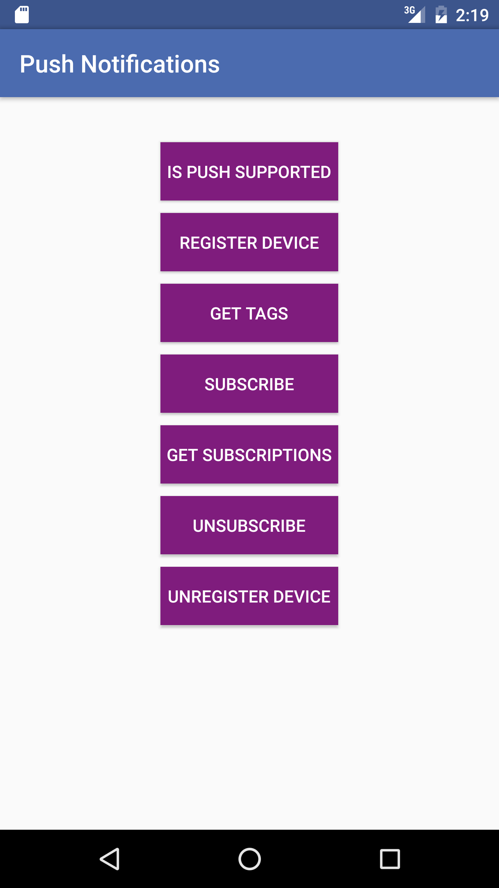

## Overview
Before Android applications are able to handle any received push notifications, support for Google Play Services needs to be configured. Once an application has been configured, MobileFirst-provided Notifications API can be used in order to register &amp; unregister devices, and subscribe &amp; unsubscribe to tags. In this tutorial, you will learn how to handle push notification in Android applications.

**Prerequisites:**

* Make sure you have read the following tutorials:
    * [Setting up your MobileFirst development environment](../../setting-up-your-development-environment/)
    * [Adding the MobileFirst Platform Foundation SDK to Android applications](../../adding-the-mfpf-sdk/android)
    * [Push Notifications Overview](../push-notifications-overview)
* MobileFirst Server to run locally, or a remotely running MobileFirst Server.
* MobileFirst Developer CLI installed on the developer workstation

#### Jump to:

* [Notifications configuration](#notifications-configuration)
* [Notifications API](#notifications-api)
* [Handling a push notification](#handling-a-push-notification)
* [Sample application](#sample-application)

## Notifications Configuration
Create a new Android Studio project or use an existing one.  
If the MobileFirst Native Android SDK is not already present in the project, follow the instructions in the [Adding the MobileFirst Platform Foundation SDK to Android applications](../../adding-the-mfpf-sdk/android) tutorial.

### Project setup

1. In **Android → Gradle scripts**, select the **build.gradle (Module: app)** file and add the following lines to `dependencies`:

	```bash
	com.google.android.gms:play-services-gcm:8.4.0
	```

    And:


    ```xml
    compile group: 'com.ibm.mobile.foundation',
    name: 'ibmmobilefirstplatformfoundationPush',
    version: '8.0.0.0.Beta1-SNAPSHOT',
    ext: 'aar',
    transitive: true
    ```
    - Or in a single line:

        ```xml
        compile 'com.ibm.mobile.foundation:ibmmobilefirstplatformfoundationpush:8.0.Beta1-SNAPSHOT'
        ```

    <span style="color:red"> remove step 2 below before going live</span>

2. Copy ibmmobilefirstplatformfoundationpush-1.0.0.aar (from halpert Electra DevOps Latest integration build) to <android_sdk>\extras\google\m2repository\com\ibm\mobile\foundation\ibmmobilefirstplatformfoundationpush\1.0.0\ibmmobilefirstplatformfoundationpush-1.0.0.aar. Also  remove libs folder from the aar.  

3. In **Android → app → manifests**, open the `AndroidManifest.xml` file.
	* Add the following permissions to the top the `manifest` tag:

		```xml
		<!-- Permissions -->
    	<uses-permission android:name="android.permission.WAKE_LOCK" />

    	<!-- GCM Permissions -->
    	<uses-permission android:name="com.google.android.c2dm.permission.RECEIVE" />
    	<permission
    	    android:name="your.application.package.name.permission.C2D_MESSAGE"
    	    android:protectionLevel="signature" />
		```
	* Add the following (`MFPPush Intent Service`, `MFPPush Instance ID Listener Service`) to the `application` tag:

		```xml
        <!-- GCM Receiver -->
        <receiver
            android:name="com.google.android.gms.gcm.GcmReceiver"
            android:exported="true"
            android:permission="com.google.android.c2dm.permission.SEND">
            <intent-filter>
                <action android:name="com.google.android.c2dm.intent.RECEIVE" />
                <category android:name="your.application.package.name" />
            </intent-filter>
        </receiver>

        <!-- MFPPush Intent Service -->
        <service
            android:name="com.ibm.mobilefirstplatform.clientsdk.android.push.api.MFPPushIntentService"
            android:exported="false">
            <intent-filter>
                <action android:name="com.google.android.c2dm.intent.RECEIVE" />
            </intent-filter>
        </service>

        <!-- MFPPush Instance ID Listener Service -->
        <service
            android:name="com.ibm.mobilefirstplatform.clientsdk.android.push.api.MFPPushInstanceIDListenerService"
            android:exported="false">
            <intent-filter>
                <action android:name="com.google.android.gms.iid.InstanceID" />
            </intent-filter>
        </service>
		```

		> **Note:** Be sure to replace `your.application.package.name` with the actual package name of your application.


## Notifications API

### MFPPush Instance
All API calls must be called on an instance of `MFPPush`.  This can be by created a class level field such as `private MFPPush push = MFPPush.getInstance();`, and then calling `push.<api-call>` throughout the class.

Alternatively you can call `MFPPush.getInstance().<api_call>` for each instance in which you need to access the push API methods.

### Challenge Handlers
If the `push.mobileclient` scope is mapped to a **security check**, you need to make sure matching **challenge handlers** exist and are registered before using any of the Push APIs.

> Learn more about challenge handlers in the [credential validation](../../authentication-and-security/credentials-validation/android) tutorial.

### Client-side

| Java Methods | Description |
|-----------------------------------------------------------------------------------|-------------------------------------------------------------------------|
| [`initialize(Context context);`](#initialization) | Initializes MFPPush for supplied context. |
| [`isPushSupported();`](#is-push-supported) | Does the device support push notifications. |
| [`registerDevice(MFPPushResponseListener);`](#register-device) | Registers the device with the Push Notifications Service. |
| [`getTags(MFPPushResponseListener)`](#get-tags) | Retrieves the tag(s) available in a push notification service instance. |
| [`subscribe(String[] tagNames, MFPPushResponseListener)`](#subscribe) | Subscribes the device to the specified tag(s). |
| [`getSubscriptions(MFPPushResponseListener)`](#get-subscriptions) | Retrieves all tags the device is currently subscribed to. |
| [`unsubscribe(String[] tagNames, MFPPushResponseListener)`](#unsubscribe) | Unsubscribes from a particular tag(s). |
| [`unregisterDevice(MFPPushResponseListener)`](#unregister) | Unregisters the device from the Push Notifications Service |

#### Initialization
Required for the client application to connect to MFPPush service with the right application context.

* The API method should be called first before using any other MFPPush APIs.
* Registers the callback function to handle received push notifications.

```java
MFPPush.getInstance().initialize(this);
```

#### Is push supported
Checks if the device supports push notifications.

```java
Boolean isSupported = MFPPush.getInstance().isPushSupported();

if (isSupported ) {
    // Push is supported
} else {
    // Push is not supported
}
```

#### Register device
Register the device to the push notifications service.

```java
MFPPush.getInstance().registerDevice(new MFPPushResponseListener<String>() {
    @Override
    public void onSuccess(String s) {
        // Successfully registered
    }

    @Override
    public void onFailure(MFPPushException e) {
        // Registration failed with error
    }
});
```

#### Get tags
Retrieve all the available tags from the push notification service.

```java
MFPPush.getInstance().getTags(new MFPPushResponseListener<List<String>>() {
    @Override
    public void onSuccess(List<String> strings) {
        // Successfully retrieved tags as list of strings
    }

    @Override
    public void onFailure(MFPPushException e) {
        // Failed to receive tags with error
    }
});
```

#### Subscribe
Subscribe to desired tags.

```java
String[] tags = {"Tag 1", "Tag 2"};

MFPPush.getInstance().subscribe(tags, new MFPPushResponseListener<String[]>() {
    @Override
    public void onSuccess(String[] strings) {
        // Subscribed successfully
    }

    @Override
    public void onFailure(MFPPushException e) {
        // Failed to subscribe
    }
});
```

#### Get subscriptions
Retrieve tags the device is currently subscribed to.

```java
MFPPush.getInstance().getSubscriptions(new MFPPushResponseListener<List<String>>() {
    @Override
    public void onSuccess(List<String> strings) {
        // Successfully received subscriptions as list of strings
    }

    @Override
    public void onFailure(MFPPushException e) {
        // Failed to retrieve subscriptions with error
    }
});
```

#### Unsubscribe
Unsubscribe from tags.

```java
String[] tags = {"Tag 1", "Tag 2"};

MFPPush.getInstance().unsubscribe(tags, new MFPPushResponseListener<String[]>() {
    @Override
    public void onSuccess(String[] strings) {
        // Unsubscribed successfully
    }

    @Override
    public void onFailure(MFPPushException e) {
        // Failed to unsubscribe
    }
});
```

#### Unregister
Unregister the device from push notification service instance.

```java
MFPPush.getInstance().unregisterDevice(new MFPPushResponseListener<String>() {
    @Override
    public void onSuccess(String s) {
        disableButtons();
        // Unregistered successfully
    }

    @Override
    public void onFailure(MFPPushException e) {
        // Failed to unregister
    }
});
```

## Handling a push notification
In order to handle a push notification you will need to set up a `MFPPushNotificationListener`.  This can be achieved by implementing one of the following methods.

### Option One
In the activity in which you wish the handle push notifications.

1. Add `implements MFPPushNofiticationListener` to the class declaration.
2. Set the class to be the listener by calling `MFPPush.getInstance().listen(this)` in the `onCreate` method.
2. Then you will need to add the following *required* method:

	```java
	@Override
    public void onReceive(MFPSimplePushNotification mfpSimplePushNotification) {
        // Handle push notification here
    }
	```

3. In this method you will receive the `MFPSimplePushNotification` and can handle the notification for the desired behavior.

### Option Two
Create a listener by calling `listen(new MFPPushNofiticationListener())` on an instance of `MFPPush` as outlined below:

```java
MFPPush.getInstance().listen(new MFPPushNotificationListener() {
    @Override
    public void onReceive(MFPSimplePushNotification mfpSimplePushNotification) {
        // Handle push notification here
    }
});
```


## Sample application

[Click to download](https://github.com/MobileFirst-Platform-Developer-Center/PushNotificationsAndroid/tree/release80) the Android Studio project.

### Sample usage
1. From a **Command-line** window, navigate to the project's root folder and run the command: `mfpdev app register`.
2. In the MobileFirst console, under **Applications** → **PushNotificationsAndroid** → **Security** → **Map scope elements to security checks**, add a mapping for `push.mobileclient`.
3. Import the project to Android Studio, and run the sample by clicking the **Run** button.

**Note:** The latest version of Google Play Services is required to be installed on the device for the sample to run.

**[Sending a notification](../sending-push-notifications):**

* Tag notification
    * Use the **MobileFirst Operations Console → [your application] → Push screen**.
* Authenticated notification:
    * Deploy the [**UserLogin** Security Check](../../authentication-and-security/user-authentication/security-check).
    * In **MobileFirst Operations Console → [your application] → Security tab**, map the **push.mobileclient** scope to the **UserLogin** Security Check.
    * Use the [REST APIs](../sending-push-notifications#rest-apis) to send the notification.
