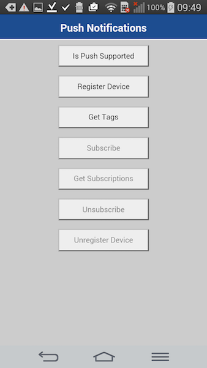

## Overview
Before iOS and Android Cordova applications are able to receive and display push notifications, the Cordova project needs to be configured with the **cordova-plugin-mfp-push** plug-in. Once an application has been configured, MobileFirst-provided Notifications API can be used in order to register &amp; unregister devices, subscribe &amp; unsubscribe tags and handle notifications.

In this tutorial you learn how to configure a Cordova application and how to use the MobileFirst-provided Notifications API.

**Prequisites:**

* Make sure you have read the following tutorials:
    * [Setting up your MobileFirst development environment](../../setting-up-your-development-environment/)
    * [Preparing the MobileFirst Server for push notification](../sending-push-notifications/)
    * [Push Notifications Overview](../push-notifications-overview)
* MobileFirst Server to run locally, or a remotely running MobileFirst Server
* MobileFirst Developer CLI installed on the developer workstation
* Cordova CLI installed on the developer workstation

#### Jump to
* [Notifications Configuration](#notifications-configuration)
    * [Android platform](#android-platform)
    * [iOS platform](#ios-platform)
* [Notifications API](#notifications-api)
* [Handling a push notification](#handling-a-push-notification)
* [Sample application](#sample-application)

## Notifications Configuration
Create a new Cordova project or use an existing one.  
If the MobileFirst Cordova SDK is not already present in the project, follow the instructions in the [Adding the MobileFirst Platform Foundation SDK to Cordova applications](../../../adding-the-mfpf-sdk/cordova) tutorial.

### Adding the Push plug-in

1. From a **command-line** window, navigate to the root of the Cordova project.  

2. Add the push plug-in to the iOS and/or Android platform by running the command:

    ```bash
    cordova plugin add cordova-plugin-mfp-push
    ```

3. Build the Cordova project by running the command: 

    ```bash
    cordova build
    ```

### iOS platform
The iOS platform requires an additional step.  
In Xcode, enable push notifications for your application in the **Capabilities** screen.

> <span class="glyphicon glyphicon-exclamation-sign" aria-hidden="true"></span> **Important:** the bundleId selected for the application must match the AppId that you have previously created in the Apple Developer site. See the [Push Notifications Overview] tutorial.


## Notifications API
### Client-side
Javascript Function | Description
--- | ---
[`MFPPush.initialize(success, failure)`](#initialization) | Initialize the MFPPush instance. 
[`MFPPush.isPushSupported(success, failure)`](#is-push-supported) | Does the device support push notifications.
[`MFPPush.registerDevice(success, failure)`](#register-device) | Registers the device with the Push Notifications Service.
[`MFPPush.getTags(success, failure)`](#get-tags) | Retrieves all the tags available in a push notification service instance.
[`MFPPush.subscribe(tag, success, failure)`](#subscribe) | Subscribes to a particular tag.
[`MFPPush.getSubsciptions(success, failure)`](#get-subscriptions) | Retrieves the tags device is currently subscribed to
[`MFPPush.unsubscribe(tag, success, failure)`](#unsubscribe) | Unsubscribes from a particular tag.
[`MFPPush.unregisterDevice(success, failure)`](#unregister) | Unregisters the device from the Push Notifications Service

### API implementation

#### Initialization
Initialize the **MFPPush** instance. 
- Required for the client application to connect to MFPPush service with the right application context.  
- The API method should be called first before using any other MFPPush APIs. 
- Registers the callback function to handle received push notifications.

```javascript 
MFPPush.initialize (
    function(successResponse) {
        alert("Successfully intialized");
        MFPPush.registerNotificationsCallback(notificationReceived);
    }, 
    function(failureResponse) {
        alert("Failed to initialize");
    }
);
```

#### Is push supported
Check if the device supports push notifications.

```javascript 
MFPPush.isPushSupported (
    function(successResponse) {
        alert("Push Supported: " + successResponse);
    },
    function(failureResponse) {
        alert("Failed to get push support status");
    }
);
```
    
#### Register device
Register the device to the push notifications service.

```javascript
MFPPush.registerDevice(
    function(successResponse) {
        alert("Successfully registered");
    },
    function(failureResponse) {
        alert("Failed to register");
    }
);
```
    
> *Optional*. *iOS-only*. Before calling the above `registerDevice` API method, use the `setOptions(options)` API method to enable or disable various options, such as alerts, notification sound, badge and interactive notifications categories.  
> 
> Read more about the the `setOptions(options)` API method in the user documentation.

#### Get tags
Retrieve all the available tags from the push notification service.

```javascript
MFPPush.getTags (
    function(tags) {
        alert(JSON.stringify(tags));
},
    function() {
        alert("Failed to get tags");
    }
);
```

#### Subscribe
Subscribe to desired tags.

```javascript
var tags = ['sample-tag1','sample-tag2'];

MFPPush.subscribe(
    tags,
    function(tags) {
        alert("Subscribed successfully");
    },
    function() {
        alert("Failed to subscribe");
    }
);
```

#### Get subscriptions
Retrieve tags the device is currently subscribed to.

```javascript
MFPPush.getSubscriptions (
    function(subscriptions) {
        alert(JSON.stringify(subscriptions));
    },
    function() {
        alert("Failed to get subscriptions");
    }
);
```

#### Unsubscribe
Unsubscribe from tags.

```javascript
var tags = ['sample-tag1','sample-tag2'];

MFPPush.unsubscribe(
    tags,
    function(tags) {
        alert("Unsubscribed successfully");
    },
    function() {
        alert("Failed to unsubscribe");
    }
);
```

#### Unregister
Unregister the device from push notification service instance.

```javascript
MFPPush.unregisterDevice(
    function(successResponse) {
        alert("Unregistered successfully");
    },
    function() {
        alert("Failed to unregister");
    }
);
```

## Handling a push notification
You can handle a received push notification by operating on its response object in the registered callback function.

```javascript
var notificationReceived = function(message) {
    alert(JSON.stringify(message));
};
```


## Sample application
[Click to download](https://github.com/MobileFirst-Platform-Developer-Center/PushNotificationsCordova/tree/release80) the Cordova project.

### Sample usage

1. From a **Command-line**, navigate to the project's root folder.
2. Register the application by running the command: `mfpdev app register`.
3. Add a platform using the `cordova platform add` command.
4. Follow required set-up steps mentioned in this tutorial.
5. Run the application by running the `cordova run` command.
