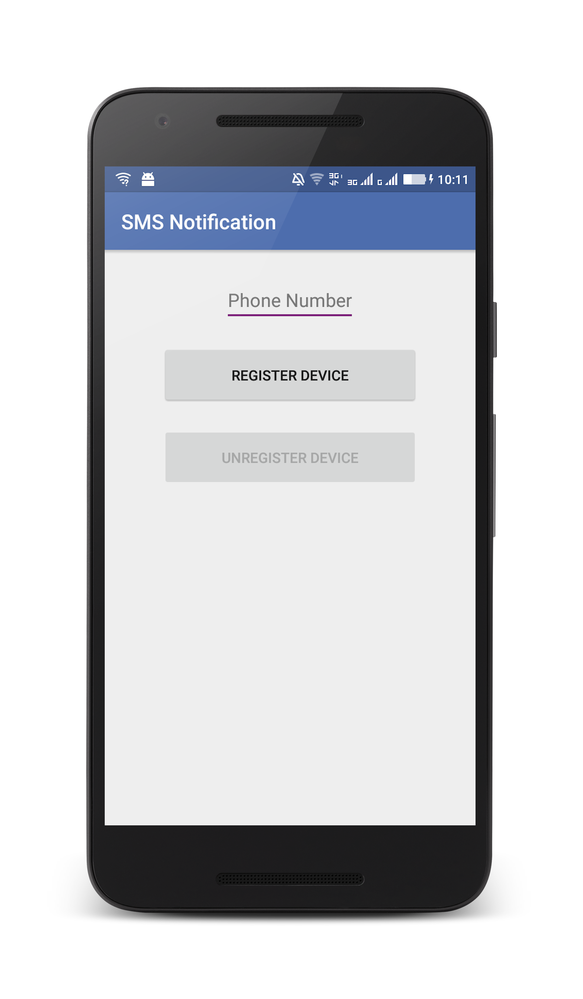

## Overview
SMS notifications are a sub-set of Push Notification, as such make sure to first [go through the Push notifications in Android](../) tutorials.

#### Jump to:
* [Notifications API](#notifications-api)   
* [Using a SMS subscribe servlet](#using-a-sms-subscribe-servlet)     
* [Sample Application](#sample-application)

## Notifications API
In SMS notifications, when registering the device, a phone number value is passed.

#### Challenge Handlers
If the `push.mobileclient` scope is mapped to a **security check**, you need to make sure matching **challenge handlers** exist and are registered before using any of the Push APIs.

#### Initialization
Required for the client application to connect to MFPPush service with the right application context.

* The API method should be called first before using any other MFPPush APIs.
* Registers the callback function to handle received push notifications.

```java
MFPPush.getInstance().initialize(this);
```

#### Register Device

Register the device to the push notifications service.

```java
MFPPush.getInstance().registerDevice(new MFPPushResponseListener<String>() {
    @Override
    public void onSuccess(String s) {
        // Successfully registered
    }

    @Override
    public void onFailure(MFPPushException e) {
        // Registration failed with error
    }
});
```

#### Unregister Device

Unregister the device from push notification service instance.

```java
MFPPush.getInstance().unregisterDevice(new MFPPushResponseListener<String>() {
    @Override
    public void onSuccess(String s) {
        disableButtons();
        // Unregistered successfully
    }

    @Override
    public void onFailure(MFPPushException e) {
        // Failed to unregister
    }
});
```

## Using a SMS subscribe servlet
REST APIs are used to send notifications to the registered devices. All forms of notifications can be sent: tag &amp; broadcast notifications, and authenticated notifications

To send a notification, a request is made using POST to the REST endpoint: `imfpush/v1/apps/<application-identifier>/messages`.  
Example URL: 

```bash
https://myserver.com:443/imfpush/v1/apps/com.sample.sms/messages
```

> To review all Push Notifications REST APIs, see the <a href="https://www.ibm.com/support/knowledgecenter/SSHS8R_8.0.0/com.ibm.worklight.apiref.doc/rest_runtime/c_restapi_runtime.html">REST API runtime services</a> topic in the user documentation.

To send a notification, see the [sending notifications](../sending-push-notifications) tutorial.


## Sample application
[Click to download](https://github.com/MobileFirst-Platform-Developer-Center/SMSNotificationsSwift/tree/release80) the Cordova project.

**Note:** The latest version of Google Play Services is required to be installed on any Android device for the sample to run.

### Sample usage

1. From a **Command-line**, navigate to the project's root folder.
2. Register the application by running the command: `mfpdev app register`.
3. In the MobileFirst console, under **Applications** → **SMSNotificationsAndroid** → **Security** → **Map scope elements to security checks**, add a mapping for `push.mobileclient`.
4. Import the project to Android Studio, and run the sample by clicking the **Run** button.

**Sending an SMS notification**

* Tag notification
    * Use the **MobileFirst Operations Console → [your application] → Push → Send Push tab**.

