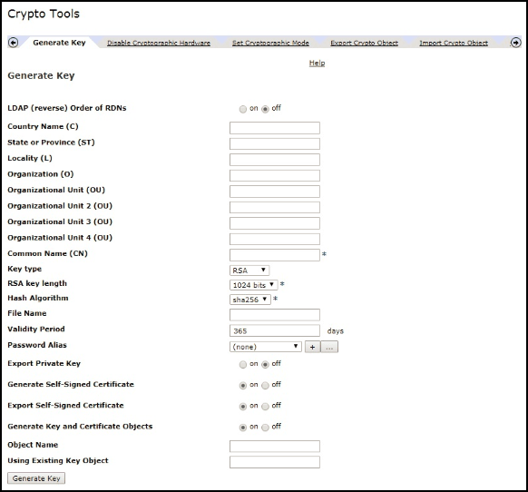
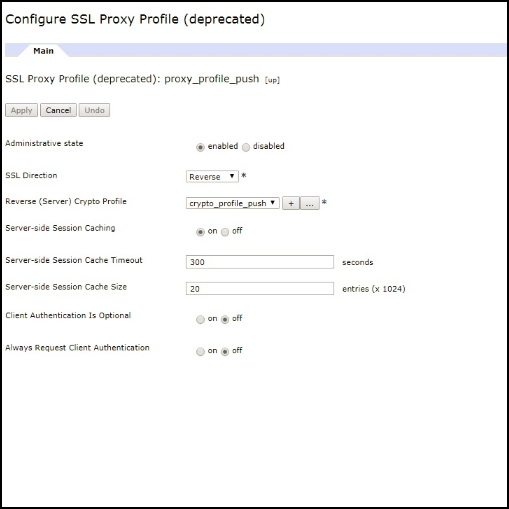

<!-- NLS_CHARSET=UTF-8 -->
## Overview
{: #overview }
Notifications is the ability of a mobile device to receive messages that are "pushed" from a server.  
Notifications are received regardless of whether the application is currently running in the foreground or background.  

{{ site.data.keys.product_full }} provides a unified set of API methods to send either push or SMS notifications to iOS, Android, Windows 8.1 Universal, Windows 10 UWP and Cordova (iOS, Android) applications. The notifications are sent from the {{ site.data.keys.mf_server }} to the vendor (Apple, Google, Microsoft, SMS Gateways) infrastructure, and from there to the relevant devices. The unified notification mechanism makes the entire process of communicating with the users and devices completely transparent to the developer.

#### Device support
{: #device-support }
Push and SMS notifications are supported for the following platforms in {{ site.data.keys.product }}:

* iOS 8.x or later
* Android 4.x or later
* Windows 8.1, Windows 10

#### Jump to:
{: #jump-to }
* [Push notifications](#push-notifications)
* [SMS notifications](#sms-notifications)
* [Proxy settings](#proxy-settings)
* [Tutorials to follow next](#tutorials-to-follow-next)

## Push notifications
{: #push-notifications }
Notifications can take several forms:

* **Alert (iOS, Android, Windows)** -  a pop-up text message
* **Sound (iOS, Android, Windows)** - a sound file playing when a notification is received
* **Badge (iOS), Tile (Windows)** - a graphical representation that allows a short text or image
* **Banner (iOS), Toast (Windows)** - a disappearing pop-up text message at the top of the device display
* **Interactive (iOS 8 and above)** - action buttons inside the banner of a received notification
* **Silent (iOS 8 and above)** - sending notifications without distrubing the user

### Push notification types
{: #push-notification-types }
#### Tag notifications
{: #tag-notifications }
Tag notifications are notification messages that are targeted to all the devices that are subscribed to a particular tag.  

Tags-based notifications allow segmentation of notifications based on subject areas or topics. Notification recipients can choose to receive notifications only if it is about a subject or topic that is of interest. Therefore, tags-based notification provides a means to segment recipients. This feature enables you to define tags and send or receive messages by tags. A message is targeted to only the devices that are subscribed to a tag.

#### Broadcast notifications
{: #broadcast-notifications }
Broadcast notifications are a form of tag push notifications that are targeted to all subscribed devices, and are enabled by default for any push-enabled {{ site.data.keys.product_adj }} application by a subscription to a reserved `Push.all` tag (auto-created for every device). Broadcast notifications can be disabled by unsubscribing from the reserved `Push.all` tag.

#### Unicast notifications
{:# unicast-notifications }
Unicast notifications, or User Authenticated Notifications are secured with OAuth. These are notification messages targeted to a particular device or a userID(s). The userID in the user subscription can come from the underlying security context.

#### Interactive notifications
{: #interactive-notifications }
With interactive notification, when a notification arrives, users can take actions without opening the application. When an interactive notification arrives, the device shows action buttons along with the notification message. Currently, interactive notifications are supported on devices with iOS version 8 onwards. If an interactive notification is sent to an iOS device with version earlier than 8, the notification actions are not displayed.

> Learn how to handle [interactive notifications](handling-push-notifications/interactive).

#### Silent notifications
{: #silent-notifications }
Silent notifications are notifications that do not display alerts or otherwise disturb the user. When a silent notification arrives, the application handing code runs in background without bringing the application to foreground. Currently, the silent notifications are supported on iOS devices with version 7 onwards. If the silent notification is sent to iOS devices with version lesser than 7, the notification is ignored if the application is running in background. If the application is running in the foreground, then the notification callback method is invoked.

> Learn how to handle [silent notifications](handling-push-notifications/silent).

**Note:** Unicast notifications do not contain any tag in the payload. The notification message can target multiple devices or users by specifying multiple deviceIDs or userIDs respectively, in the target block of the POST message API.

## SMS Notifications
{: #sms-notifications }
To start receiving SMS notifications, an application must first register to an SMS notification subscription. To subscribe to SMS notifications, the user supplies a mobile phone number and approves the notification subscription. A subscription request is sent to the {{ site.data.keys.mf_server }} upon receipt of the user approval. When a notification is retrieved from the {{ site.data.keys.mf_console }}, it is processed and sent through a preconfigured SMS gateway.

To configure a gateway, see the [Sending Notifications](sending-notifications) tutorial.

## Proxy settings
{: #proxy-settings }
Use the proxy settings to set the optional proxy through which notifications are sent to APNS and FCM. You can set the proxy by using the **push.apns.proxy.*** and **push.gcm.proxy.*** configuration properties. For more information, see [List of JNDI properties for {{ site.data.keys.mf_server }} push service](../installation-configuration/production/server-configuration/#list-of-jndi-properties-for-mobilefirst-server-push-service).

> **Note:** WNS does not have proxy support.

### Using WebSphere DataPower as a push notification endpoint
{: #proxy-settings-datapower }

You can setup DataPower to accept notification requests from MobileFirst server and redirect it to FCM, SMS and WNS.

Note that APNs is not supported.

#### Configuring the MobileFirst Server
{: #proxy-settings-datapower-1 }

In `server.xml` configure the following JNDI property:
```
<jndiEntry jndiName="imfpush/mfp.push.dp.endpoint" value = '"https://host"' />
<jndiEntry jndiName="imfpush/mfp.push.dp.gcm.port" value = '"port"' />
<jndiEntry jndiName="imfpush/mfp.push.dp.wns.port" value = '"port"' />
```

Where `host` is the hostname of DataPower and `port` is the port number on which HTTPS Front Side Handler is configured for FCM and WNS.

For SMS, configuration settings will be provided as part of REST API call. No need to provide JNDI properties.

#### Configuring DataPower
{: #proxy-settings-datapower-2 }

1. Login to the DataPower appliance.
2. Navigate to **Services** > **Multi-Protocol Gateway** > **New Multi-Protocol Gateway**.
3. Provide a name with which you can identify the configuration.
4. Select XML Manager, Multi-Protocol Gateway Policy as default and URL Rewrite Policy to none.
5. Select **static-backend** radio button, and select any of the following options for **set Default Backend URL**:
	- For FCM:	`https://gcm-http.googleapis.com`
	- For SMS:	`http://<samplegateway>/gateway`
	- For WNS:	`https://hk2.notify.windows.com`
6. Select the Response Type, Request Type as pass through.

#### Generating a certificate
{: #proxy-settings-datapower-3 }

To generate certificate, choose any of the following:

- For FCM:
	1. From command line, issue `Openssl` to get the FCM certificates.
	2. Run the following command:
		```
		openssl s_client -connect gcm-http.googleapis.com:443
		```
	3. Copy the contents from -----BEGIN CERTIFICATE-----  to -----END CERTIFICATE----- and save it in a file with the `.pem` extension.

- For SMS, no certificates are required.
- For WNS:
	1. From command-line, use `Openssl` to get the WNS certificates.
	2. Run the following command:
		```
		openssl s_client -connect https://hk2.notify.windows.com:443
		```
	3. Copy the contents from -----BEGIN CERTIFICATE-----  to -----END CERTIFICATE----- and save it in a file with the `.pem` extension.

#### Backside settings
{: #proxy-settings-datapower-4 }


- For FCM and WNS:

	1. Create a Crypto Certificate:

		a. Navigate to **Objects** > **Crypto Configuration** and click **Crypto certificate**.

		b. Provide a name with which you can identify the crypto certificate.

		c. Click **Upload** to upload the generated FCM certificate.

		d. Set **Password Alias** to none.

		e. Click **Generate key**.
		

	2. Create a Crypto Validation Credential:

		a. Navigate to **Objects** > **Crypto Configuration** and click **Crypto Validation Credential**.

		b. Provide a unique name.

		c. For Certificates, select the Crypto Certificate that you had created in the preceeding step - step 1.

		d. For **Certificate Validation Mode** select Match exact certificate or immediate issuer.

		e. Click **Apply**.
		

	3. Create a Crypto Validation Credential:

		a. Navigate to **Objects** > **Crypto Configuration** and click **Crypto Profile**.

		b. Click **Add**.

		c. Provide a unique name.

		d. For **Validation Credentials**, select the validation credential created in the preceeding step - step 2 from the drop down menu, set Identification Credentials to **none**.

		e. Click **Apply**.
		

	4. Create a SSL Proxy Profile:

		a. Navigate to **Objects** > **Crypto Configuration** > **SSL Proxy Profile**.

		b. Choose either of the following options:

		- For SMS, select **SSL Proxy Profile** as none.
		- For FCM and WNS with a secure backend URL (HTTPS), complete the following steps:
			1.	Click **Add**.

			2.	Provide a name with which you can identify the ssl proxy profile later.

			3.	Select **SSL Direction** as **Forward** from drop down.

			4.	For Forward (Client) Crypto Profile, select the crypto profile created in step 3.

			5.	Click **Apply**.
			

	5. On Multi-Protocol Gateway window, under **Back side settings**, select  **Proxy Profile** as the **SSL client type** and select the SSL Proxy Profile created in step 4.
	 

- For SMS, no backside settings are required.

#### Frontside settings
{: #proxy-settings-datapower-5 }

- For FCM, WNS and SMS:


	1. Create a key-certificate pair with Common Name (CN) value as the hostname of DataPower:

		a. Navigate to **Administration** > **Miscellaneous** and click **Crypto Tools**.

		b. Enter hostname of datapower as the value for Common Name (CN).

		c. Select **Export private key** if you plan to export the private key later, and click **Generate Key**.
		

	2. Create a Crypto Identification Credential:

		a. Navigate to **Objects** > **Crypto Configuration** and click **Crypto Identification Credentials**.

		b. Click **Add**.

		c. Provide a unique name.

		d. For the Crypto Key and Certificate, select the key and certificate generated from the preceeding step - step 1 from the list box.

		e. Click **Apply**.
		

	3. Create a Crypto Profile:

		a. Navigate to **Objects** > **Crypto Configuration** and click **Crypto Profile**.

		b. Click **Add**.

		c. Provide a unique name.

		d. For Identification Credentials, select the identification credential created from the preceeding step - step 2 from the list box. Set Validation credentials to none.

		e. Click **Apply**.
		

	4. Create a SSL Proxy Profile:

		a. Navigate to **Objects** > **Crypto Configuration** > **SSL Proxy Profile**.

		b. Click **Add**.

		c. Provide a unique name.

		d. Select SSL Direction as **Reverse** from the list box.

		e. For Reverse (Server) Crypto Profile, select the crypto profile created in the preceeding step - step 3.  

		f. Click **Apply**.
		

	5. Create a HTTPS Front Side Handler:

		a. Navigate to	**Objects** > **Protocol Handlers** > **HTTPS Front Side Handler**.

		b. Click **Add**.

		c. Provide a unique name.

		d. For **Local IP address**, either select the correct alias or leave it at the default value (0.0.0.0).

		e. Provide an available port.

		f. For **Allowed methods and versions** select HTTP 1.0, HTTP 1.1, POST method, GET method, URL with ?, URL with #, URL with ..

		g. Select **Proxy Profile** as the SSL server type.

		h. For SSL proxy profile (deprecated), select the ssl proxy profile created in the preceeding step - step 4.

		i. Click **Apply**.
		

	6. On Configure Multi-Protocol Gateway page, under **Front side settings**, select the https front side handler as **Front Side Protocol**, created in step 5, and click **Apply**.

	

	The certificate that is being used by DataPower in Front side settings, is a self-signed one. Unless that certificate is added to the JRE keystore used by Mobilefirst, connections to DataPower will fail.

	To add the self-signed certificate into the JRE keystore, follow instructions from the document: [IBM Worklight Server and self-signed certificates](https://www.ibm.com/support/knowledgecenter/SSZH4A_5.0.5/com.ibm.worklight.help.doc/admin/t_ibm_worklight_server_and_self-signed_certificates.html).


## Tutorials to follow next
{: #tutorials-to-follow-next }
Follow through the below required setup of the server-side and client-side in order to be able to send and receive push notifications:
