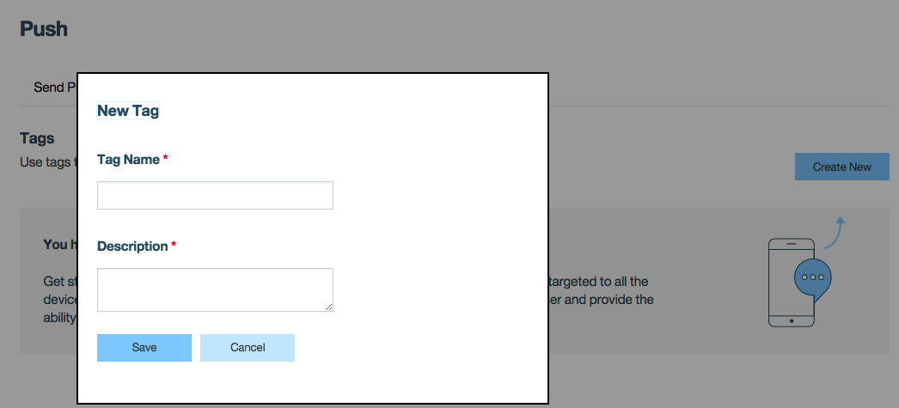
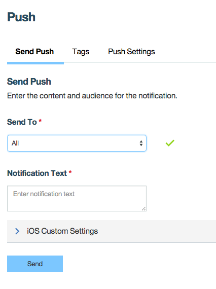
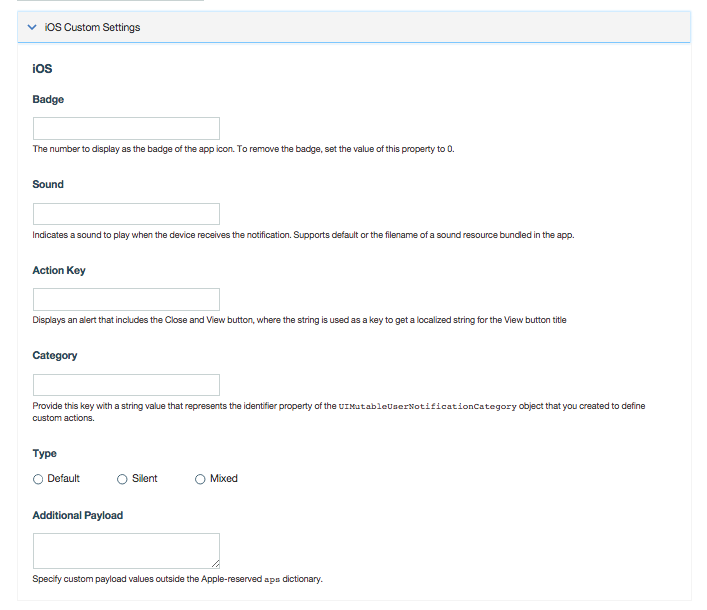

teach how to send push notifications: 
1. how to handle tokens for added security
2. by tag/broadcast, 
3. to specific user (authentication)

Push notifications can now be sent from the operations console.

*Prerequisite*: Make sure to read the push notifications overview to set up your environment appropriately and the corresponding platforms for your application.

## Overview

* [Settings Up Tags in the Console](#setting-up-tags)
* [Sending Push Notifications from the Console](#sending-push-notifications)
* [Setting Up Custom Push Notifications](#sending-custom-notifications)
* [Sending a Secure Push Notification](#sending-secure-notifications)

## Setting Up Tags in the Console
In the MobileFirst Operations Console → **[your application] → Push → Tags**, and select the **Create New** button. Provide the appropriate `Tag Name` and `Description`. Then,  click **Save**.

## Sending Push Notifications from the Console
In the MobileFirst Operations Console → **[your application] → Push → Send Push**. 
Select who to `Send To` and `Notification Text`. Then,  click **Send**.

There are two types of notifications that can be sent: tag and broadcast notifications.

Tag notifications are notification messages that are targeted to all the devices that are subscribed to a particular tag. Tags represent topics of interest to the user and provide the ability to receive notifications according to the chosen interest. This can be done by selecting `Send To > Devices By Tags`.

Broadcast notifications are a form of tag push notifications that are targeted to all subscribed devices. Broadcast notifications are enabled by default for any push-enabled MobileFirst application by a subscription to a reserved Push.all tag (auto-created for every device). This can be done by selecting `Send To > All`.

## Setting Up Custom Push Notifications
You have the option of customizing your iOS Push Notifications in Send Push > iOS Custom Settings.

## Sending a Secure Push Notification
>TODO