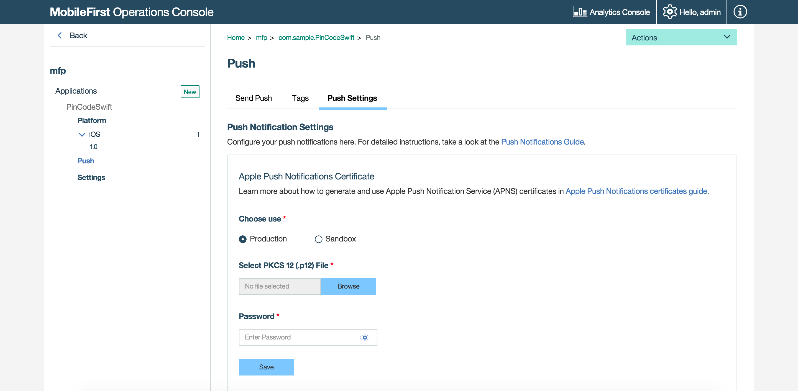

## Overview
In order to send push notifications to iOS or Android devices, the MobileFirst Server first needs to be configured with the GCM details for Android or APNS certificate for iOS. Notifications can then be sent to: all devices (broadcast), devices that registered to specific tags, a single Device ID, only iOS devices, only Android devices, or based on the authenticated user.

**Prerequisite**: Make sure to read the [Push Notifications overview](../push-notifications-overview/) tutorial.

#### Jump to

* [Setting up Push Notifications](#setting-up-push-notifications)
* [Adding Tags](#adding-tags)
* [Sending Push Notifications](#sending-push-notifications)
* [Customizing Push Notifications](#customzing-push-notifications)
* [Tutorials to follow next](#tutorials-to-follow-next)

## Setting up Push Notifications
Enabling push notifications support involves several configuration steps in both MobileFirst Server and the client application.

### Scope mapping
Map the **push.mobileclient** scope element to the application.

1. Load the MobileFirst Operations Console and navigate to **[your application] → Security → Map Scope Elements to Security Checks**, click on **Create New**.
2. Write "push.mobileclient" in the **Scope element** field. Then, click **Add**.

For User Authenticated notifications the **push.mobileclient** scope element should be mapped to the security check of the application.

### GCM
Android devices use the Google Cloud Messaging (GCM) service for push notifications.  
To setup GCM:

1. Visit [Google's Services website](https://developers.google.com/mobile/add?platform=android&cntapi=gcm&cnturl=https:%2F%2Fdevelopers.google.com%2Fcloud-messaging%2Fandroid%2Fclient&cntlbl=Continue%20Adding%20GCM%20Support&%3Fconfigured%3Dtrue).
2. Provide your application name and package name.
3. Select "Cloud Messaging" and click on **Enable Google cloud messaging**.  
    - This step generates a **Server API Key** and a **Sender ID**.
    - The generated values are used to identify the application by Google's GCM service in order to send notifications to the device.
4. In the MobileFirst Operations Console → **[your application] → Push → Push Settings**, add the GCM **Sender ID** and server **API Key** and click **Save**.

#### Notes
If your organization has a firewall that restricts the traffic to or from the Internet, you must go through the following steps:  

* Configure the firewall to allow connectivity with GCM in order for your GCM client apps to receive messages.
* The ports to open are 5228, 5229, and 5230. GCM typically uses only 5228, but it sometimes uses 5229 and 5230. 
* GCM does not provide specific IP, so you must allow your firewall to accept outgoing connections to all IP addresses contained in the IP blocks listed in Google’s ASN of 15169. 
* Ensure that your firewall accepts outgoing connections from MobileFirst Server to android.googleapis.com on port 443.

### APNS
iOS devices use Apple's Push Notification Service (APNS) for push notifications.  
To setup APNS:

1. [Generate a push notification certificate](https://www.ibm.com/developerworks/community/blogs/worklight/entry/understanding-and-setting-up-push-notifications-in-development-evnironment?lang=en).
2. In the MobileFirst Operations Console → **[your application] → Push → Push Settings**, select the certificate type and provide the certificate's file and password. Then, click **Save**.

#### Notes
* For push notifications to be sent, the following servers must be accessible from a MobileFirst Server instance:  
    * Sandbox servers:  
        * gateway.sandbox.push.apple.com:2195
        * feedback.sandbox.push.apple.com:2196
    * Production servers:  
        * gateway.push.apple.com:2195
        * Feedback.push.apple.com:2196
        * 1-courier.push.apple.com 5223
* During the development phase, use the apns-certificate-sandbox.p12 sandbox certificate file.
* During the production phase, use the apns-certificate-production.p12 production certificate file.
    * The APNS production certificate can only be tested once the application that utilizes it has been successfully submitted to the Apple App Store.



## Adding Tags
In the MobileFirst Operations Console → **[your application] → Push → Tags**, click **Create New**.  
Provide the appropriate `Tag Name` and `Description` and click **Save**.


## Sending Push Notifications
Push notifications can be sent either from the MobileFirst Operations Console or via REST APIs.

### From the MobileFirst Operations Console
In the MobileFirst Operations Console → **[your application] → Push → Send Push**.  
Select who to send the notification to from the **Send To** dropdown, and provide the **Notification Text**. Then, click **Send**.

From the MobileFirst Console, there are two types of notifications that can be sent: tag and broadcast notifications.

* Tag notifications are notification messages that are targeted to all the devices that are subscribed to a particular tag. Tags represent topics of interest to the user and provide the ability to receive notifications according to the chosen interest. 

    This can be done by selecting **Send To → Devices By Tags**.

    

* Broadcast notifications are a form of tag push notifications that are targeted to all subscribed devices. Broadcast notifications are enabled by default for any push-enabled MobileFirst application by a subscription to a reserved `Push.all` tag (auto-created for every device). 

    This can be done by selecting **Send To → All**.

    

* Notifications can also be sent a single Device ID, only iOS devices or only Android devices.

### Via MobileFirst-provided REST APIs
To send a push notification with the REST API use the PUSH Message (POST) API.

**Path**

`/apps/<applicationId>/messages`

**Example**

`https://example.com:443/imfpush/v1/apps/myapp/messages`

**Header Parameters** 

_Authorization_

The token with the scope `messages.write` and `push.application._<applicationId>_` obtained using the confidential client in the format Bearer token. This parameter has to be mandatorily set.

Payload Properties| Definition
--- | ---
message | The alert message to be sent
settings | The settings are the different attributes of the notification.
target | Set of targets can be consumer Ids, devices, platforms, or tags. Only one of the targets can be set.
deviceIds | An array of the devices represented by the device identifiers. Devices with these ids receive the notification. This is a unicast notification.
platforms | An array of device platforms. Devices running on these platforms receive the notification. Supported values are A (Apple/iOS), G (Google/Android) and M (Microsoft/Windows).
tagNames | An array of tags specified as tagNames. Devices that are subscribed to these tags receive the notification. Use this type of target for tag based notifications.
userIds | An array of users represented by their userIds to send the notification. This is a unicast notification.

**Payload JSON Example**

```json
{
    "message" : {
    "alert" : "Test message",
  },
  "settings" : {
    "apns" : {
      "badge" : 1,
      "iosActionKey" : "Ok",
      "payload" : "",
      "sound" : "song.mp3",
      "type" : "SILENT",
    },
    "gcm" : {
      "delayWhileIdle" : ,
      "payload" : "",
      "sound" : "song.mp3",
      "timeToLive" : ,
    },
  },
  "target" : {
    "deviceIds" : [ "MyDeviceId1", ... ],
    "platforms" : [ "A,G", ... ],
    "tagNames" : [ "Gold", ... ],
    "userIds" : [ "MyUserId", ... ],
  },
}
```
> For more information about the push rest API, see the topic about push notifications in the user documentation.

## Customizing Push Notifications
You can also customize the following:

### Android

* Notification sound, how long a notification can be stored in the GCM storage, custom payload and more.
* If you want to change the notification title, then add `push_notification_tile` in the Android project's **strings.xml** file.

### iOS

* Notification sound, custom payload, action key title, notification type and badge number.


## Tutorials to follow next
With the server-side now set-up, setup the client-side and handle received notifications.

* [Handling push notifications in Cordova applications](../handling-push-notifications-in-cordova)
* [Handling push notifications in iOS applications](../handling-push-notifications-in-ios)
* [Handling push notifications in Android applications](../handling-push-notifications-in-android)
