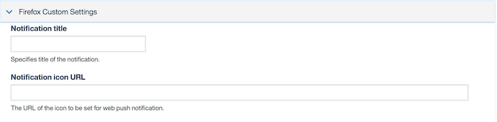

<!-- NLS_CHARSET=UTF-8 -->

Sending notifications to web platforms is similar to sending notifications to mobile platforms. Refer [here]({{ site.baseurl }}/tutorials/en/foundation/8.0/notifications/sending-notifications/), for more information.

* In the **Send Notifications** tab, you see a new option for **Platform** selection.
* You can select *Mobile* or *Web*.

From the **Send to** drop-down menu, you have new options such as **Chrome**, **Firefox** and **Safari** based on the platform configured. Each platform comes with an associated custom settings section, as required by the platform. You can also target a Notification to **All** platforms, **Devices by Tags**, **Devices by User ID** or to a **Single Device**.

### Chrome custom settings

Below are some of the settings specific to Chrome.

- **Notification Title**: Specifies title of the notification.
- **Notification Icon Url**: The URL of the icon to be set for web push notification.
- **Time to live**: Notifies FCM on message validity.

### Firefox custom settings

Below are some of the settings specific to Firefox.
- **Notification Title**: Specifies title of the notification.
- **Notification Icon Url**: The URL of the icon to be set for web push notification.

### Safari custom settings

Below are some of the settings specific to Safari.
- **Notification Title**: Specifies title of the notification.
- **Action**: The label of the action button.
- **URL arguments**: The URL arguments that need to be used with this notification. The format is a JSON array.
- **Body**: The body of the Notification.

Sending *Tag* based Notifications, *Device ID* and *User ID* based notifications are similar to what we do for mobile platforms.
