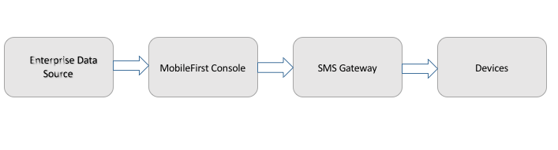

## Overview
IBM MobileFirst Foundation provides a unified set of API methods to send notifications to iOS, Android and Cordova (iOS, Android) applications. Continue reading to learn more on the available SMS support, such as how to send notifications to devices and how to handle received notifications in your application.

#### Jump to:
* [What is SMS Notifications?](#what-is-sms-notification) 
* [Notification Architecture](#notification-architecture)
* [Tutorials to follow next](#tutorials-to-follow-next)

## What is SMS Notification?
SMS notification is the ability of a mobile device to receive notifications as SMS messages that are pushed from a server.  
Notifications are received regardless of whether the application is running.

#### Devices Supporting SMS Notification
SMS notifications are supported on devices running iOS, Android and Windows Phone, and devices that support SMS functions.

## Notification Architecture
    
#### Subscription
To start receiving SMS notifications, an application must first register to an SMS notification subscription. To subscribe to SMS notifications, the user supplies a mobile phone number and approves the notification subscription. A subscription request is sent to the MobileFirst Server upon receipt of the user approval.

#### Sending Notifications
MobileFirst provides a unified push notification API which applies to SMS as well. With the push API, you can:

 - Manage subscriptions
 - Push and poll notifications from back-end systems  
 - Send push notifications to devices

 With the client-side API, you can subscribe to, and unsubscribe from, SMS notification subscription. To send a notification, you first retrieve it from the back-end system. A tag can either poll notifications from the back-end system, or wait for the back-end system to explicitly push a new notification. When a notification is retrieved from the MobileFirst Operations Console, it is processed and sent through a preconfigured SMS gateway. You can add extra security in the console preprocess notifications. The SMS gateway receives the notification and sends it to a device.

 

 The process rolls out as follows:

* Notifications are retrieved by either poll or push from the back-end system.
* A MobileFirst adapter processes the notification and sends it to an SMS gateway.
* The SMS gateway sends a push notification to the device.
* The device processes the push notification as an SMS message.

## Tutorials to follow next
Follow through the below required setup of the server-side and client-side in order to be able to send and receive SMS notifications:

* [Handling push notifications in Cordova applications](../handling-sms-notifications-in-cordova)
* [Handling push notifications in Android applications](../handling-push-notifications-in-android)
