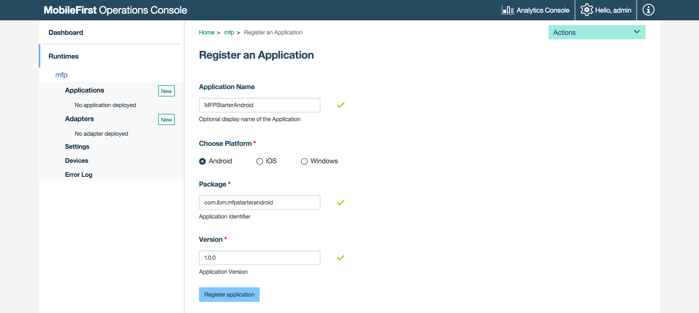
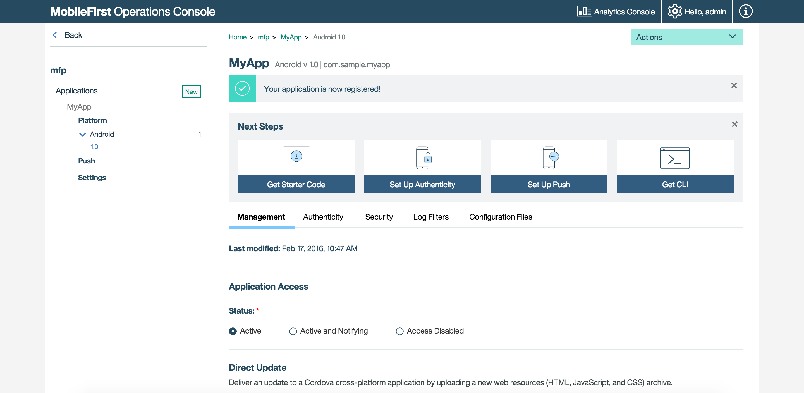
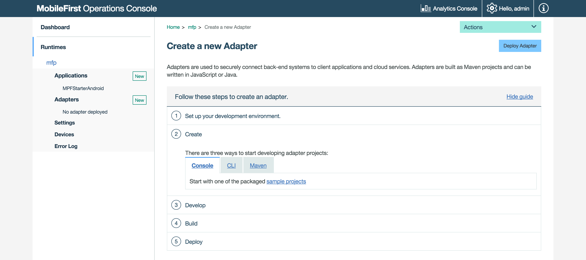

## Overview
The purpose of this demonstration is to experience an end-to-end flow:

1. A sample application that is pre-bundled with the MobileFirst client SDK is registered and downloaded from the MobileFirst Operations Console.
2. A new or provided adapter is deployed to the MobileFirst Operations Console.  
3. The application logic is changed to make a resource request.

**End result**:

* Successfully pinging the MobileFirst Server.
* Successfully retrieving data using a MobileFirst Adapter.

#### Prerequisites:

* Android Studio
* *Optional*. MobileFirst CLI ([download]({{site.baseurl}}/downloads))
* *Optional*. Stand-alone MobileFirst Server ([download]({{site.baseurl}}/downloads))

### 1. Starting the MobileFirst Server
Make sure you have [created a Mobile Foundation instance](../../bluemix/using-mobile-foundation), or  
If using the [MobileFirst Foundation Development Kit](../../installation-configuration/development/mobilefirst), navigate to the server's folder and run the command: `./run.sh` in Mac and Linux or `run.cmd` in Windows.

### 2. Creating an application

In a browser window, open the MobileFirst Operations Console by loading the URL: `http://your-server-host:server-port/mfpconsole`. If running locally, use: [http://localhost:9080/mfpconsole](http://localhost:9080/mfpconsole). The username/password are *admin/admin*.
 
1. Click the **New** button next to **Applications**
    * Select the **Android** platform
    * Enter **com.ibm.mfpstarterandroid** as the **application identifier**
    * Enter **1.0** as the **version** value
    * Click on **Register application**

    
 
2. Click on the **Get Starter Code** tile and select to download the Android sample application.

    

### 3. Editing application logic

1. Open the Android Studio project and import the project.

2. From the **Project** sidebar menu, select the **app → java → com.ibm.mfpstarterandroid → ServerConnectActivity.java** file and:

* Add the following imports:

    ```java
    import java.net.URI;
    import java.net.URISyntaxException;
    import android.util.Log;
    ```
    
* Paste the following code snippet, replacing the call to `WLAuthorizationManager.getInstance().obtainAccessToken`:

    ```java
    WLAuthorizationManager.getInstance().obtainAccessToken("", new WLAccessTokenListener() {
                @Override
                public void onSuccess(AccessToken token) {
                    System.out.println("Received the following access token value: " + token);
                    runOnUiThread(new Runnable() {
                        @Override
                        public void run() {
                            titleLabel.setText("Yay!");
                            connectionStatusLabel.setText("Connected to MobileFirst Server");
                        }
                    });

                    URI adapterPath = null;
                    try {
                        adapterPath = new URI("/adapters/javaAdapter/resource/greet");
                    } catch (URISyntaxException e) {
                        e.printStackTrace();
                    }

                    WLResourceRequest request = new WLResourceRequest(adapterPath, WLResourceRequest.GET);
                    
                    request.setQueryParameter("name","world");
                    request.send(new WLResponseListener() {
                        @Override
                        public void onSuccess(WLResponse wlResponse) {
                            // Will print "Hello world" in LogCat.
                            Log.i("MobileFirst Quick Start", "Success: " + wlResponse.getResponseText());
                        }

                        @Override
                        public void onFailure(WLFailResponse wlFailResponse) {
                            Log.i("MobileFirst Quick Start", "Failure: " + wlFailResponse.getErrorMsg());
                        }
                    });
                }

                @Override
                public void onFailure(WLFailResponse wlFailResponse) {
                    System.out.println("Did not receive an access token from server: " + wlFailResponse.getErrorMsg());
                    runOnUiThread(new Runnable() {
                        @Override
                        public void run() {
                            titleLabel.setText("Bummer...");
                            connectionStatusLabel.setText("Failed to connect to MobileFirst Server");
                        }
                    });
                }
            });
    ```

### 4. Deploy an adapter
Download [this prepared .adapter artifact](../javaAdapter.adapter) and deploy it from the MobileFirst Operations Console using the **Actions → Deploy adapter** action.

Alternatively, click the **New** button next to **Adapters**.  
        
1. Select the **Actions → Download sample** option. Download the "Hello World" **Java** adapter sample.

    > If Maven and MobileFirst CLI are not installed, follow the on-screen **Set up your development environment** instructions.

2. From a **Command-line** window, navigate to the adapter's Maven project root folder and run the command:

    ```bash
    mfpdev adapter build
    ```

3. When the build finishes, deploy it from the MobileFirst Operations Console using the **Actions → Deploy adapter** action. The adapter can be found in the **[adapter]/target** folder.
    
       


### 5. Testing the application

1. In Android Studio, from the **Project** sidebar menu, select the **app → src → main →assets → mfpclient.properties** file and edit the **protocol**, **host** and **port** properties with the correct values for your MobileFirst Server.
    * If using a local MobileFirst Server, the values are typically **http**, **localhost** and **9080**.
    * If using a remote MobileFirst Server (on Bluemix), the values are typically **https**, **your-server-address** and **443**.

    Alternatively, if you have installed the MobileFirst CLI, then navigate to the project root folder and run the command `mfpdev app register`. If a remote MobileFirst Server is used, [run the command `mfpdev server add`](../../application-development/using-mobilefirst-cli-to-manage-mobilefirst-artifacts/#add-a-new-server-instance) to add the server, followed by for example: `mfpdev app register myBluemixServer`.

2. Click on the **Run App** button.  

<br clear="all"/>
### Results
* Clicking the **Ping MobileFirst Server** button will display **Connected to MobileFirst Server**.
* If the application was able to connect to the MobileFirst Server, a resource request call using the deployed Java adapter will take place.

The adapter response is then printed in Android Studio's LogCat view.


## Next steps
Learn more on using adapters in applications, and how to integrate additional services such as Push Notifications, using the MobileFirst security framework and more:

- Review the [Using the MobileFirst Foundation](../../application-development/) tutorials
- Review the [Adapters development](../../adapters/) tutorials
- Review the [Authentication and security tutorials](../../authentication-and-security/)
- Review the [Notifications tutorials](../../notifications/)
- Review [All Tutorials](../../all-tutorials)
