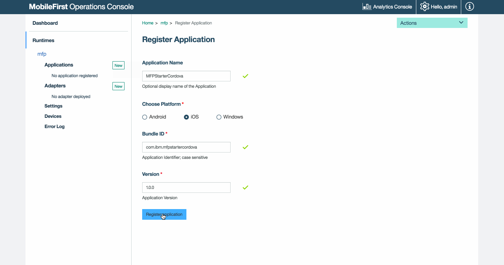
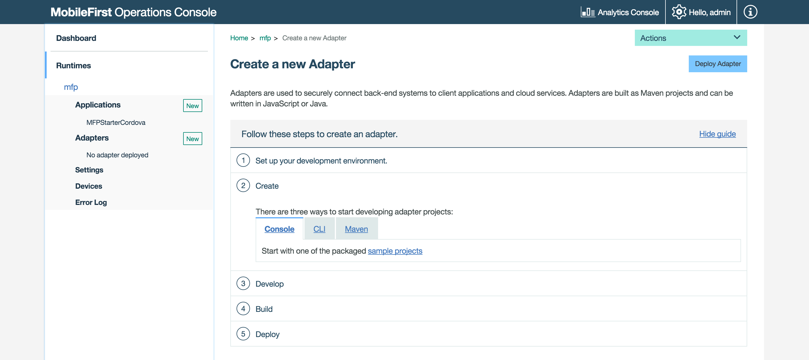
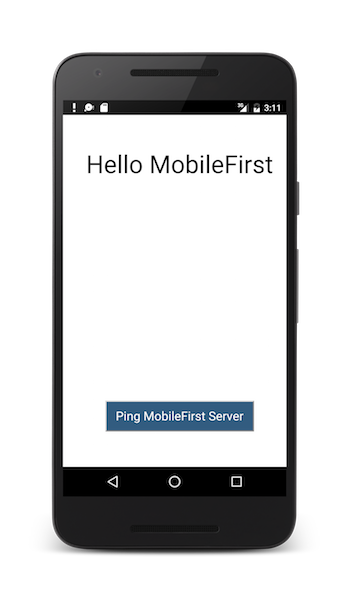

## Overview
The purpose of this demonstration is to experience an end-to-end flow:

1. A sample application that is pre-bundled with the MobileFirst client SDK is registered and downloaded from the MobileFirst Operations Console.
2. A new or provided adapter is deployed to the MobileFirst Operations Console.  
3. The application logic is changed to make a resource request.

**End result**:

* Successfully pinging the MobileFirst Server.
* Successfully retrieving data using a MobileFirst Adapter.

#### Prerequisites:

* Xcode for iOS, Android Studio for Android or Visual Studio 2013/2015 for Windows 8.1 Universal / Windows 10 UWP
* Cordova CLI 6.x.
* *Optional*. MobileFirst CLI ([download]({{site.baseurl}}/downloads))
* *Optional*. Stand-alone MobileFirst Server ([download]({{site.baseurl}}/downloads))

### 1. Starting the MobileFirst Server
Make sure you have [created a Mobile Foundation instance](../../bluemix/using-mobile-foundation), or  
If using the [MobileFirst Foundation Development Kit](../../installation-configuration/development/mobilefirst), navigate to the server's folder and run the command: `./run.sh` in Mac and Linux or `run.cmd` in Windows.

### 2. Creating and registering an application

In a browser window, open the MobileFirst Operations Console by loading the URL: `http://your-server-host:server-port/mfpconsole`. If running locally, use: [http://localhost:9080/mfpconsole](http://localhost:9080/mfpconsole). The username/password are *admin/admin*.
 
1. Click the **New** button next to **Applications**
    * Select a platform: **Android, iOS, Windows**
    * Enter **com.ibm.mfpstartercordova** as the **application identifier**
    * Enter **1.0.0** as the **version**
    * Click on **Register application**

    
 
2. Click on the **Get Starter Code** tile and select to download the Cordova sample application.

    
 
### 3. Editing application logic

1. Open the Cordova project in your code editor of choice.

2. Select the **www/js/index.js** file and paste the following code snippet, replacing the existing `WLAuthorizationManager.obtainAccessToken()` function:

    ```javascript
    WLAuthorizationManager.obtainAccessToken()
        .then(
            function(accessToken) {
                titleText.innerHTML = "Yay!";
                statusText.innerHTML = "Connected to MobileFirst Server";
                
                var resourceRequest = new WLResourceRequest(
                    "/adapters/javaAdapter/resource/greet/",
                    WLResourceRequest.GET
                );
                
                resourceRequest.setQueryParameter("name", "world");
                resourceRequest.send().then(
                    function(response) {
                        // Will display "Hello world" in an alert dialog.
                        alert("Success: " + response.responseText);
                    },
                    function(response) {
                        alert("Failure: " + JSON.stringify(response));
                    }
                );
            },

            function(error) {
                titleText.innerHTML = "Bummer...";
                statusText.innerHTML = "Failed to connect to MobileFirst Server";
            }
        );
    ```
    
### 4. Deploy an adapter
Download [this prepared .adapter artifact](../javaAdapter.adapter) and deploy it from the MobileFirst Operations Console using the **Actions → Deploy adapter** action.

Alternatively, click the **New** button next to **Adapters**.  
        
1. Select the **Actions → Download sample** option. Download the "Hello World" **Java** adapter sample.

    > If Maven and MobileFirst CLI are not installed, follow the on-screen **Set up your development environment** instructions.

2. From a **Command-line** window, navigate to the adapter's Maven project root folder and run the command:

    ```bash
    mfpdev adapter build
    ```

3. When the build finishes, deploy it from the MobileFirst Operations Console using the **Actions → Deploy adapter** action. The adapter can be found in the **[adapter]/target** folder.
    
       



### 5. Testing the application

1. From a **Command-line** window, navigate to the Cordova project's root folder.
2. Run the command: `cordova platform add ios/android/windows` to add a platform.
3. In the Cordova project, select the **config.xml** file and edit the  `<mfp:server ... url=" "/>` value with the **protocol**, **host** and **port** properties with the correct values for your MobileFirst Server.
    * If using a local MobileFirst Server, the values are typically **http**, **localhost** and **9080**.
    * If using a remote MobileFirst Server (on Bluemix), the values are typically **https**, **your-server-address** and **443**.

    Alternatively, if you have installed the MobileFirst CLI, then navigate to the project root folder and run the command `mfpdev app register`. If a remote MobileFirst Server is used, [run the command `mfpdev server add`](../../app-dev/using-mobilefirst-cli-to-manage-mobilefirst-artifacts/#add-a-new-server-instance) to add the server, followed by for example: `mfpdev app register myBluemixServer`.

4. Run the command: `cordova run`.

If a device is connected, the application will be installed and launched in the device,  
Otherwise the Simulator or Emulator will be used.

<br clear="all"/>
### Results
* Clicking the **Ping MobileFirst Server** button will display **Connected to MobileFirst Server**.
* If the application was able to connect to the MobileFirst Server, a resource request call using the deployed Java adapter will take place.

The adapter response is then displayed in an alert.

## Next steps
Learn more on using adapters in applications, and how to integrate additional services such as Push Notifications, using the MobileFirst security framework and more:

- Review the [Using the MobileFirst Foundation](../../app-dev/) tutorials
- Review the [Adapters development](../../adapters/) tutorials
- Review the [Authentication and security tutorials](../../authentication-and-security/)
- Review the [Notifications tutorials](../../notifications/)
- Review [All Tutorials](../../all-tutorials)
