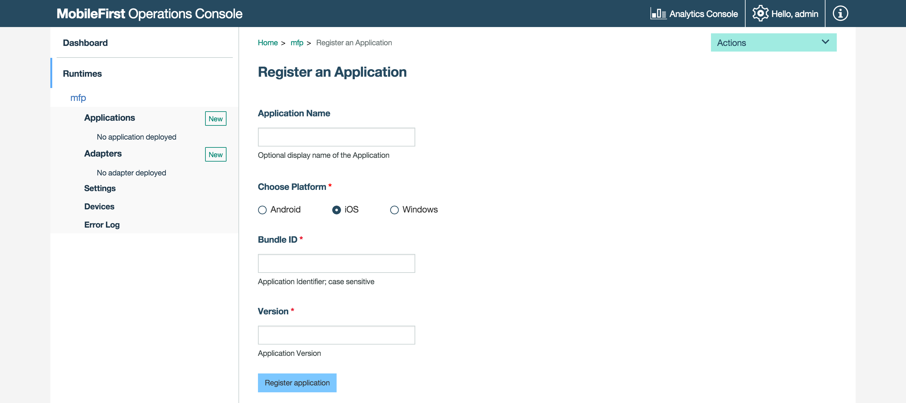
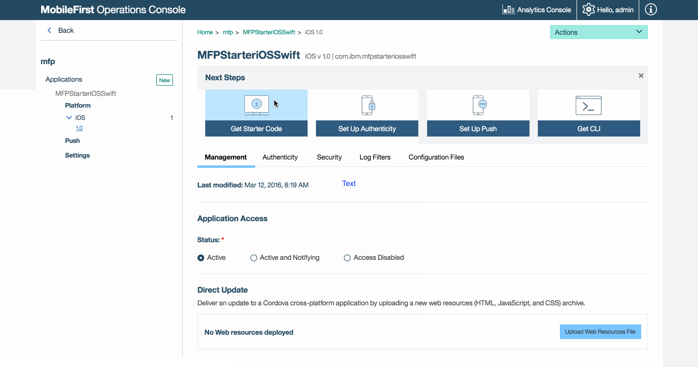
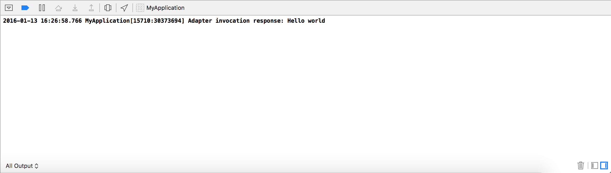

## Overview
The purpose of this demonstration is to experience an end-to-end flow:

1. A sample application that is pre-bundled with the MobileFirst client SDK is registered and downloaded from the MobileFirst Operations Console.
2. A new or provided adapter is deployed to the MobileFirst Operations Console.  
3. The application logic is changed to make a resource request.

**End result**:

* Successfully pinging the MobileFirst Server.
* Successfully retrieving data using a MobileFirst Adapter.

#### Prerequisites:

* Xcode
* *Optional*. MobileFirst CLI ([download]({{site.baseurl}}/downloads))
* *Optional*. Stand-alone MobileFirst Server ([download]({{site.baseurl}}/downloads))

### 1. Starting the MobileFirst Server
Make sure you have [created a Mobile Foundation instance](../../bluemix/using-mobile-foundation), or  
If using the [MobileFirst Foundation Development Kit](../../installation-configuration/development/mobilefirst), navigate to the server's folder and run the command: `./run.sh` in Mac and Linux or `run.cmd` in Windows.

### 2. Creating an application

In a browser window, open the MobileFirst Operations Console by loading the URL: `http://your-server-host:server-port/mfpconsole`. If running locally, use: [http://localhost:9080/mfpconsole](http://localhost:9080/mfpconsole). The username/password are *admin/admin*.
 
1. Click the **New** button next to **Applications**
    * Select the **iOS** platform
    * Enter **com.ibm.mfpstarteriosobjectivec** or **com.ibm.mfpstarteriosswift** as the **application identifier** (depending on the application scaffold you will download in the next step)
    * Enter **1.0** as the **version** value
    * Click on **Register application**
    
    
 
2. Click on the **Get Starter Code** tile and select to download the iOS Objective-C or iOS Swift sample application.

    
    
### 3. Editing application logic

1. Open the Xcode project by double-clicking the **.xcworkspace** file.

2. Select the **[project-root]/ViewController.m/swift** file and paste the following code snippet, replacing the existing `getAccessToken()` function:
 
   In Objective-C:

   ```objc
   - (IBAction)getAccessToken:(id)sender {
   _testServerButton.enabled = NO;
   NSURL *serverURL = [[WLClient sharedInstance] serverUrl];
   _connectionStatusLabel.text = [NSString stringWithFormat:@"Connecting to server...\n%@", serverURL];
    
   NSLog(@"Testing Server Connection");
   [[WLAuthorizationManager sharedInstance] obtainAccessTokenForScope:@"" withCompletionHandler:^(AccessToken *token, NSError *error) {
        if (error != nil) {
            _titleLabel.text = @"Bummer...";
            _connectionStatusLabel.text = [NSString stringWithFormat:@"Failed to connect to MobileFirst Server\n%@", serverURL];
            NSLog(@"Did not receive an access token from server: %@", error.description);
        } else {
            _titleLabel.text = @"Yay!";
            _connectionStatusLabel.text = [NSString stringWithFormat:@"Connected to MobileFirst Server\n%@", serverURL];
            NSLog(@"Received the following access token value: %@", token.value);
            
            NSURL* url = [NSURL URLWithString:@"/adapters/javaAdapter/resource/greet/"];
            WLResourceRequest* request = [WLResourceRequest requestWithURL:url method:WLHttpMethodGet];
            
            [request setQueryParameterValue:@"world" forName:@"name"];
            [request sendWithCompletionHandler:^(WLResponse *response, NSError *error) {
                if (error != nil){
                    NSLog(@"Failure: %@",error.description);
                }
                else if (response != nil){
                    // Will print "Hello world" in the Xcode Console.
                    NSLog(@"Success: %@",response.responseText);
                }
            }];
        }

        _testServerButton.enabled = YES;
    }];
}
   ```
    
   In Swift:
    
   ```swift
   @IBAction func getAccessToken(sender: AnyObject) {
        self.testServerButton.enabled = false
        
        let serverURL = WLClient.sharedInstance().serverUrl()
        
        connectionStatusLabel.text = "Connecting to server...\n\(serverURL)"
        print("Testing Server Connection")
        WLAuthorizationManager.sharedInstance().obtainAccessTokenForScope(nil) { (token, error) -> Void in
            
            if (error != nil) {
                self.titleLabel.text = "Bummer..."
                self.connectionStatusLabel.text = "Failed to connect to MobileFirst Server\n\(serverURL)"
                print("Did not recieve an access token from server: " + error.description)
            } else {
                self.titleLabel.text = "Yay!"
                self.connectionStatusLabel.text = "Connected to MobileFirst Server\n\(serverURL)"
                print("Recieved the following access token value: " + token.value)
                
                let url = NSURL(string: "/adapters/javaAdapter/resource/greet/")
                let request = WLResourceRequest(URL: url, method: WLHttpMethodGet)
                
                request.setQueryParameterValue("world", forName: "name")
                request.sendWithCompletionHandler { (response, error) -> Void in
                    if (error != nil){
                        NSLog("Failure: " + error.description)
                    }
                    else if (response != nil){
                        NSLog("Success: " + response.responseText)
                    }
                }
            }
            
            self.testServerButton.enabled = true
        }
   }
   ```

### 4. Deploy an adapter
Download [this prepared .adapter artifact](../javaAdapter.adapter) and deploy it from the MobileFirst Operations Console using the **Actions → Deploy adapter** action.

Alternatively, click the **New** button next to **Adapters**.  
        
1. Select the **Actions → Download sample** option. Download the "Hello World" **Java** adapter sample.

   > If Maven and MobileFirst CLI are not installed, follow the on-screen **Set up your development environment** instructions.

2. From a **Command-line** window, navigate to the adapter's Maven project root folder and run the command:

   ```bash
   mfpdev adapter build
   ```

3. When the build finishes, deploy it from the MobileFirst Operations Console using the **Actions → Deploy adapter** action. The adapter can be found in the **[adapter]/target** folder. 

       


### 5. Testing the application

1. In Xcode, select the **mfpclient.plist** file and edit the **protocol**, **host** and **port** properties with the correct values for your MobileFirst Server.
    * If using a local MobileFirst Server, the values are typically **http**, **localhost** and **9080**.
    * If using a remote MobileFirst Server (on Bluemix), the values are typically **https**, **your-server-address** and **443**.
     
    Alternatively, if you have installed the MobileFirst CLI, then navigate to the project root folder and run the command `mfpdev app register`. If a remote MobileFirst Server is used, [run the command `mfpdev server add`](../../application-development/using-mobilefirst-cli-to-manage-mobilefirst-artifacts/#add-a-new-server-instance) to add the server, followed by for example: `mfpdev app register myBluemixServer`.

2. Press the **Play** button.

<br clear="all"/>
### Results
* Clicking the **Ping MobileFirst Server** button will display **Connected to MobileFirst Server**.
* If the application was able to connect to the MobileFirst Server, a resource request call using the deployed Java adapter will take place.

The adapter response is then printed in the Xcode Console.



## Next steps
Learn more on using adapters in applications, and how to integrate additional services such as Push Notifications, using the MobileFirst security framework and more:

- Review the [Using the MobileFirst Foundation](../../application-development/) tutorials
- Review the [Adapters development](../../adapters/) tutorials
- Review the [Authentication and security tutorials](../../authentication-and-security/)
- Review the [Notifications tutorials](../../notifications/)
- Review [All Tutorials](../../all-tutorials)
