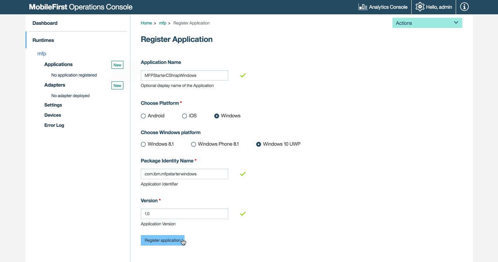
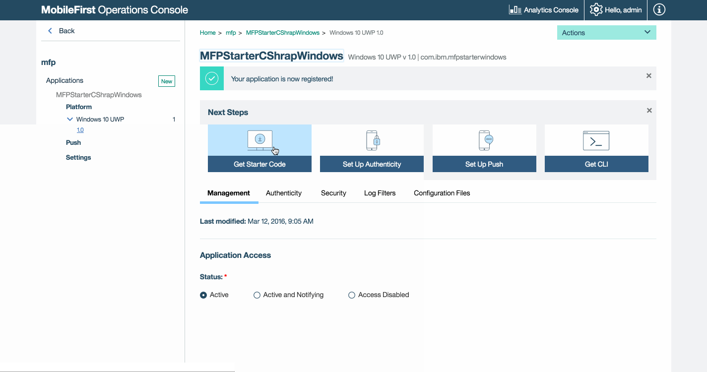
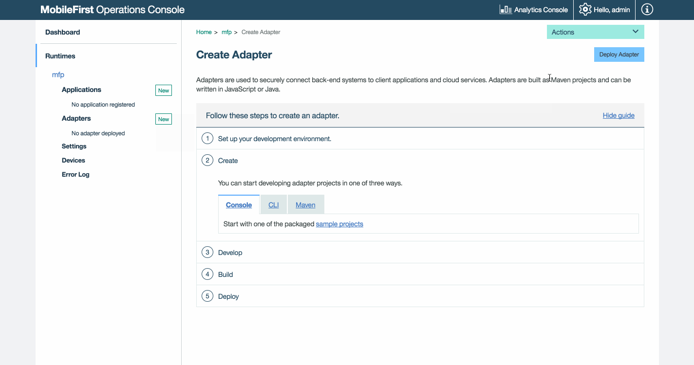

<!-- NLS_CHARSET=UTF-8 -->
## Overview
{: #overview }
The purpose of this demonstration is to experience an end-to-end flow:

1. A sample application that is pre-bundled with the {{ site.data.keys.product_adj }} client SDK is registered and downloaded from the {{ site.data.keys.mf_console }}.
2. A new or provided adapter is deployed to the {{ site.data.keys.mf_console }}.  
3. The application logic is changed to make a resource request.

**End result**:

* Successfully pinging the {{ site.data.keys.mf_server }}.
* Successfully retrieving data using an adapter.

#### Prerequisites:
{: #prerequisites }
* Configured Visual Studio 2013/5
* *Optional*. {{ site.data.keys.mf_cli }} ([download]({{site.baseurl}}/downloads))
* *Optional*. Stand-alone {{ site.data.keys.mf_server }} ([download]({{site.baseurl}}/downloads))

### 1. Starting the {{ site.data.keys.mf_server }}
{: #1-starting-the-mobilefirst-server }
Make sure you have [created a Mobile Foundation instance](../../bluemix/using-mobile-foundation), or  
If using the [{{ site.data.keys.mf_dev_kit }}](../../installation-configuration/development/mobilefirst), navigate to the server's folder and run the command: `./run.cmd`.

### 2. Creating an application
{: #2-creating-an-application }
In a browser window, open the {{ site.data.keys.mf_console }} by loading the URL: `http://your-server-host:server-port/mfpconsole`. If running locally, use: [http://localhost:9080/mfpconsole](http://localhost:9080/mfpconsole). The username/password are *admin/admin*.

1. Click the **New** button next to **Applications**
    * Select a **Windows** platform
    * Enter **MFPStarterCSharp.Windows** as the **application identifier** for Windows, or **MFPStarterCSharp.WindowsPhone** for Windows Phone
    * Enter **1.0.0** as the **version** value
    * Click on **Register application**

    

2. Click on the **Get Starter Code** tile and select to download the Windows 8.1 or Windows 10 sample application.

    

### 3. Editing application logic
{: #3-editing-application-logic }
1. Open the Visual Studio project.

2. Select the solution's **MainPage.xaml.cs** file and paste the following code snippet into the GetAccessToken() method:

   ```csharp
   try
      {
          IWorklightClient _newClient = WorklightClient.CreateInstance();
          accessToken = await _newClient.AuthorizationManager.ObtainAccessToken("");
          if (accessToken.IsValidToken && accessToken.Value != null && accessToken.Value != "")
          {
              System.Diagnostics.Debug.WriteLine("Received the following access token value: " + accessToken.Value);
              titleTextBlock.Text = "Yay!";
              statusTextBlock.Text = "Connected to {{ site.data.keys.mf_server }}";

              Uri adapterPath = new Uri("/adapters/javaAdapter/resource/greet",UriKind.Relative);
              WorklightResourceRequest request = _newClient.ResourceRequest(adapterPath, "GET","");
              request.SetQueryParameter("name", "world");
              WorklightResponse response = await request.Send();

              System.Diagnostics.Debug.WriteLine("Success: " + response.ResponseText);

            }
        }
        catch (Exception e)
        {
            titleTextBlock.Text = "Uh-oh";
            statusTextBlock.Text = "Client failed to connect to {{ site.data.keys.mf_server }}";
            System.Diagnostics.Debug.WriteLine("An error occurred: '{0}'", e);
        }
   ```


### 4. Deploy an adapter
{: 4-deploy-an-adapter }
Download [this prepared .adapter artifact](../javaAdapter.adapter) and deploy it from the {{ site.data.keys.mf_console }} using the **Actions → Deploy adapter** action.

<!-- Alternatively, click the **New** button next to **Adapters**.  

1. Select the **Actions → Download sample** option. Download the "Hello World" **Java** adapter sample.

    > If Maven and {{ site.data.keys.mf_cli }} are not installed, follow the on-screen **Set up your development environment** instructions.

2. From a **Command-line** window, navigate to the adapter's Maven project root folder and run the command:

    ```bash
    mfpdev adapter build
    ```

3. When the build finishes, deploy it from the {{ site.data.keys.mf_console }} using the **Actions → Deploy adapter** action. The adapter can be found in the **[adapter]/target** folder.

        -->


### 5. Testing the application
{: 5-testing-the-application }
1. In Visual Studio, select the **mfpclient.resw** file and edit the **protocol**, **host** and **port** properties with the correct values for your {{ site.data.keys.mf_server }}.
    * If using a local {{ site.data.keys.mf_server }}, the values are typically **http**, **localhost** and **9080**.
    * If using a remote {{ site.data.keys.mf_server }} (on Bluemix), the values are typically **https**, **your-server-address** and **443**.

    Alternatively, if you have installed the {{ site.data.keys.mf_cli }}, then navigate to the project root folder and run the command `mfpdev app register`. If a remote {{ site.data.keys.mf_server }} is used, [run the command `mfpdev server add`](../../application-development/using-mobilefirst-cli-to-manage-mobilefirst-artifacts/#add-a-new-server-instance) to add the server, followed by for example: `mfpdev app register myBluemixServer`.

2. Press the **Run App** button.

### Results
{: #results }
* Clicking the **Ping {{ site.data.keys.mf_server }}** button will display **Connected to {{ site.data.keys.mf_server }}**.
* If the application was able to connect to the {{ site.data.keys.mf_server }}, a resource request call using the deployed Java adapter will take place.

The adapter response is then printed in Visual Studio's Outpout console.


## Next steps
{: #next-steps }
Learn more on using adapters in applications, and how to integrate additional services such as Push Notifications, using the {{ site.data.keys.product_adj }} security framework and more:

- Review the [Application development](../../application-development/) tutorials
- Review the [Adapters development](../../adapters/) tutorials
- Review the [Authentication and security tutorials](../../authentication-and-security/)
- Review the [Notifications tutorials](../../notifications/)
- Review [All Tutorials](../../all-tutorials)
