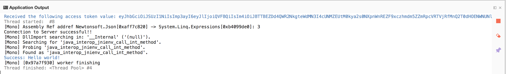

<!-- NLS_CHARSET=UTF-8 -->
## Overview
The purpose of this demonstration is to experience an end-to-end flow:

1. A sample application that is bundled with the MobileFirst Xamarin client SDK is registered with the MobileFirst Operations Console.
2. A new or provided adapter is deployed to the MobileFirst Operations Console.  
3. The application logic is changed to make a resource request.

**End result**:

* Successfully pinging the MobileFirst Server.
* Successfully retrieving data using a MobileFirst Adapter.

#### Prerequisites:

* Xamarin Studio
* *Optional*. Stand-alone MobileFirst Server ([download]({{site.baseurl}}/downloads))

### 1. Starting the MobileFirst Server
Make sure you have [created a Mobile Foundation instance](../../bluemix/using-mobile-foundation), or  
If using the [MobileFirst Foundation Development Kit](../../setting-up-your-development-environment/mobilefirst-development-environment), navigate to the server's folder and run the command: `./run.sh` in Mac and Linux or `run.cmd` in Windows.

### 2. Creating an application

In a browser window, open the MobileFirst Operations Console by loading the URL: `http://your-server-host:server-port/mfpconsole`. If running locally, use: [http://localhost:9080/mfpconsole](http://localhost:9080/mfpconsole). The username/password are *admin/admin*.

1. Click the **New** button next to **Applications**
    * Select the **Android** platform
    * Enter **com.ibm.mfpstarterxamarin** as the **application identifier** (depending on the application scaffold you will download in the next step)
    * Enter **1.0** as the **version** value
    * Click on **Register application**

    

### 3. Editing application logic

1. Create a Xamarin project with name and packaging the details during registration.
2. Add the Xamarin SDK as mentioned in [Adding the SDK](../../application-development/sdk/xamarin/)
2. Select the **[project-root]/[ProjectName/App.cs]**. You can choose to add the logic in any other .cs file.
3. Choose  file and paste the following code snippet:

    ```csharp
    try
	{

	    IWorklightClient _newClient = App.GetWorklightClient;

		WorklightAccessToken accessToken = await _newClient.AuthorizationManager.ObtainAccessToken("");

		 if (accessToken.Value != null && accessToken.Value != "")
		 {
			  System.Diagnostics.Debug.WriteLine("Received the following access token value: " + accessToken.Value);

			  mfpstarterxamarinPage.DisplayOutput("Yay!\nConnected to MobileFirst Server");

			  //Xamarin SDK has an issue with relative URI. As a workaround , use the absolute uri while invoking adapters.
			  StringBuilder uriBuilder = new StringBuilder().Append(_newClient.ServerUrl.AbsoluteUri)
					 .Append("/adapters/javaAdapter/resource/greet");

		      WorklightResourceRequest request = _newClient.ResourceRequest(new Uri(uriBuilder.ToString()), "GET", "");

			  request.SetQueryParameter("name", "world");
		      WorklightResponse response = await request.Send();

			  System.Diagnostics.Debug.WriteLine("Success: " + response.ResponseText);

		  }
	}
	catch (Exception e)
	{
		mfpstarterxamarinPage.DisplayOutput("Uh-oh\nClient failed to connect to MobileFirst Server");
		System.Diagnostics.Debug.WriteLine("An error occurred: '{0}'", e);
	}


    ```


### 4. Deploy an adapter
Download [this prepared .adapter artifact](../javaAdapter.adapter) and deploy it from the MobileFirst Operations Console using the **Actions → Deploy adapter** action.

Alternatively, click the **New** button next to **Adapters**.  

1. Select the **Actions → Download sample** option. Download the "Hello World" **Java** adapter sample.

    > If Maven and MobileFirst CLI are not installed, follow the on-screen **Set up your development environment** instructions.

2. From a **Command-line** window, navigate to the adapter's Maven project root folder and run the command:

    ```bash
    mfpdev adapter build
    ```

3. When the build finishes, deploy it from the MobileFirst Operations Console using the **Actions → Deploy adapter** action. The adapter can be found in the **[adapter]/target** folder.

       


### 5. Testing the application

1. In Xamarin Studio, select the **mfpclient.plist** file and edit the **protocol**, **host** and **port** properties with the correct values for your MobileFirst Server.
    * If using a local MobileFirst Server, the values are typically **http**, **localhost** and **9080**.
    * If using a remote MobileFirst Server (on Bluemix), the values are typically **https**, **your-server-address** and **443**.

2. Press the **Play** button.

<br clear="all"/>
### Results
* Clicking the **Ping MobileFirst Server** button will display **Connected to MobileFirst Server**.
* If the application was able to connect to the MobileFirst Server, a resource request call using the deployed Java adapter will take place.

The adapter response is then printed in the Xamarin Studio Console.



## Next steps
Learn more on using adapters in applications, and how to integrate additional services such as Push Notifications, using the MobileFirst security framework and more:

- Review the [Using the MobileFirst Foundation](../../using-the-mfpf-sdk/) tutorials
- Review the [Adapters development](../../adapters/) tutorials
- Review the [Authentication and security tutorials](../../authentication-and-security/)
- Review the [Notifications tutorials](../../notifications/)
- Review [All Tutorials](../../all-tutorials)
