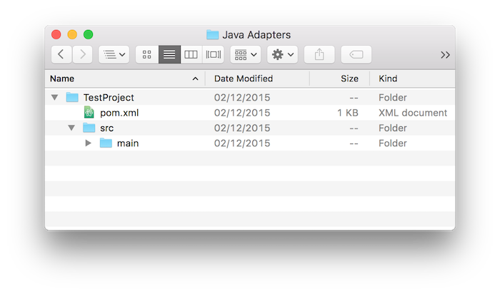
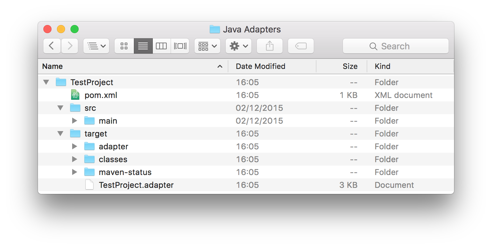

### Overview
This tutorial demonstrates how to create either Java or JavaScript adapter using the Maven Archetype "adapter-maven-archetype".
The "adapter-maven-archetype" is based on the [Maven archetype toolkit](https://maven.apache.org/guides/introduction/introduction-to-archetypes.html) in order to create the adapter as a Maven project.

**Prerequisite:**  Make sure that you read the [Adapters Overview](../adapters-overview) tutorial first.</span>

###Jump To:
* [Creating Adapters using Maven](#creatingWithMaven)
 * [Install Maven](#installMvn)
 * [Create an Adapter](#createAdapter)
 * [Build and Deploy Adapters](#build&deploy)
 * [Dependencies](#dependencies)
 * [Grouping Adapters in a Single Maven Project](#grouping)
* [Creating Adapters using MobileFirst CLI](#creatingWithCli)
* [Creating Adapters using MobileFirst Operations Console](#creatingWithConsole)

### Creating Adapters using Maven Archetype "adapter-maven-archetype"<a name="creatingWithMaven"></a>
The "adapter-maven-archetype" is based on the [Maven archetype toolkit](https://maven.apache.org/guides/introduction/introduction-to-archetypes.html) in order to create the adapter as a Maven project.

</br>
#### Install Maven<a name="installMvn"></a>
In order to create an adapter, you first need to download and install Maven. Go to the [Apache Maven website](https://maven.apache.org/) and follow the instructions how to download and install Maven.

</br>
#### Create an Adapter<a name="createAdapter"></a>
To create a Maven adapter project, use the `archetype:generate` command.
You can choose to run the command interactively or directly.

**In Interactive Mode**

1. Run:

    ```shell
    mvn archetype:generate -DarchetypeGroupId=com.ibm.mfp -DarchetypeArtifactId=<adapter type artifact ID> -DarchetypeVersion=8.0.0
    ```
  * The `Archetype Group Id` and Archetype Version are required parameters to identify the archetype.
  * The `Archetype Artifact Id` is a required parameter to identify the adapter type:
     * Use `adapter-maven-archetype-java` to crate a Java adapter
     * Use `adapter-maven-archetype-http` to create a JavaScript HTTP adapter
     * Use `adapter-maven-archetype-sql` to create a JavaScript SQL adapter  

2. Enter the Group Id of the Maven project to be build:

    ```shell
    Define value for property 'groupId': : com.mfp
    ```

3. Enter the Artifact Id of the Maven project **which will later be used also as the adapter name**:

    ```shell
    Define value for property 'artifactId': : SampleAdapter
    ```

4. Enter the Maven project version (the default is `1.0-SNAPSHOT`):

    ```shell
    Define value for property 'version':  1.0-SNAPSHOT: : 1.0
    ```

5. Enter the Java adapter package name (the default is the `groupId`):

    ```shell
    Define value for property 'package':  com.mfp: : com.sample
    ```

6. Enter `y` to confirm:

    ```shell
    [INFO] Using property: archetypeVersion = 7.2.0.0
    Confirm properties configuration:
    groupId: sample.group.id
    artifactId: Sample
    version: 1.0
    package: com.sample.adapter
    adapter-name: TestAdapter
    archetypeVersion: 7.2.0.0
     Y: : y
    ```
<br/>

**In Direct Mode**

Replace the placeholders with the actual values and run:

```shell
mvn archetype:generate -DarchetypeGroupId=com.ibm.mfp -DarchetypeArtifactId=<adapter type artifact ID> -DarchetypeVersion=8.0.0 -DgroupId=<maven_project_groupid> -DartifactId=<maven_project_artifactid> -Dversion=<maven_project_version> -Dpackage=<java_adapter_package_name>
```

<br/>

>For more information about the `archetype:generate` command see the Maven documentation.

After creating the adapter the result will be a Maven project containing a `src` folder and a `pom.xml` file:



#### Build and Deploy Adapters <a name="build&deploy"></a>
**Build**

The adapter will be built every time you run the `mvn install` command to build your Maven project.  
The end result is the `.adapter` file in the project `target` folder:



**Deploy**

1. The `pom.xml` file contains the following `properties` parameters:

      ```xml
      <properties>
    		<!-- parameters for deploy mfpf adapter -->
    		<mfpfUrl>http://localhost:9080/mfpadmin</mfpfUrl>
    		<mfpfUser>demo</mfpfUser>
    		<mfpfPassword>demo</mfpfPassword>
    	</properties>
      ```
   * Replace the `IP` and `PORT` with your MobileFirst Server IP and port.
   * Replace the `mfpfUser` and `mfpfPassword` with your MobileFirst admin user name and password.  
2. Open the project's root folder in terminal and run the `mvn:adapter` command:

      ```shell
      mvn adapter:deploy
      ```
**NOTE:** The deploy command is available only during development (for security reasons).

</br>
#### Dependencies <a name="dependencies"></a>
In order to use an external library in your adapter, follow these suggested instructions:

1. Add a `lib` folder under the root Maven project folder and put the external library in it.
2. Add the library path under the `dependencies` element in the Maven project `pom.xml` file.  
For example:

    ```xml
    <dependency>
        <groupId>sample</groupId>
        <artifactId>com.sample</artifactId>
        <version>1.0</version>
        <scope>system</scope>
        <systemPath>${project.basedir}/lib/</systemPath>
    </dependency>
    ```

</br>
> For more information about `dependencies` see the Maven documentation.

</br>
#### Grouping Adapters in a Single Maven Project <a name="grouping"></a>
If you have several adapters in your project you may want to arrange them under a single Maven project. Grouping adapters provides many benefits such as build all and deploy all abilities, sharing dependencies etc.

To group adapters you need to:

1. Create a root folder and call it, for example, "GroupAdapters".
2. Put the Maven adapter projects in it.
3. Create a `pom.xml` file:

    ```xml
    <project xmlns="http://maven.apache.org/POM/4.0.0" xmlns:xsi="http://www.w3.org/2001/XMLSchema-instance"
    	xsi:schemaLocation="http://maven.apache.org/POM/4.0.0 http://maven.apache.org/xsd/maven-4.0.0.xsd">

    	<modelVersion>4.0.0</modelVersion>
    	<groupId>com.sample</groupId>
    	<artifactId>GroupAdapters</artifactId>
    	<version>1.0-SNAPSHOT</version>
    	<packaging>pom</packaging>

    	<modules>
    					<module>AdapterName1</module>
    					<module>AdapterName2</module>
    	</modules>

    	<properties>
    		<!-- parameters for deploy mfpf adapter -->
    		<mfpfUrl>http://localhost:9080/mfpadmin</mfpfUrl>
    		<mfpfUser>demo</mfpfUser>
    		<mfpfPassword>demo</mfpfPassword>
    	</properties>

    </project>
    ```
  * Define a **`groupId`** of your choice
  * Add an **`artifactId`** - the root folder's name
  * Replace the `IP` and `PORT` with your MobileFirst Server IP and port.
  * Replace the `mfpfUser` and `mfpfPassword` with your MobileFirst admin user name and password.

4. To build or deploy all adapters, run the commands from the root "GroupAdapters" project.

### Creating Adapters using MobileFirst CLI <a name="creatingWithCli"></a>

### Creating Adapters using MobileFirst Operations Console <a name="creatingWithConsole"></a>


<br/><br/><br/>

* **Using the MobileFirst Operations Console:**
  1. Open your browser of choice and load the MobileFirst Operations Console using the address `http://<IP>:<PORT>/mfpconsole/`.  
  2. Drag and drop the `.adapter` file from the target folder into the Console.
