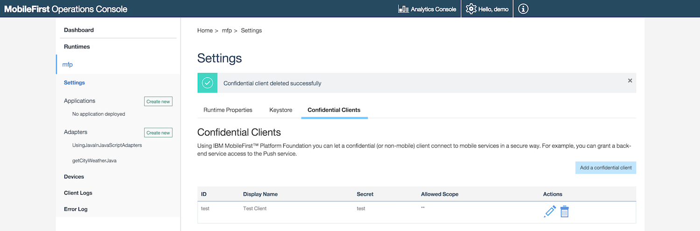
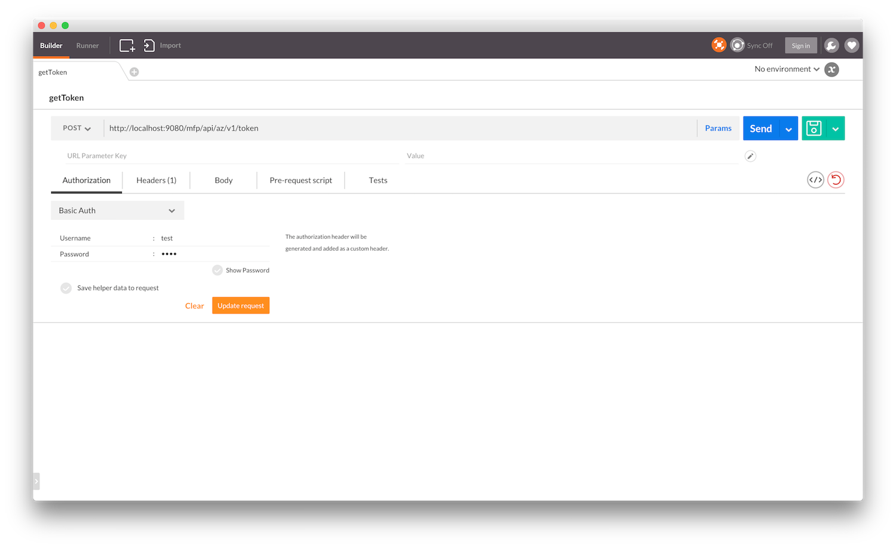

## Overview
Adapters are Maven projects that contains server-side code implemented in either Java or JavaScript. An adapter project can be created by using Maven, MobileFirst CLI or MobileFirst Operations Console. This tutorial demonstrates how to create either a Java or JavaScript adapter using the above methods.

The adapter project is based on the Maven Archetype "adapter-maven-archetype" which is based on the [Maven archetype toolkit](https://maven.apache.org/guides/introduction/introduction-to-archetypes.html).

**Prerequisite:**  Make sure that you read the [Adapters Overview](../adapters-overview) tutorial first.</span>

#### Jump to:
* [Creating Adapters Using Maven](#creating-adapters-using-maven-archetype-quot-adapter-maven-archetype-quot)
 * [Install Maven](#install-maven)
 * [Create an Adapter](#create-an-adapter)
 * [Build and Deploy Adapters](#build-and-deploy-adapters)
 * [Dependencies](#dependencies)
 * [Grouping Adapters in a Single Maven Project](#grouping-adapters-in-a-single-maven-project)
* [Creating Adapters Using MobileFirst CLI](#creating-adapters-using-mobilefirst-cli)
* [Creating Adapters Using MobileFirst Operations Console](#creating-adapters-using-mobilefirst-operations-console)
* [Testing Adapters](#testing-adapters)
 * [Using Postman](#using-postman)
 * [Using the MobileFirst CLI](#using-the-mobilefirst-cli)


## Creating Adapters Using Maven Archetype "adapter-maven-archetype"
The "adapter-maven-archetype" is based on the [Maven archetype toolkit](https://maven.apache.org/guides/introduction/introduction-to-archetypes.html) in order to create the adapter as a Maven project.

### Install Maven
In order to create an adapter, you first need to download and install Maven. Go to the [Apache Maven website](https://maven.apache.org/) and follow the instructions how to download and install Maven.

### Create an Adapter
To create a Maven adapter project, use the `archetype:generate` command.
You can choose to run the command interactively or directly.

#### Interactive Mode

1. Replace the **DarchetypeArtifactId** placeholder with the actual value and run:

    ```shell
    mvn archetype:generate -DarchetypeGroupId=com.ibm.mfp -DarchetypeArtifactId=<adapter type artifact ID> -DarchetypeVersion=8.0.0
    ```
  * The `Archetype Group Id` and Archetype Version are required parameters to identify the archetype.
  * The `Archetype Artifact Id` is a required parameter to identify the adapter type:
     * Use `adapter-maven-archetype-java` to crate a Java adapter
     * Use `adapter-maven-archetype-http` to create a JavaScript HTTP adapter
     * Use `adapter-maven-archetype-sql` to create a JavaScript SQL adapter  

2. Enter a [Group Id](https://maven.apache.org/guides/mini/guide-naming-conventions.html) of the Maven project to be build. For example:

    ```shell
    Define value for property 'groupId': : com.mycompany
    ```

3. Enter an Artifact Id of the Maven project **which will later be used also as the adapter name**. For example:

    ```shell
    Define value for property 'artifactId': : SampleAdapter
    ```

4. Enter a Maven project version (the default is `1.0-SNAPSHOT`). For example:

    ```shell
    Define value for property 'version':  1.0-SNAPSHOT: : 1.0
    ```

5. Enter an adapter package name (the default is the `groupId`). For example:

    ```shell
    Define value for property 'package':  com.mycompany: : com.mypackage
    ```

6. Enter `y` to confirm:

    ```shell
    [INFO] Using property: archetypeVersion = 8.0.0
    Confirm properties configuration:
    groupId: com.mycompany
    artifactId: SampleAdapter
    version: 1.0
    package: com.mypackage
    archetypeVersion: 8.0.0
     Y: : y
    ```
<br/>

#### Direct Mode

Replace the placeholders with the actual values and run:

```shell
mvn archetype:generate -DarchetypeGroupId=com.ibm.mfp -DarchetypeArtifactId=<adapter type artifact ID> -DarchetypeVersion=8.0.0 -DgroupId=<maven_project_groupid> -DartifactId=<maven_project_artifactid> -Dversion=<maven_project_version> -Dpackage=<java_adapter_package_name>
```

<br/>

>For more information about the `archetype:generate` command see the Maven documentation.

After creating the adapter the result will be a Maven project containing a `src` folder and a `pom.xml` file:


### Build and Deploy Adapters
#### Build

The adapter is built each time you run the `mvn install` command to build the Maven project.
This generates an **.adapter** file which can be found in the **target** folder:


#### Deploy

1. The `pom.xml` file contains the following `properties` parameters:

      ```xml
      <properties>
    		<!-- parameters for deploy mfpf adapter -->
    		<mfpfUrl>http://localhost:9080/mfpadmin</mfpfUrl>
    		<mfpfUser>demo</mfpfUser>
    		<mfpfPassword>demo</mfpfPassword>
    	</properties>
      ```
   * Replace the `localhost:9080` with your MobileFirst Server IP and port.
   * Replace the `mfpfUser` and `mfpfPassword` values with your MobileFirst admin user name and password.  
2. Open the project's root folder in terminal and run the `mvn:adapter` command:

      ```shell
      mvn adapter:deploy
      ```
**NOTE:** The deploy command is available only during development (for security reasons).

### Dependencies <a name="dependencies"></a>
In order to use an external library in your adapter, follow these suggested instructions:

1. Add a `lib` folder under the root Maven project folder and put the external library in it.
2. Add the library path under the `dependencies` element in the Maven project `pom.xml` file.  
For example:

    ```xml
    <dependency>
        <groupId>sample</groupId>
        <artifactId>com.sample</artifactId>
        <version>1.0</version>
        <scope>system</scope>
        <systemPath>${project.basedir}/lib/</systemPath>
    </dependency>
    ```

</br>
> For more information about `dependencies` see the Maven documentation.

### Grouping Adapters in a Single Maven Project
If you have several adapters in your project you may want to arrange them under a single Maven project. Grouping adapters provides many benefits such as build all and deploy all abilities, sharing dependencies etc.

To group adapters you need to:

1. Create a root folder and call it, for example, "GroupAdapters".
2. Put the Maven adapter projects in it.
3. Create a `pom.xml` file:

    ```xml
    <project xmlns="http://maven.apache.org/POM/4.0.0" xmlns:xsi="http://www.w3.org/2001/XMLSchema-instance"
    	xsi:schemaLocation="http://maven.apache.org/POM/4.0.0 http://maven.apache.org/xsd/maven-4.0.0.xsd">

    	<modelVersion>4.0.0</modelVersion>
    	<groupId>com.sample</groupId>
    	<artifactId>GroupAdapters</artifactId>
    	<version>1.0-SNAPSHOT</version>
    	<packaging>pom</packaging>

    	<modules>
				<module>Adapter1</module>
				<module>Adapter2</module>
    	</modules>

    	<properties>
    		<!-- parameters for deploy mfpf adapter -->
    		<mfpfUrl>http://localhost:9080/mfpadmin</mfpfUrl>
    		<mfpfUser>demo</mfpfUser>
    		<mfpfPassword>demo</mfpfPassword>
    	</properties>

      <build>
    		<plugins>
    			<plugin>
    				<groupId>com.ibm.mfp</groupId>
    				<artifactId>adapter-maven-plugin</artifactId>
    				<version>8.0.0</version>
    				<extensions>true</extensions>
    			</plugin>
    		</plugins>
    	</build>

    </project>
    ```
  1. Define a **`groupId`** element of your choice
  2. Add an **`artifactId`** element - the root folder's name
  3. Add a **`module`** element for each adapter
  4. Add the **`build`** element
  5. Replace the **localhost:9080** with your MobileFirst Server IP and port.
  6. Replace the **mfpfUser** and **mfpfPassword** values with your MobileFirst admin user name and password.

4. To build or deploy all adapters, run the commands from the root "GroupAdapters" project.

## Creating Adapters Using MobileFirst CLI


## Creating Adapters Using MobileFirst Operations Console

* **Using the MobileFirst Operations Console:**
  1. Open your browser of choice and load the MobileFirst Operations Console using the address `http://<IP>:<PORT>/mfpconsole/`.  
  2. Drag and drop the `.adapter` file from the target folder into the Console.


## Testing Adapters
MobileFirst adapters are available via a REST interface. This means that if you know the URL of a resource/procedure, you can use HTTP tools such as Postman to test requests and pass URL parameters, path parameters, body parameters or headers as you see fit.

The structure of the URL used to access the adapter resource is: `http://<IP>:<PORT>/mfp/api/adapters/{adapter-name}/{procedure-name}`

### Using Postman

**Passing parameters:**

* When using Java adapters, parameters can be passed in the URL, body, form, etc, depending on how you configured your adapter.
* When using JavaScript adapters, parameters are passed as `params=[a,b,c,d]`. In other words, a JavaScript procedure receives only one parameter called `params` which needs to be an array of ordered, unnamed values. This parameter can either be in the URL (`GET`) or in the body (`POST`) using `Content-Type: application/x-www-form-urlencoded`.

**Handling security:**

If your resource is protected by a scope, the request prompts you to provide a valid authorization header. Note that by default, MobileFirst uses a simple security scope even if you did not specify any. So unless you specifically disabled security, the endpoint is always protected.

To disable security in Java adapters you should attach the `OAuthSecurity` annotation to the procedure/class:

```java
@OAuthSecurity(enabled=false)
```

To disable security in JavaScript adapters you should add the `secured` attribute to the procedure:

```js
<procedure name="proc1" secured="false"/>
```

Alternatively, the development version of the MobileFirst Server includes a test token endpoint to bypass the security challenges. To receive a Test Token you should:

1. In the MobileFirst Operations Console -> **Settings** -> **Confidential Clients** tab, create a confidential client or use the default one:  
For testing purposes set **Allowed Scopes** as `**`.

  

1. Use your HTTP client (Postman) to make an HTTP `POST` request to `http://<IP>:<PORT>/mfp/api/az/v1/token` with the following parameters using `Content-Type: application/x-www-form-urlencoded`:

    ```xml
    grant_type : client_credentials
    scope : **
    ```

  
2. Add an authorization header using Basic authentication with the <span style="color:red">Add link to the confidential client tutorial</span>
confidential client's ID (test) and secret (test):  

  


The result will be a JSON object with a temporary valid access token:

```json
{
  "access_token": "eyJhbGciOiJSUzI1NiIsImp3ayI6eyJlIjoiQVFBQiIsIm4iOiJBTTBEZDd4QWR2NkgteWdMN3I4cUNMZEUtM0kya2s0NXpnWnREZF9xczhmdm5ZZmRpcVRTVjRfMnQ2T0dHOENWNUNlNDFQTXBJd21MNDEwWDlJWm52aHhvWWlGY01TYU9lSXFvZS1ySkEwdVp1dzJySGhYWjNXVkNlS2V6UlZjQ09Zc1FOLW1RSzBtZno1XzNvLWV2MFVZd1hrU093QkJsMUVocUl3VkR3T2llZzJKTUdsMEVYc1BaZmtOWkktSFU0b01paS1Uck5MelJXa01tTHZtMDloTDV6b3NVTkExNXZlQ0twaDJXcG1TbTJTNjFuRGhIN2dMRW95bURuVEVqUFk1QW9oMmluSS0zNlJHWVZNVVViTzQ2Q3JOVVl1SW9iT2lYbEx6QklodUlDcGZWZHhUX3g3c3RLWDVDOUJmTVRCNEdrT0hQNWNVdjdOejFkRGhJUHU4Iiwia3R5IjoiUlNBIiwia2lkIjoidGVzdCJ9fQ.eyJpc3MiOiJjb20uaWJtLm1mcCIsInN1YiI6InRlc3QiLCJhdWQiOiJjb20uaWJtLm1mcCIsImV4cCI6MTQ1MjUxNjczODAwNSwic2NvcGUiOiJ4eCJ9.vhjSkv5GShCpcDSu1XCp1FlgSpMHZa-fcJd3iB4JR-xr_3HOK54c36ed_U5s3rvXViao5E4HQUZ7PlEOl23bR0RGT2bMGJHiU7c0lyrMV5YE9FdMxqZ5MKHvRnSOeWlt2Vc2izh0pMMTZd-oL-0w1T8e-F968vycyXeMs4UAbp5Dr2C3DcXCzG_h9jujsNNxgXL5mKJem8EpZPolQ9Rgy2bqt45D06QTW7J9Q9GXKt1XrkZ9bGpL-HgE2ihYeHBygFll80M8O56By5KHwfSvGDJ8BMdasHFfGDRZUtC_yz64mH1lVxz5o0vWqPwEuyfslTNCN-M8c3W9-6fQRjO4bw",
  "token_type": "Bearer",
  "expires_in": 3599,
  "scope": "**"
}
```

Now with any future request to adapter endpoints, add an HTTP header with the name `Authorization` and the value you received previously. The security framework will skip any security challenges protecting your resource.


### Using the MobileFirst CLI
